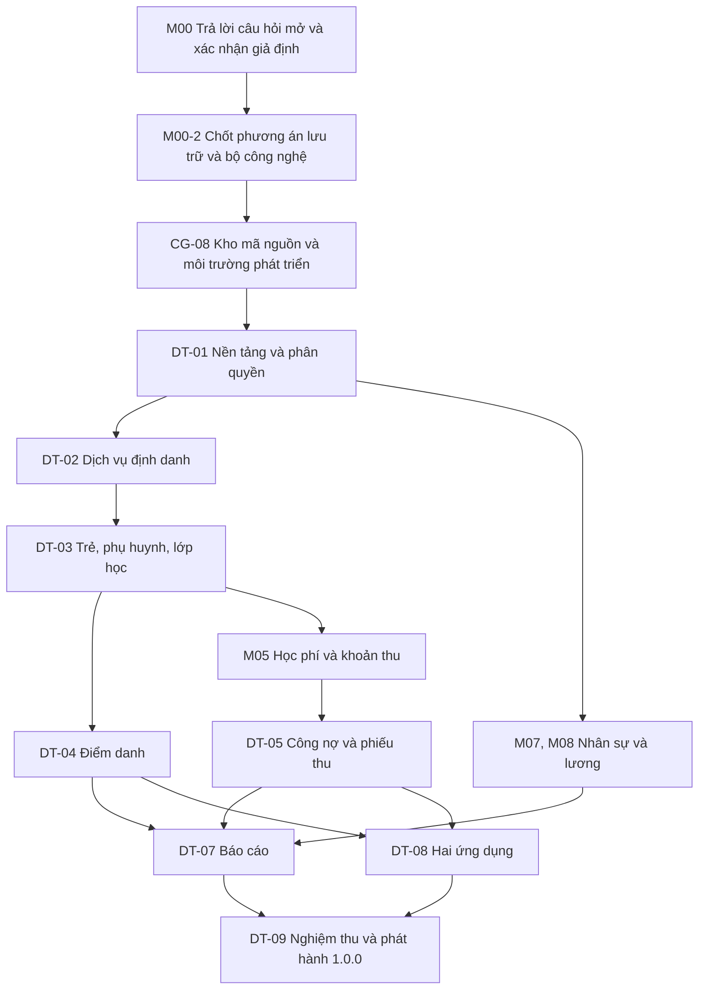

# 01. KẾ HOẠCH TỔNG THỂ

- Mô tả: Tài liệu điều phối cấp cao nhất của dự án: mười hai giai đoạn kèm cổng kiểm soát, các mốc phát hành, kế hoạch thực thi theo đợt, đường găng, tổ chức thực hiện, quản lý thay đổi và rủi ro.
- Phiên bản: 1.5
- Ngày cập nhật: 2026-10-11
- Trạng thái: Đã phê duyệt
- Người phê duyệt: Eric, ngày 2026-10-09

## 1. Mục đích và phạm vi áp dụng

Tài liệu này là kế hoạch tổng thể của dự án. Nó trả lời bốn câu hỏi mà các tài liệu khác không trả lời: dự án đi qua những bước nào, mỗi bước kết thúc bằng điều kiện gì, ai quyết định ở mỗi bước, và việc gì chặn việc gì.

Tài liệu này **không thay thế** các tài liệu khác. Nó chỉ đứng trên và trỏ xuống:

| Tài liệu | Vai trò |
|---|---|
| `01_KE_HOACH_TONG_THE.md` (tệp này) | Thứ tự, cổng, trách nhiệm, rủi ro |
| `03_DANH_SACH_CONG_VIEC.md` | Việc cụ thể hằng ngày và tiến độ theo phân hệ |
| `02_NHAT_KY_DU_AN.md` | Việc đã làm, theo ngày |
| `23_LICH_SU_PHIEN_BAN.md` | Phiên bản đã phát hành |
| `04` đến `22` | Nội dung nghiệp vụ, thiết kế, kiểm thử, bảo mật |
| `24_YEU_CAU_THAY_DOI.md` | Yêu cầu thay đổi và đánh giá ảnh hưởng |
| `25_QUY_TRINH_NGHIEP_VU/` | Đặc tả quy trình nghiệp vụ `QT-01` đến `QT-10` |

Đối tượng đọc: người quyết định (Eric), người thực hiện (Minh), và bất kỳ ai tham gia dự án về sau.

Phạm vi áp dụng: từ giai đoạn 01 Xác định ý tưởng tới giai đoạn 12 Vận hành và cải tiến, không bỏ giai đoạn nào.

## 2. Nguyên tắc điều hành

Kế hoạch này vận hành trên bảy nguyên tắc bất biến của quy trình, không thương lượng, không được bỏ qua kể cả khi được yêu cầu:

1. **Con người quyết định, trí tuệ nhân tạo thực hiện.** Eric quyết định mục tiêu, nghiệp vụ, phạm vi, quyền hạn, quy tắc dữ liệu, tiêu chuẩn chất lượng và nghiệm thu cuối cùng.
2. **Không đoán.** Thiếu thông tin thì dừng lại, làm đủ năm việc: phát hiện, mô tả, xác định thành phần ảnh hưởng, đưa phương án, xin xác nhận.
3. **Không phá vỡ.** Mọi thay đổi phải bảo toàn dữ liệu, giao diện lập trình, nghiệp vụ, phân quyền, giao diện và chức năng đang có.
4. **Không xóa chức năng** nếu Eric không yêu cầu rõ ràng.
5. **Không tự phát sinh chức năng.** Chỉ đề xuất, chờ phê duyệt.
6. **Xây nhỏ, kiểm tra, tiếp tục.** Chia theo cấp bậc sản phẩm, phân hệ, chức năng, nhiệm vụ.
7. **Không có tiêu chí nghiệm thu thì không được coi là hoàn thành.**

Bốn câu kiểm soát của quy trình, áp dụng cho mọi cổng trong tài liệu này:

- Không có đầu vào đạt chuẩn thì không bắt đầu.
- Không có đầu ra đạt chuẩn thì không chuyển tiếp.
- Không có tiêu chí nghiệm thu thì không được coi là hoàn thành.
- Không có kiểm soát thay đổi thì không được coi là phát triển có kiểm soát.

## 3. Sản phẩm và các mốc phát hành

Sản phẩm: School Management, hệ thống quản lý trường mầm non cho một trường công lập có cây đơn vị hai cấp: Trường chính và các Phân hiệu, Điểm trường trực thuộc (QĐ-23). Gồm cổng quản trị trên trình duyệt, ứng dụng giáo viên và ứng dụng phụ huynh; một máy chủ giao diện lập trình ứng dụng nghiệp vụ và một dịch vụ định danh độc lập; cơ sở dữ liệu định danh, cơ sở dữ liệu hệ thống và mỗi năm học một cơ sở dữ liệu; API chỉ đọc cho đối tác.

| Mốc | Nội dung | Giai đoạn quy trình | Trạng thái |
|---|---|---|---|
| 0.1.0 | Khởi tạo bộ tài liệu thiết kế | 01 đến 07 | Đã có |
| 0.2.0 | Bốn thay đổi: Ban Giám hiệu, nhiều cấp đơn vị, tách giao diện và máy chủ, dịch vụ định danh | 01 đến 07 | Đã có |
| 0.3.0 | Kế hoạch tổng thể dự án | 08 | Đã có |
| 0.3.1 | Đổi tên dự án thành School Management | 01 đến 08 | Đã có |
| 0.29.4 | DT-06 phần 6b-1: ngày nghỉ lễ, lịch học bù và nghỉ bù, giờ làm, thuộc tính loại nghỉ, chấm công (YCTD-59) | 08, 09 | Đã có |
| 0.29.3 | DT-06 phần 6a: hồ sơ nhân sự, hợp đồng lao động, liên kết tài khoản, nhập nhân sự từ Excel (YCTD-58) | 08, 09 | Đã có |
| 0.29.2 | DT-05 phần 5f: thanh toán trực tuyến qua tài khoản ảo và mã QR dùng một lần, đối chiếu tự lập phiếu thu (YCTD-57) | 08, 09 | Đã có |
| 0.29.1 | DT-05 phần 5e-2: phiếu đảo phiếu chi duyệt theo hạn mức (YCTD-56) | 08, 09 | Đã có |
| 0.29.0 | DT-05 phần 5e-1: phiếu chi duyệt theo hạn mức, hoàn tiền thôi học, sổ quỹ (YCTD-55) | 08, 09 | Đã có |
| 0.28.9 | DT-05 phần 5d-2: đảo phiếu thu, nhập công nợ đầu kỳ (YCTD-54) | 08, 09 | Đã có |
| 0.28.8 | DT-05 phần 5d-1: phiếu thu, phân bổ, quỹ và tài khoản, công nợ phải thu (YCTD-53) | 08, 09 | Đã có |
| 0.28.7 | DT-05 phần 5c-2: miễn giảm và phiếu điều chỉnh hóa đơn, duyệt theo hạn mức (YCTD-52) | 08, 09 | Đã có |
| 0.28.6 | DT-05 phần 5c-1: tính học phí, phát hành hóa đơn chính và bổ sung (YCTD-51) | 08, 09 | Đã có |
| 0.28.5 | DT-05 phần 5b: đăng ký dịch vụ, chốt kỳ, đăng ký và hủy trễ, học hè (YCTD-50) | 08, 09 | Đã có |
| 0.28.4 | DT-05 phần 5a: danh mục dịch vụ, biểu phí, loại miễn giảm, khoản mục thu chi (YCTD-49) | 08, 09 | Đã có |
| 0.28.3 | DT-04 phần 4b: người được ủy quyền đón trẻ, bàn giao, xác nhận tại cổng (YCTD-48) | 08, 09 | Đã có |
| 0.28.2 | DT-04 phần 4a: điểm danh, chốt ngày, báo vắng, ứng dụng giáo viên (YCTD-47) | 08, 09 | Đã có |
| 0.28.1 | DT-03 phần 3c: nhập lớp, trẻ và phụ huynh từ Excel, nhập mã định danh ngành (YCTD-46) | 08, 09 | Đã có |
| 0.28.0 | DT-03 phần 3b: hồ sơ trẻ, phụ huynh, duyệt và phân lớp, chuyển lớp, kho tệp, mã hóa số định danh (YCTD-45) | 08, 09 | Đã có |
| 0.27.9 | DT-03 phần 3a: lớp học và phân công giáo viên (YCTD-44) | 08, 09 | Đã có |
| 0.27.8 | DT-02: mật khẩu mặc định của phụ huynh, mã một lần, kích hoạt, ứng dụng phụ huynh, cookie riêng theo kênh (YCTD-43) | 08, 09 | Đã có |
| 0.27.7 | DT-01 phần 6b: phòng ban, chức danh, danh mục dùng chung, hạn mức phê duyệt, phòng học, bậc học (YCTD-42) | 08, 09 | Đã có |
| 0.27.6 | Chốt học phí mặc định mùng 1 tháng sau, chốt công cố định mùng 1 tháng sau (YCTD-41) | 01 đến 08 | Đã có |
| 0.27.5 | DT-01 phần 6a: cấu hình theo đơn vị, nhật ký thao tác, tự khóa tài khoản | 09 | Đã có |
| 0.27.4 | Cấu hình theo đơn vị, kế thừa từ Trường chính, tự khóa tài khoản lâu không dùng (YCTD-40) | 01 đến 08 | Đã có |
| 0.27.3 | DT-01 phần 5: tài khoản, vai trò, quyền | 09 | Đã có |
| 0.27.2 | Phân quyền quản lý tài khoản, mật khẩu tạm, nhật ký của dịch vụ định danh (YCTD-39) | 01 đến 08 | Đã có |
| 0.27.1 | DT-01 phần 4: cây đơn vị hai cấp, nhật ký thao tác | 09 | Đã có |
| 0.27.0 | Cây đơn vị hai cấp, nhãn cố định (YCTD-38) | 01 đến 08 | Đã có |
| 0.26.6 | DT-01 phần 3: năm học, lịch năm học, mở năm học | 09 | Đã có |
| 0.26.5 | Mở năm học mới là đóng năm cũ, sửa lịch tới khi đóng, quyền `P01.academic-year.manage` (YCTD-37) | 01 đến 08 | Đã có |
| 0.26.4 | DT-01 phần 2: máy chủ API kiểm tra mã phiên và quyền, màn hình đăng nhập | 09 | Đã có |
| 0.26.3 | Cookie httpOnly cho mã làm mới, gói `packages/server`, điều hướng dọc, MH-47 và MH-48 (YCTD-36) | 01 đến 08 | Đã có |
| 0.26.2 | DT-01 phần 1: phần lõi dịch vụ định danh | 09 | Đã có |
| 0.26.1 | Chốt quy tắc mật khẩu, tạm khóa, mã quyền, tài khoản đầu tiên VT-01 (YCTD-35) | 01 đến 08 | Đã có |
| 0.26.0 | Gộp phần lõi dịch vụ định danh vào DT-01, chia sáu phần; QĐ-20 đến QĐ-22 (YCTD-34) | 01 đến 08 | Đã có |
| 0.25.5 | Qua cổng CG-08, hoàn thành đợt DT-00 | 01 đến 08 | Đã có |
| 0.25.4 | Thêm điểm cuối kiểm tra sức khỏe cho đợt DT-00 | 01 đến 08 | Đã có |
| 0.25.3 | Chọn Kysely, quy ước nhánh và yêu cầu gộp (YCTD-33) | 01 đến 08 | Đã có |
| 0.25.2 | Chỉ dùng GitHub trước, hạ tầng đám mây khi triển khai (YCTD-32) | 01 đến 08 | Đã có |
| 0.25.1 | Bỏ xác thực hai lớp (YCTD-31) | 01 đến 08 | Đã có |
| 0.25.0 | Lịch năm học: học kỳ, kỳ hè, tuần học, tuần nghỉ; đăng ký học hè; số phiếu theo năm học (YCTD-30) | 01 đến 08 | Đã có |
| 0.24.1 | N21 đợt 5: bộ ca kiểm thử chi tiết P08 | 01 đến 08 | Đã có |
| 0.24.0 | Lương trả trước đầu tháng, điều chỉnh theo công tháng trước; bảng quyết toán khi nghỉ việc (YCTD-29) | 01 đến 08 | Đã có |
| 0.23.3 | N21 đợt 4: bộ ca kiểm thử chi tiết P06; trả lời Q-152 (YCTD-28) | 01 đến 08 | Đã có |
| 0.23.2 | N21 đợt 3: bộ ca kiểm thử chi tiết P05; trả lời Q-150, Q-151 (YCTD-27) | 01 đến 08 | Đã có |
| 0.23.1 | N21 đợt 2: bộ ca kiểm thử chi tiết P02 và P04 | 01 đến 08 | Đã có |
| 0.23.0 | N21 đợt 1: bộ ca kiểm thử chi tiết dịch vụ định danh và P01; trả lời Q-147 đến Q-149 (YCTD-26) | 01 đến 08 | Đã có |
| 0.22.2 | Rà duyệt QT-10 | 01 đến 08 | Đã có |
| 0.22.1 | Rà duyệt QT-09 | 01 đến 08 | Đã có |
| 0.22.0 | Rà duyệt QT-07; bổ sung gửi thuốc và chăm sóc sức khỏe: giáo viên nhận thuốc khi đơn vị không có y tế, ảnh thuốc, chăm sóc hằng ngày P10-12, phụ huynh xác nhận đã biết (YCTD-25) | 01 đến 08 | Đã có |
| 0.21.2 | Rà duyệt QT-06 | 01 đến 08 | Đã có |
| 0.21.1 | Rà duyệt QT-05; Ban Giám hiệu duyệt phiếu đảo phiếu chi (YCTD-24) | 01 đến 08 | Đã có |
| 0.21.0 | Rà duyệt QT-04; thêm P05-12 xử lý công nợ quá hạn; Ban Giám hiệu duyệt phiếu đảo phiếu thu (YCTD-23) | 01 đến 08 | Đã có |
| 0.20.3 | Rà duyệt QT-03 | 01 đến 08 | Đã có |
| 0.20.2 | Rà duyệt QT-02 | 01 đến 08 | Đã có |
| 0.20.1 | Rà duyệt QT-01 | 01 đến 08 | Đã có |
| 0.20.0 | Rà duyệt tài liệu 01; xếp năm chức năng giai đoạn 1 mới vào các đợt DT-00, DT-03, DT-05, DT-06, DT-07 | 01 đến 08 | Đã có |
| 0.19.7 | Rà duyệt tài liệu 23; sửa cấp tiêu đề mục phiên bản | 01 đến 08 | Đã có |
| 0.19.6 | Rà duyệt tài liệu 22; thêm BM-70; sắp lại BM-61 đến BM-69 theo mục | 01 đến 08 | Đã có |
| 0.19.5 | Rà duyệt tài liệu 21; thêm AC-211, CT-167 | 01 đến 08 | Đã có |
| 0.19.4 | Rà duyệt tài liệu 20; thêm PV-13 đến PV-15, DL-11 đến DL-13 | 01 đến 08 | Đã có |
| 0.19.3 | Rà duyệt tài liệu 19; câu lệnh hệ thống thêm nguyên tắc 17; bổ sung bảng quy ước mã | 01 đến 08 | Đã có |
| 0.19.2 | Rà duyệt tài liệu 18; thêm AI-41, AI-42 | 01 đến 08 | Đã có |
| 0.19.1 | Rà duyệt tài liệu 17; thêm điểm cuối còn thiếu cho chức năng đã duyệt | 01 đến 08 | Đã có |
| 0.19.0 | Rà duyệt tài liệu 16; hóa đơn bổ sung cùng kỳ; cơ sở dữ liệu hệ thống; thêm năm bảng | 01 đến 08 | Đã có |
| 0.18.1 | Rà duyệt tài liệu 15; cỡ chữ tối thiểu 14; mức tương phản; thành phần TD-16, TD-17 | 01 đến 08 | Đã có |
| 0.18.0 | Rà duyệt tài liệu 14; thêm MH-44 cho nhân sự tự phục vụ trên cổng quản trị | 01 đến 08 | Đã có |
| 0.17.2 | Rà duyệt tài liệu 13; thêm QU-11 cho cơ sở dữ liệu theo năm học | 01 đến 08 | Đã có |
| 0.17.1 | Rà duyệt tài liệu 12; chốt QĐ-01, QĐ-03, QĐ-05; sửa kiến trúc theo QĐ-15, QĐ-16 | 01 đến 08 | Đã có |
| 0.17.0 | Rà duyệt tài liệu 11; bỏ bữa tối; ba bữa sáng, trưa, xế thuộc bán trú; buffet theo dịp | 01 đến 08 | Đã có |
| 0.16.0 | Rà duyệt tài liệu 10; phiếu chi và quỹ tiền mặt chuyển sang giai đoạn 1 | 01 đến 08 | Đã có |
| 0.15.1 | Rà duyệt tài liệu 09; sửa luồng cho khớp quy tắc đã chốt | 01 đến 08 | Đã có |
| 0.15.0 | Rà duyệt tài liệu 08; kiểm toán viên xem toàn trường; bổ sung quyền phê duyệt và đăng nhập còn thiếu trong ma trận | 01 đến 08 | Đã có |
| 0.14.0 | Rà duyệt tài liệu 07; quyền xem sức khỏe thêm Ban Giám hiệu; hoàn tiền khi thôi học do Hiệu trưởng phê duyệt | 01 đến 08 | Đã có |
| 0.13.0 | Rà duyệt tài liệu 04 đến 06; bỏ dịch vụ học thứ bảy, lịch học bù thứ bảy chung toàn trường do Ban Giám hiệu lập | 01 đến 08 | Đã có |
| 0.12.0 | Xác nhận toàn bộ giả định; bán trú bắt buộc; đăng ký trễ do Ban Giám hiệu duyệt; mã trẻ theo số định danh và mã ngành; mật khẩu mặc định chung | 01 đến 08 | Đã có |
| 0.11.0 | Trả lời toàn bộ câu hỏi mở: bỏ xe đưa đón, thêm năm vai trò, cây đơn vị không giới hạn cấp, mỗi năm học một cơ sở dữ liệu, API cho đối tác, tiền làm thêm giờ, quy tắc AI chặt hơn | 01 đến 08 | Đã có |
| 0.10.0 | Bỏ ứng lương; quỹ tiền mặt không âm bắt buộc; đồng ý hình ảnh trên ứng dụng hoặc giấy ký tay; lưu và che số định danh của trẻ | 01 đến 08 | Đã có |
| 0.9.0 | Nhập dữ liệu ban đầu từ Excel; thanh toán trực tuyến bằng mã QR ở giai đoạn 1; không nhận thanh toán một phần; Zalo ở giai đoạn 3; người cùng nghiệm thu | 01 đến 08 | Đã có |
| 0.8.0 | Điểm danh một lần mỗi ngày; phụ huynh đăng nhập thêm bằng mã một lần; hạ tầng đám mây trong nước; GitHub kèm tự động hóa; chốt công và học phí cuối tháng; chặn đăng ký dịch vụ khi nợ quá hạn cấu hình theo đơn vị | 01 đến 08 | Đã có |
| 0.7.0 | Chế độ kế toán hành chính, sự nghiệp; học phí chính khóa cấu hình được; thêm P05-11 và P08-11 để nhà trường tự cấu hình miễn giảm, khấu trừ, phép năm | 01 đến 08 | Đã có |
| 0.6.0 | Chốt phương án lưu trữ, bộ công nghệ, công thức học phí giữa tháng, cách tính tiền ăn, sổ kế toán kép ở giai đoạn 3, biểu phí dùng chung, cách xếp ba giai đoạn | 01 đến 08 | Đã có |
| 0.5.3 | Trả lời Q-139, xác nhận GD-86 | 04 | Đã có |
| 0.5.2 | Bổ sung điểm cuối cho phân hệ Giảng dạy và bảng lịch hoạt động lớp | 07 | Đã có |
| 0.5.1 | Trả lời Q-136 đến Q-138: tiêu chuẩn sức khỏe theo Bộ Y tế, phí ngoại khóa theo hoạt động hoặc theo tháng, nghỉ thứ bảy định kỳ trừ lịch học bù | 01 đến 08 | Đã có |
| 0.5.0 | Bổ sung hai mươi chức năng theo tám ảnh sơ đồ chức năng | 01 đến 08 | Đã có |
| 0.4.0 | Chuyển bộ tài liệu sang cấu trúc Vibecoding_Flow, sửa các chỗ chưa khớp, thống nhất phân cấp phê duyệt, đổi mã dự án thành SM | 01 đến 08 | Đã có |
| 1.0.0 | Giai đoạn 1 chạy thật: nền tảng, trẻ, điểm danh, học phí, thanh toán mã QR, phiếu thu, phiếu chi, quỹ tiền mặt, nhân sự, lương cơ bản, hai ứng dụng, báo cáo cơ bản, nhập dữ liệu từ Excel, nhập mã định danh của Bộ, API đối tác | 09 đến 11 | Chưa bắt đầu |
| 1.1.0 | Giai đoạn 2: giảng dạy, y tế, bếp, kho, hoạt động, tương tác, công việc, tài khoản ngân hàng và công nợ phải trả, báo cáo hợp nhất | 09 đến 11 | Chưa bắt đầu |
| 1.2.0 | Giai đoạn 3: tuyển sinh, tuyển dụng, kết nối Facebook, đối soát thanh toán, sổ kế toán kép | 09 đến 11 | Chưa bắt đầu |

Ba giai đoạn sản phẩm nêu trong `05_PHAM_VI.md` mục 4 đến mục 6, đã được Eric xác nhận ngày 09/10/2026 (`Q-07`, `M00-3`).

## 4. Mười hai giai đoạn và cổng kiểm soát

Mỗi giai đoạn kết thúc bằng một cổng. Cổng không đạt thì không chuyển tiếp. Mã cổng dùng tiền tố `CG-nn`.

| Giai đoạn | Đầu ra bắt buộc | Cổng | Trạng thái hiện tại |
|---|---|---|---|
| 01 Xác định ý tưởng | `04_TONG_QUAN_DU_AN.md` | CG-01 | Đã đạt ngày 09/10/2026 |
| 02 Xác định phạm vi | `05_PHAM_VI.md` | CG-02 | Đã đạt ngày 09/10/2026 |
| 03 Phân tích nghiệp vụ | `06`, `07`, `08`, `09` và 10 đặc tả `QT-01` đến `QT-10` | CG-03 | Đã đạt ngày 09/10/2026 |
| 04 Đặc tả yêu cầu | `10_YEU_CAU_CHUC_NANG.md`, `11_TIEU_CHI_NGHIEM_THU.md` | CG-04 | Đã đạt ngày 09/10/2026 |
| 05 Thiết kế kiến trúc | `12_KIEN_TRUC_HE_THONG.md`, `13_CONG_NGHE_SU_DUNG.md` | CG-05 | Đã đạt ngày 09/10/2026 |
| 06 Thiết kế giao diện | `14_DAC_TA_GIAO_DIEN.md`, `15_HE_THONG_THIET_KE.md` | CG-06 | Đã đạt ngày 09/10/2026 |
| 07 Thiết kế dữ liệu và giao diện lập trình | `16_CO_SO_DU_LIEU.md`, `17_DAC_TA_API.md` | CG-07 | Đã đạt ngày 09/10/2026 |
| 08 Chuẩn bị môi trường | `18_QUY_TAC_PHAT_TRIEN_AI.md`, `19_CHI_DAN_HE_THONG_AI.md`, kho mã nguồn GitHub, môi trường phát triển | CG-08 | Đã đạt ngày 09/10/2026 |
| 09 Xây dựng theo phân hệ | Mã nguồn, thay đổi dữ liệu, kiểm thử tự động | CG-09 | Chưa bắt đầu |
| 10 Kiểm thử và kiểm soát chất lượng | `20_KE_HOACH_KIEM_THU.md`, `21_KICH_BAN_KIEM_THU.md`, kết quả chạy thật | CG-10 | Tài liệu `20`, `21`, `22` đã duyệt; chưa chạy |
| 11 Nghiệm thu và phát hành | Bản phát hành 1.0.0, `23_LICH_SU_PHIEN_BAN.md`, biên bản triển khai | CG-11 | Chưa bắt đầu |
| 12 Vận hành và cải tiến | Sửa lỗi, cải tiến, `24_YEU_CAU_THAY_DOI.md`, tài liệu cập nhật | CG-12 | Chưa bắt đầu |

Vị trí hiện tại của dự án: tài liệu `01`, `04` đến `22` và các đặc tả QT đã được Eric phê duyệt ngày 09/10/2026; CG-01 đến CG-08 đã đạt; đợt DT-00 đã gộp vào nhánh `main` qua yêu cầu gộp số 1. Môi trường thử nghiệm và chạy thật dựng khi triển khai (YCTD-32). Việc tiếp theo là đợt DT-01 (`M01`).

### 4.1 Giai đoạn 01 — Xác định ý tưởng

Nội dung: tên sản phẩm, vấn đề cần giải quyết, mục tiêu, đối tượng sử dụng, giá trị mang lại, yêu cầu cấp cao, giới hạn ban đầu.

Đầu ra: `04_TONG_QUAN_DU_AN.md`, đã có mục "Chưa xác minh được" và `YCC-01` đến `YCC-11`.

Cổng CG-01 đạt khi: vấn đề và mục tiêu rõ; tuyên bố sản phẩm không chứa yêu cầu kỹ thuật chưa xác định; Eric xác nhận.

Việc cần làm: không còn; `04_TONG_QUAN_DU_AN.md` đã phê duyệt, `GD-71` đã xác nhận.

### 4.2 Giai đoạn 02 — Xác định phạm vi

Nội dung: phạm vi trong, phạm vi ngoài, chức năng bắt buộc giai đoạn 1, chức năng ưu tiên giai đoạn 2, chức năng để giai đoạn sau, giới hạn của phiên bản.

Đầu ra: `05_PHAM_VI.md` với 19 phân hệ `P01` đến `P19`, `G1-01` đến `G1-20`, `G2-01` đến `G2-17`, `G3-01` đến `G3-09`.

Cổng CG-02 đạt khi: trả lời được sản phẩm làm gì, không làm gì, phiên bản hiện tại gồm gì; không còn chức năng ở trạng thái không rõ thuộc phạm vi hay không.

Việc cần làm: không còn; cách xếp ba giai đoạn đã xác nhận (`Q-07`, `M00-3`).

### 4.3 Giai đoạn 03 — Phân tích nghiệp vụ

Nội dung: nhóm người dùng, vai trò, trách nhiệm, quyền hạn; quy trình chính, quy trình phụ, quy trình ngoại lệ; quy tắc nghiệp vụ; dữ liệu nghiệp vụ.

Đầu ra: `06_YEU_CAU_NGHIEP_VU.md`, `07_QUY_TAC_NGHIEP_VU.md` với `BR-01` đến `BR-85`, `08_VAI_TRO_NGUOI_DUNG.md` với `VT-01` đến `VT-20` (VT-13 đã bỏ) và ma trận 19 cột, `09_LUONG_NGHIEP_VU.md`, cùng 10 đặc tả `QT-01` đến `QT-10` đủ mười lăm mục theo khuôn.

Cổng CG-03 đạt khi: bao phủ toàn bộ nghiệp vụ trong phạm vi; không có quy tắc nghiệp vụ quan trọng chưa xác định; mỗi quy trình có ít nhất một trường hợp thất bại về quyền; không có mâu thuẫn nội bộ.

Việc cần làm: không còn; các đặc tả QT đã phê duyệt, QT-08 đã bỏ.

### 4.4 Giai đoạn 04 — Đặc tả yêu cầu

Nội dung: chuyển nghiệp vụ thành yêu cầu chức năng có mã, mục tiêu, người sử dụng, điều kiện trước, dữ liệu vào, xử lý, dữ liệu ra, quy tắc, ngoại lệ, phân quyền, thông báo lỗi, tiêu chí nghiệm thu.

Đầu ra: `10_YEU_CAU_CHUC_NANG.md` với 171 mã chức năng trên 19 phân hệ, 161 còn hiệu lực và `PCF-11` đến `PCF-13`; `11_TIEU_CHI_NGHIEM_THU.md` với `AC-01` đến `AC-232`.

Cổng CG-04 đạt khi: hiểu được mà không cần suy đoán; triển khai được; kiểm thử được; mỗi chức năng có tiêu chí xác định đúng hoặc sai.

Việc cần làm: không còn; hai tài liệu đã phê duyệt.

### 4.5 Giai đoạn 05 — Thiết kế kiến trúc

Nội dung: kiến trúc tổng thể, thành phần, công nghệ, bảo mật, triển khai, ràng buộc kỹ thuật.

Đầu ra: `12_KIEN_TRUC_HE_THONG.md` với `TP-01` đến `TP-11`, `XT-01` đến `XT-09`, `QĐ-01` đến `QĐ-17`; `13_CONG_NGHE_SU_DUNG.md` với `QU-01` đến `QU-11`.

Cổng CG-05 đạt khi: đáp ứng yêu cầu nghiệp vụ và phi chức năng; có phương án triển khai; không còn quyết định kiến trúc quan trọng chưa xác định.

Việc cần làm: không còn; hai tài liệu đã phê duyệt. Hai điểm chặn cũ đã được chốt ngày 09/10/2026:

1. Phương án lưu trữ nhiều đơn vị: chọn phương án A (`Q-77`, `QĐ-02`).
2. Bộ công nghệ: dùng bộ đề xuất tại `13_CONG_NGHE_SU_DUNG.md` (`Q-79`, `QĐ-11`).

Năm quyết định đã chốt ngày 09/10/2026, ghi tại `QĐ-06` đến `QĐ-10`: tách giao diện khỏi máy chủ; một máy chủ giao diện lập trình ứng dụng duy nhất; một dịch vụ định danh tự viết; nhiều cấp đơn vị; Ban Giám hiệu tách thành Hiệu trưởng và Phó Hiệu trưởng kèm hạn mức.

### 4.6 Giai đoạn 06 — Thiết kế giao diện

Nội dung: danh sách màn hình, điều hướng, bố cục, thành phần, dữ liệu hiển thị, thao tác, trạng thái, thông báo, xử lý lỗi, quyền hiển thị, thích ứng màn hình, quy tắc thiết kế thống nhất.

Đầu ra: `14_DAC_TA_GIAO_DIEN.md` với 51 màn hình cổng quản trị `MH-01` đến `MH-51`, 16 màn hình giáo viên `MG-xx`, 19 màn hình phụ huynh `MP-xx`, và `RG-01` đến `RG-06` về ranh giới với máy chủ; `15_HE_THONG_THIET_KE.md`.

Cổng CG-06 đạt khi: bao phủ chức năng và vai trò; có đầy đủ trạng thái rỗng, đang tải, lỗi; điều hướng rõ; chuyển được thành giao diện thật.

Việc cần làm: không còn; ba kênh và cách chia màn hình đã phê duyệt.

### 4.7 Giai đoạn 07 — Thiết kế dữ liệu và giao diện lập trình

Nội dung: thực thể, trường, kiểu, khóa, quan hệ, ràng buộc, chỉ mục, trạng thái, lịch sử thay đổi, chính sách xóa dữ liệu; điểm cuối, phương thức, yêu cầu, phản hồi, xác thực, phân quyền, kiểm tra dữ liệu, xử lý lỗi, phân trang, lọc, sắp xếp, phiên bản.

Đầu ra: `16_CO_SO_DU_LIEU.md` với 162 bảng dự kiến, bảng `org_units` hai cấp (QĐ-23) và cột `org_unit_id`; `17_DAC_TA_API.md` với quy ước 8 và 9 về hai dịch vụ phục vụ và giao diện không truy cập cơ sở dữ liệu; ba loại cơ sở dữ liệu theo `QĐ-15`, `QĐ-17`.

Cổng CG-07 đạt khi: bao phủ toàn bộ dữ liệu cần thiết; quan hệ rõ; có kiểm tra dữ liệu; giao kèo giao diện lập trình rõ; phân quyền truy cập dữ liệu đã xác định.

Việc cần làm: không còn; hai tài liệu đã phê duyệt. Phương án A đã chốt nên mọi bảng nghiệp vụ có `org_unit_id` kèm chính sách bảo vệ mức bản ghi.

### 4.8 Giai đoạn 08 — Chuẩn bị môi trường

Nội dung: ngữ cảnh cho trí tuệ nhân tạo, câu lệnh hệ thống, quy tắc phát triển, quy tắc viết mã nguồn, kho mã nguồn, chiến lược phân nhánh, môi trường, khuôn khổ kiểm thử, tích hợp và triển khai liên tục.

Đầu ra: `18_QUY_TAC_PHAT_TRIEN_AI.md` với `AI-01` đến `AI-42`; `19_CHI_DAN_HE_THONG_AI.md`; kho mã nguồn; môi trường phát triển và thử nghiệm.

Cổng CG-08 đạt khi: trí tuệ nhân tạo có đủ thông tin để hiểu sản phẩm, phạm vi, nghiệp vụ, kiến trúc, dữ liệu, tiêu chuẩn viết mã, cách kiểm thử và giới hạn quyền hạn.

Việc cần làm: Eric tạo kho riêng trên GitHub; dựng môi trường phát triển chạy Docker trên máy cục bộ và tích hợp liên tục chỉ chạy kiểm thử; thuê máy chủ đám mây trong nước cho môi trường thử nghiệm và chạy thật khi triển khai (YCTD-32). Nơi lưu mã, hạ tầng và cách đánh phiên bản đã chốt ngày 09/10/2026 (`QĐ-12`, `QĐ-13`).

### 4.9 Giai đoạn 09 — Xây dựng theo phân hệ

Nguyên tắc: không xây toàn bộ trong một lần. Chia theo cấp bậc sản phẩm, phân hệ, chức năng, nhiệm vụ. Chi tiết ở mục 5 của tài liệu này.

Một nhiệm vụ chỉ được đưa vào xây dựng khi có mục tiêu rõ, phạm vi rõ, dữ liệu vào, kết quả ra, tiêu chí nghiệm thu, ràng buộc cần tuân thủ và không phụ thuộc thông tin chưa xác định.

Cổng CG-09 đạt khi: mã nguồn đúng yêu cầu, đúng kiến trúc, đúng quy tắc nghiệp vụ, đúng bảo mật, có kiểm thử, không gây lỗi cho chức năng đang có, không có thay đổi ngoài phạm vi.

### 4.10 Giai đoạn 10 — Kiểm thử và kiểm soát chất lượng

Bảy lớp kiểm thử bắt buộc cho mỗi chức năng: chức năng, nghiệp vụ, giao diện, phân quyền, dữ liệu, bảo mật, hồi quy.

Đầu ra: `20_KE_HOACH_KIEM_THU.md` với `PV-01` đến `PV-15`; `21_KICH_BAN_KIEM_THU.md` với `CT-001` đến `CT-188` và `27_BO_CA_KIEM_THU_CHI_TIET/`; kết quả chạy thật.

Cổng CG-10 đạt khi: không có lỗi nghiêm trọng chưa xử lý; tiêu chí nghiệm thu bắt buộc đạt; lỗi còn lại được phân loại theo mức nghiêm trọng, cao, trung bình, thấp và có quyết định xử lý.

Việc cần làm: dựng môi trường kiểm thử; chạy bộ ca kiểm thử trên môi trường thật, không chạy trên giấy.

### 4.11 Giai đoạn 11 — Nghiệm thu và phát hành

Trình tự: chức năng, được phê duyệt, lưu vào hệ thống quản lý phiên bản, đóng gói, phát hành.

Cổng CG-11 đạt khi: phiên bản được nghiệm thu; được xác định phiên bản; có lịch sử thay đổi; có khả năng truy xuất; có phương án quay lui; đã xác nhận sau triển khai.

Việc cần làm: có hạ tầng chạy thật, việc `T6`; Eric nghiệm thu và phê duyệt phát hành.

### 4.12 Giai đoạn 12 — Vận hành và cải tiến

Nội dung duy trì: theo dõi lỗi, hiệu năng, bảo mật; sao lưu; phục hồi; quản lý phiên bản; quản lý thay đổi; quản lý yêu cầu mới; cập nhật tài liệu.

Cổng CG-12 đạt khi: mọi thay đổi có lý do, có phạm vi, có đánh giá ảnh hưởng, được kiểm thử, được ghi nhận phiên bản, không làm mất kiểm soát hệ thống.

Quy tắc bắt buộc: không thực hiện thay đổi trực tiếp trên hệ thống đang chạy mà không qua quản lý thay đổi.

## 5. Kế hoạch thực thi giai đoạn xây dựng theo đợt

Đợt là đơn vị công việc lớn nhất trong giai đoạn 09. Mã đợt dùng tiền tố `DT-nn`. Mỗi đợt kết thúc bằng một lần kiểm tra và nghiệm thu trước khi sang đợt kế tiếp.

| Đợt | Nội dung | Phân hệ | Việc | Phụ thuộc | Điều kiện ra |
|---|---|---|---|---|---|
| DT-00 | Nền móng kỹ thuật: kho mã nguồn GitHub, cấu trúc dự án nhiều gói, môi trường phát triển chạy Docker trên máy cục bộ, khuôn khổ kiểm thử, tích hợp liên tục chỉ chạy kiểm thử (YCTD-32), cơ sở dữ liệu định danh, hệ thống và theo năm học (`QĐ-15`, `QĐ-17`, `QU-11`) | Toàn dự án | `M01-3` | CG-08 | Dựng được môi trường trống, chạy được một kiểm thử mẫu |
| DT-01 | Nền tảng và phần lõi dịch vụ định danh, làm theo sáu phần (YCTD-34): (1) tài khoản, vai trò, quyền, đăng nhập bằng mật khẩu, làm mới phiên, đăng xuất, đổi mật khẩu, khóa khi sai nhiều lần, tạo tài khoản quản trị đầu tiên; (2) máy chủ API kiểm tra mã phiên và quyền ở mọi yêu cầu; (3) năm học, học kỳ, tuần học (G1-20), mở năm học tạo cơ sở dữ liệu năm học; (4) cây đơn vị hai cấp (QĐ-23); (5) quản lý tài khoản, vai trò, ma trận quyền; (6) cấu hình theo đơn vị, nhật ký thao tác, phòng ban, chức danh, danh mục, phòng học, bậc học, hạn mức phê duyệt | P01 | `M01`, `M01-2` | DT-00 | Đăng nhập được, phân quyền ba lớp chạy đúng |
| DT-02 | Dịch vụ định danh, phần dành cho phụ huynh: mã một lần, kích hoạt tài khoản bằng mật khẩu mặc định (YCTD-34) | P01 | `M01-2` | DT-01 | Cấp mã một lần cho phụ huynh, phụ huynh kích hoạt được tài khoản |
| DT-03 | Hồ sơ trẻ, phụ huynh, lớp học, phân lớp; nhập Excel phần trẻ, phụ huynh, lớp (G1-15); nhập mã định danh của Bộ (G1-18) | P02 | `M02` | DT-01 | Tiếp nhận được một trẻ thật theo `QT-01` |
| DT-04 | Điểm danh, báo vắng, đón trả trẻ | P04 | `M04` | DT-03 | Điểm danh đúng theo `QT-02` |
| DT-05 | Biểu phí, đăng ký dịch vụ, tính học phí, miễn giảm, phiếu thu, công nợ, thanh toán mã QR (G1-16), phiếu chi, quỹ tiền mặt (G1-19); nhập công nợ đầu kỳ từ Excel; đăng ký học hè (G1-20) | P05, P06 | `M05`, `M06` | DT-03 | Tính đúng học phí một tháng thật theo `QT-03` và `QT-04` |
| DT-06 | Hồ sơ nhân sự, hợp đồng lao động, chấm công, nghỉ phép, bảng lương cơ bản; nhập Excel phần nhân sự | P07, P08 | `M07`, `M08` | DT-01 | Tính đúng bảng lương một tháng thật theo `QT-06` |
| DT-07 | Bảng điều khiển và báo cáo cơ bản; API chỉ đọc cho đối tác (G1-17) | P17, P01 | `M17` | DT-04, DT-05, DT-06 | Số liệu báo cáo khớp dữ liệu gốc; khóa API đúng phạm vi, có nhật ký |
| DT-08 | Ứng dụng giáo viên và ứng dụng phụ huynh | P19 | `M19` | DT-03, DT-04, DT-05 | Phụ huynh xem được điểm danh, học phí, thông báo, nhật ký |
| DT-09 | Kiểm thử toàn bộ giai đoạn 1, nghiệm thu, phát hành 1.0.0 | Toàn dự án | — | DT-07, DT-08 | Qua cổng CG-10 và CG-11 |
| DT-10 | Giai đoạn 2: giảng dạy, công việc, y tế, bếp, kho, hoạt động, tương tác, tài khoản ngân hàng và công nợ phải trả, báo cáo hợp nhất | P03, P06, P09, P10, P12 đến P15, P17 | `M03`, `M09`, `M10`, `M12` đến `M15` | 1.0.0 | Phát hành 1.1.0 |
| DT-11 | Giai đoạn 3: tuyển sinh, tuyển dụng, kết nối Facebook, đối soát thanh toán, sổ kế toán kép | P14, P16, P18 | `M16`, `M18`, `N2` đến `N5` | 1.1.0 | Phát hành 1.2.0 |

Thứ tự trong bảng là thứ tự đề xuất, không phải thứ tự cứng. Đổi thứ tự phải qua quản lý thay đổi và phải giữ nguyên các phụ thuộc ở cột thứ sáu.

## 6. Đường găng và các điểm chặn



Đường găng thật của dự án hiện tại gồm bảy mắt xích, mắt xích nào đứt thì lùi toàn bộ:

1. `M00` — đã xử lý ngày 09/10/2026: không còn câu hỏi mở và giả định chờ xác nhận.
2. `M00-2` — đã chốt ngày 09/10/2026: phương án lưu trữ A và bộ công nghệ đề xuất.
3. `M00-3` — đã xác nhận ngày 09/10/2026: cách xếp ba giai đoạn như đề xuất.
4. `M00-4` — đã trả lời ngày 09/10/2026: nhà trường tự tạo cây đơn vị trong phần Cấu hình; biểu phí dùng chung.
5. `M00-5` — đã trả lời ngày 09/10/2026: chưa có mức, cấu hình sau; khi chưa cấu hình Hiệu trưởng duyệt mọi chứng từ; `Q-123` đã trả lời.
6. Đã xử lý ngày 09/10/2026: mức miễn giảm do nhà trường cấu hình (P05-11), công thức học phí giữa tháng và tiền ăn đã chốt.
7. Đã xử lý ngày 09/10/2026: danh mục khấu trừ và số ngày phép năm do nhà trường cấu hình (P08-11).

Từ ngày 09/10/2026 không còn việc xây dựng nào bị chặn bởi câu hỏi nghiệp vụ. Tài liệu và các đặc tả QT đã phê duyệt; CG-08 đã đạt ngày 09/10/2026; việc tiếp theo là đợt DT-01.

## 7. Tổ chức thực hiện và trách nhiệm

| Vai trò | Người | Trách nhiệm |
|---|---|---|
| Người quyết định | Eric | Mục tiêu, nghiệp vụ, phạm vi, quyền hạn, quy tắc dữ liệu, tiêu chuẩn chất lượng, phê duyệt từng cổng, nghiệm thu cuối cùng |
| Người thực hiện | Minh | Phân tích, đề xuất, thiết kế kỹ thuật, viết mã nguồn, viết và chạy kiểm thử, tài liệu hóa, cập nhật nhật ký và checklist |
| Người cung cấp nghiệp vụ | Ban Giám hiệu, kế toán trưởng, giáo viên, phụ huynh đại diện | Cung cấp biểu mẫu thật, quy trình thật, con số thật; nghiệm thu nghiệp vụ |
| Người cùng nghiệm thu | Hiệu trưởng | Nghiệm thu nghiệp vụ chung của từng phân hệ trước khi Eric phê duyệt cổng (Q-129) |
| Người cùng nghiệm thu tài chính | Kế toán trưởng | Nghiệm thu phân hệ P05, P06, P08 |

Ma trận trách nhiệm theo giai đoạn. Ký hiệu: A là người phê duyệt, R là người thực hiện, C là người được hỏi ý kiến, I là người được thông báo.

| Giai đoạn | Eric | Minh | Nghiệp vụ nhà trường |
|---|---|---|---|
| 01 Xác định ý tưởng | A | R | C |
| 02 Xác định phạm vi | A | R | C |
| 03 Phân tích nghiệp vụ | A | R | C |
| 04 Đặc tả yêu cầu | A | R | C |
| 05 Thiết kế kiến trúc | A | R | I |
| 06 Thiết kế giao diện | A | R | C |
| 07 Thiết kế dữ liệu và giao diện lập trình | A | R | I |
| 08 Chuẩn bị môi trường | A | R | I |
| 09 Xây dựng theo phân hệ | A | R | C |
| 10 Kiểm thử | A | R | C |
| 11 Nghiệm thu và phát hành | A | R | C |
| 12 Vận hành và cải tiến | A | R | C |

Nguyên tắc: không có cổng nào tự đạt. Mỗi cổng cần một dòng xác nhận của Eric ghi vào `02_NHAT_KY_DU_AN.md`.

## 8. Cổng kiểm soát chất lượng

Sáu yếu tố phải kiểm tra trước mỗi giai đoạn: đầy đủ, rõ ràng, nhất quán, có thể kiểm tra, có thể truy xuất, được phê duyệt.

Sáu tiêu chí một đầu ra phải đạt: đầy đủ theo phạm vi, đúng yêu cầu, không mâu thuẫn với tài liệu khác, có thể kiểm thử, truy xuất được về yêu cầu ban đầu, được xác nhận trước khi trở thành đầu vào của giai đoạn sau.

| Cổng | Sau giai đoạn | Điều kiện đạt | Bằng chứng |
|---|---|---|---|
| CG-01 | 01 | Vấn đề, mục tiêu, đối tượng, giá trị rõ | `04_TONG_QUAN_DU_AN.md` được Eric xác nhận |
| CG-02 | 02 | Ranh giới sản phẩm rõ, không có chức năng mơ hồ | `05_PHAM_VI.md` được Eric xác nhận |
| CG-03 | 03 | Nghiệp vụ đầy đủ, không mâu thuẫn nội bộ | Bốn tài liệu `06` đến `09` và mười đặc tả `QT` |
| CG-04 | 04 | Mỗi chức năng có tiêu chí xác định đúng hoặc sai | `10_YEU_CAU_CHUC_NANG.md`, `11_TIEU_CHI_NGHIEM_THU.md` |
| CG-05 | 05 | Không còn quyết định kiến trúc quan trọng chưa xác định | `QĐ-xx` đã chốt; `Q-77` và bộ công nghệ đã chốt |
| CG-06 | 06 | Bao phủ chức năng và vai trò, đủ trạng thái | `14_DAC_TA_GIAO_DIEN.md`, `15_HE_THONG_THIET_KE.md` |
| CG-07 | 07 | Giao kèo dữ liệu và giao diện lập trình rõ | `16_CO_SO_DU_LIEU.md`, `17_DAC_TA_API.md` |
| CG-08 | 08 | Trí tuệ nhân tạo đủ ngữ cảnh và có kho mã nguồn | `18`, `19`, kho mã nguồn GitHub, môi trường phát triển (YCTD-32) |
| CG-09 | 09 | Mã nguồn đạt định nghĩa hoàn thành mười một điều kiện | Mã nguồn, kiểm thử tự động, tài liệu cập nhật |
| CG-10 | 10 | Không còn lỗi nghiêm trọng chưa xử lý | Kết quả chạy thật của `CT-001` đến `CT-188` và các ca `CTC-...` |
| CG-11 | 11 | Bản phát hành được nghiệm thu, có phương án quay lui | Ghi chú phát hành, biên bản triển khai |
| CG-12 | 12 | Mọi thay đổi có kiểm soát thay đổi | Nhật ký thay đổi, phiên bản mới |

## 9. Quản lý thay đổi

Mọi thay đổi phát sinh sau khi một cổng đã đạt phải được đánh giá đủ chín mục trước khi triển khai: lý do thay đổi, nội dung thay đổi, thành phần bị ảnh hưởng, dữ liệu bị ảnh hưởng, giao diện lập trình bị ảnh hưởng, giao diện bị ảnh hưởng, quyền bị ảnh hưởng, kiểm thử cần thực hiện, khả năng ảnh hưởng chức năng đang có.

Ngưỡng phê duyệt:

| Loại thay đổi | Người phê duyệt | Ghi vào |
|---|---|---|
| Đổi quy tắc nghiệp vụ đã duyệt | Eric | `07_QUY_TAC_NGHIEP_VU.md`, `02_NHAT_KY_DU_AN.md` |
| Đổi phạm vi hoặc thứ tự giai đoạn | Eric | `05_PHAM_VI.md`, `01_KE_HOACH_TONG_THE.md` |
| Đổi kiến trúc, dữ liệu, giao diện lập trình đã duyệt | Eric | `12`, `16`, `17`, `23_LICH_SU_PHIEN_BAN.md` |
| Đổi phân quyền hoặc hạn mức phê duyệt | Eric | `08_VAI_TRO_NGUOI_DUNG.md`, `07_QUY_TAC_NGHIEP_VU.md` |
| Sửa lỗi trong phạm vi đã duyệt | Eric xác nhận trước khi sửa (AI-40) | `02_NHAT_KY_DU_AN.md` |
| Sửa lỗi ngoài phạm vi đã duyệt | Eric | `02_NHAT_KY_DU_AN.md`, `23_LICH_SU_PHIEN_BAN.md` |

Mỗi thay đổi ghi thành một mục `YCTD-nn` trong `24_YEU_CAU_THAY_DOI.md` trước khi triển khai.

Thay đổi quan trọng phải được phê duyệt trước khi triển khai. Mọi thay đổi quay lại đúng quy trình: yêu cầu mới, phân tích, đánh giá ảnh hưởng, cập nhật đặc tả, thiết kế, xây dựng, kiểm thử, nghiệm thu, phát hành.

## 10. Rủi ro và phương án xử lý

Mã rủi ro dùng tiền tố `RR-nn`. Mức đánh giá theo ba bậc: cao, trung bình, thấp.

| Mã | Rủi ro | Mức | Ảnh hưởng | Ứng phó |
|---|---|---|---|---|
| RR-01 | Đã xử lý: mọi câu hỏi và giả định đã được Eric trả lời ngày 09/10/2026; nguồn nghiệp vụ vẫn chỉ là tám ảnh và câu trả lời của Eric | Thấp | Xây sai nghiệp vụ, phải làm lại | Trả lời theo nhóm ưu tiên trước khi mở đợt DT-01 |
| RR-02 | Phương án lưu trữ nhiều đơn vị: đã chốt phương án A ngày 09/10/2026 | Thấp | Rò dữ liệu giữa đơn vị nếu sót điều kiện | Chính sách bảo vệ mức bản ghi; ca kiểm thử `CT-001`, `CT-095`, `CT-096` |
| RR-03 | Công thức học phí, tiền ăn và mức miễn giảm: đã xử lý ngày 09/10/2026 | Thấp | Cấu hình sai mức miễn giảm khi vận hành | Kiểm thử `CT-133`; nhà trường rà soát cấu hình trước kỳ thu đầu tiên |
| RR-04 | Danh mục khấu trừ và số ngày phép năm: nhà trường tự cấu hình | Thấp | Cấu hình sai khấu trừ khi vận hành | Kiểm thử `CT-134`, `CT-135`; kế toán rà soát cấu hình trước kỳ lương đầu tiên |
| RR-05 | Sổ kế toán kép theo chế độ kế toán hành chính, sự nghiệp ở giai đoạn 3 | Trung bình | Phiếu thu, phiếu chi giai đoạn 1 phải ghép được bút toán về sau | Dùng khoản mục thu chi (P06-10) làm cầu nối sang tài khoản kế toán; kế toán trưởng kiểm tra văn bản áp dụng trước đợt DT-11 |
| RR-06 | Mức hạn mức phê duyệt chưa cấu hình; khi chưa cấu hình Hiệu trưởng duyệt mọi chứng từ | Thấp | Kiểm thử luồng phê duyệt phải dùng mức giả định | Nhà trường cấu hình khi vận hành |
| RR-07 | Quy mô dưới 1 000 trẻ, khoảng 100 người dùng đồng thời (Q-31) | Thấp | Thấp | Kiểm thử hiệu năng theo `20_KE_HOACH_KIEM_THU.md` mục 7 (HN-01 đến HN-05) với dữ liệu môi trường thử nghiệm |
| RR-08 | Chưa thuê hạ tầng đám mây trong nước, việc `T6` | Trung bình | Không nghiệm thu được, chặn cổng CG-11 | Chọn nhà cung cấp và thuê máy chủ khi triển khai, trước đợt DT-09; môi trường phát triển chạy Docker trên máy cục bộ từ đợt DT-00 (YCTD-32) |
| RR-09 | Dịch vụ định danh tự viết có thể sai sót về bảo mật | Cao | Rò rỉ tài khoản, mất kiểm soát phiên | Bám chuẩn giao thức, có ca kiểm thử bảo mật riêng, `BM-54` đến `BM-59` |
| RR-10 | Không có nghiệp vụ thật để đối chiếu: không biểu mẫu, không phỏng vấn | Cao | Tài liệu lệch thực tế, phải sửa nhiều | Xin biểu mẫu thật và phỏng vấn trước khi mở đợt DT-03 |
| RR-11 | Nút thắt ở khâu phê duyệt vì người quyết định và người thực hiện không tách rời về thời gian | Trung bình | Cổng bị treo, tiến độ dồn cục | Gộp câu hỏi thành nhóm, mỗi lần xin xác nhận một lượt |
| RR-12 | Kế hoạch không có mốc ngày theo quyết định của Eric (Q-128) | Thấp | Khó đo tiến độ theo lịch | Đo tiến độ bằng điều kiện ra của từng đợt |
| RR-13 | Mỗi năm học một cơ sở dữ liệu (QĐ-15) | Cao | Chuyển dữ liệu khi mở năm học có thể sai hoặc thiếu; báo cáo nhiều năm phức tạp; thay đổi cấu trúc dữ liệu phải chạy trên mọi cơ sở dữ liệu năm học | Kiểm thử chuyển năm học với dữ liệu một năm học đầy đủ (`DL-11`, `CT-150`); công cụ thay đổi cấu trúc chạy lần lượt mọi cơ sở dữ liệu; báo cáo nhiều năm đi qua lớp tổng hợp riêng |
| RR-14 | Mật khẩu mặc định chung cho mọi tài khoản phụ huynh (GD-21) | Trung bình | Người biết mật khẩu chung và số điện thoại có thể vào tài khoản chưa đổi mật khẩu | Bắt buộc đổi mật khẩu lần đầu; phiên đăng nhập bằng mật khẩu mặc định chỉ vào được màn hình đổi mật khẩu; mã một lần gửi tới đúng số điện thoại của phụ huynh nên vẫn dùng được (Q-147); theo dõi đăng nhập sai (BM-69) |
| RR-15 | Không dùng xác thực hai lớp cho Hiệu trưởng, Phó Hiệu trưởng, kế toán trưởng, quản trị nền tảng (YCTD-31) | Trung bình | Lộ mật khẩu của vai trò phê duyệt có thể dẫn tới phê duyệt chứng từ trái phép | Mật khẩu đủ độ dài và độ phức tạp (BM-03), khóa khi sai nhiều lần (BM-04), theo dõi đăng nhập sai (BM-36), thu hồi phiên khi đăng nhập bất thường (BM-56), nhật ký phê duyệt (BR-80) |

## 11. Định nghĩa hoàn thành

Một nhiệm vụ chỉ được đánh dấu Hoàn thành khi đáp ứng đủ mười một điều kiện:

1. Đúng yêu cầu.
2. Đúng nghiệp vụ.
3. Đúng giao diện.
4. Đúng phân quyền.
5. Đúng dữ liệu.
6. Đã xử lý lỗi.
7. Đã kiểm thử.
8. Không phá vỡ chức năng cũ.
9. Đạt tiêu chí nghiệm thu.
10. Đã rà soát.
11. Đã cập nhật tài liệu.

Thiếu bất kỳ điều kiện bắt buộc nào thì trạng thái phải là Đang thực hiện, Cần sửa hoặc Bị chặn, không được là Hoàn thành. Không được xem một phiên bản chưa được lưu vào hệ thống quản lý phiên bản hoặc chưa được kiểm thử là phiên bản hoàn thành.

Áp dụng cho cả ba mức: nhiệm vụ, chức năng và phiên bản phát hành.

## 12. Nhịp làm việc và báo cáo

Mỗi phiên làm việc đi theo trình tự cố định:

```
Nhận nhiệm vụ
    ↓
Đọc index.md, 02_NHAT_KY_DU_AN.md, 03_DANH_SACH_CONG_VIEC.md
    ↓
Phân tích và xác nhận phạm vi
    ↓
Thiết kế giải pháp
    ↓
Eric xác nhận
    ↓
Triển khai
    ↓
Kiểm thử
    ↓
Rà soát và sửa lỗi
    ↓
Nghiệm thu
    ↓
Ghi 02_NHAT_KY_DU_AN.md và cập nhật 03_DANH_SACH_CONG_VIEC.md
    ↓
Bàn giao
```

Quy tắc báo cáo:

- Sau mỗi lần cập nhật checklist, báo lại một dòng gồm mã công việc và trạng thái mới.
- Mọi phát biểu về hệ thống phải trỏ được đường dẫn tệp và số dòng.
- Điều gì chưa rõ phải thành `GD-xx` hoặc `Q-xx`, không được bịa.
- Tài liệu phải được cập nhật cùng lượt với mã nguồn, không để lệch.

Về mốc thời gian: tài liệu này dùng **thứ tự và điều kiện vào, điều kiện ra** thay cho hạn ngày, theo quyết định của Eric tại `Q-128`.

## 13. Trạng thái hiện tại và việc trước mắt

Dự án chưa có mã nguồn. Tài liệu `01`, `04` đến `22` và các đặc tả QT đã được Eric phê duyệt ngày 09/10/2026.

| Thứ tự | Việc | Mã | Chặn cái gì |
|---|---|---|---|
| 1 | Xác nhận giả định — đã xong ngày 09/10/2026, ưu tiên học phí, lương, phê duyệt | `M00` | Toàn bộ giai đoạn 09 |
| 2 | Chốt phương án lưu trữ nhiều đơn vị và bộ công nghệ — đã chốt ngày 09/10/2026 | `M00-2` | CG-05, CG-07, DT-00 |
| 3 | Xác nhận cách xếp ba giai đoạn — đã xác nhận ngày 09/10/2026 | `M00-3` | CG-02, thứ tự các đợt |
| 4 | Xác nhận cây đơn vị thật — nhà trường tự tạo trong Cấu hình | `M00-4` | DT-01, ước lượng khối lượng |
| 5 | Chốt mức hạn mức phê duyệt — để cấu hình sau | `M00-5` | Kiểm thử luồng phê duyệt |
| 6 | Phê duyệt bộ tài liệu — đã xong ngày 09/10/2026 | `M00` | CG-01 đến CG-07 |
| 7 | Tạo kho mã nguồn GitHub và môi trường phát triển — đã xong ngày 09/10/2026; môi trường thử nghiệm và chạy thật khi triển khai | `M01-3`, `T6` | CG-08, DT-00 |
| 8 | Chế độ kế toán cho sổ kế toán kép — đã chốt hành chính, sự nghiệp | `N5` | DT-11 |
| 9 | Mức miễn giảm — nhà trường tự cấu hình | `M05` | DT-05, DT-07, DT-08 |
| 10 | Danh mục khấu trừ và số ngày phép năm — nhà trường tự cấu hình | `M08` | DT-06 |

Việc 1 đến 6 và 8 đến 10 đã xong. Việc 7 là việc của Minh sau khi có phê duyệt.

## 14. Chưa xác minh được

Không còn mục chưa xác minh. Các mục trước đây đã được trả lời: cách xếp giai đoạn (`Q-07`), không đặt mốc ngày (`Q-128`), thuê hạ tầng đám mây trong nước (`QĐ-13`, việc `T6`), người cùng nghiệm thu (`Q-129`), nhập dữ liệu cũ từ Excel (`Q-02`, G1-15).

## 15. Giả định và câu hỏi mở

| Mã | Nội dung | Cần ai trả lời |
|---|---|---|
| GD-82 | Đã xác nhận ngày 09/10/2026 (theo Q-07): Kế hoạch tổng thể này là đề xuất của Minh; thứ tự đợt và cách xếp giai đoạn có thể đổi sau khi Eric xác nhận | Eric |
| GD-83 | Đã xác nhận ngày 09/10/2026 (theo Q-128): Kế hoạch dùng thứ tự và điều kiện vào, điều kiện ra thay cho hạn ngày, cho tới khi Eric xác nhận nguồn lực và ngày bắt đầu | Eric |
| Q-128 | Đã trả lời ngày 09/10/2026: giữ cách dùng điều kiện vào, điều kiện ra, không đặt mốc ngày | Eric |
| Q-129 | Đã trả lời ngày 09/10/2026: Eric duyệt mọi cổng; Hiệu trưởng cùng nghiệm thu nghiệp vụ; kế toán trưởng cùng nghiệm thu phân hệ học phí, tài chính, lương | Eric |
| Q-130 | Đã trả lời ngày 09/10/2026: dùng Git trên GitHub, kho riêng; dựng tích hợp và triển khai tự động ngay từ đợt DT-00 | Eric |
