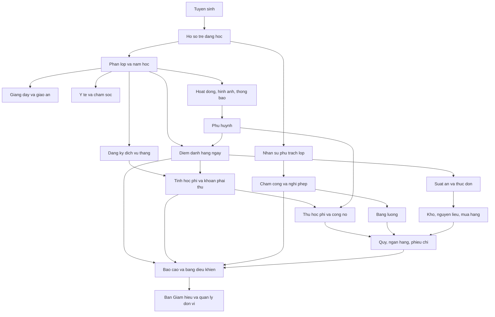

# 09. LUỒNG NGHIỆP VỤ

- Mô tả: Tổng quan các luồng nghiệp vụ chính, luồng phụ, luồng ngoại lệ. Liên kết tới thư mục 25_QUY_TRINH_NGHIEP_VU cho phần chi tiết từng quy trình.
- Phiên bản: 1.2
- Ngày cập nhật: 2026-10-09
- Trạng thái: Đã phê duyệt
- Người phê duyệt: Eric, ngày 2026-10-09

## 1. Bản đồ luồng nghiệp vụ

Bốn khối nghiệp vụ lớn, liên kết với nhau qua hai trục: trẻ và tiền.

## 2. Luồng nghiệp vụ chính

| Mã | Tên luồng | Vai trò khởi động | Đầu ra | Đặc tả chi tiết |
|---|---|---|---|---|
| LN-01 | Tiếp nhận trẻ mới và lập hồ sơ trẻ | Nhân viên tuyển sinh | Hồ sơ trẻ ở trạng thái đang học, đã phân lớp | `25_QUY_TRINH_NGHIEP_VU/QT-01_TIEP_NHAN_TRE_MOI.md` |
| LN-02 | Điểm danh, báo vắng và đón trả trẻ | Giáo viên chủ nhiệm, phụ huynh | Bản ghi điểm danh trong ngày, số trẻ có mặt thực tế | `25_QUY_TRINH_NGHIEP_VU/QT-02_DIEM_DANH_BAO_VANG.md` |
| LN-03 | Đăng ký dịch vụ và tính học phí theo tháng | Kế toán | Hóa đơn học phí của kỳ cho từng trẻ | `25_QUY_TRINH_NGHIEP_VU/QT-03_DANG_KY_DICH_VU_VA_TINH_HOC_PHI.md` |
| LN-04 | Thu học phí và quản lý công nợ phải thu | Kế toán | Phiếu thu đã phân bổ, số dư công nợ của trẻ; thủ quỹ lập phiếu thu tiền mặt, thanh toán mã QR tự lập phiếu thu | `25_QUY_TRINH_NGHIEP_VU/QT-04_THU_HOC_PHI_VA_CONG_NO.md` |
| LN-05 | Lập phiếu chi và quản lý quỹ, tài khoản ngân hàng | Kế toán, kế toán trưởng, thủ quỹ | Phiếu chi đã duyệt, số dư quỹ và ngân hàng | `25_QUY_TRINH_NGHIEP_VU/QT-05_PHIEU_CHI_VA_QUY.md` |
| LN-06 | Chấm công, nghỉ phép và tính lương | Nhân sự, kế toán | Bảng công đã chốt, bảng lương của kỳ | `25_QUY_TRINH_NGHIEP_VU/QT-06_CHAM_CONG_VA_TINH_LUONG.md` |
| LN-07 | Dặn thuốc, cấp thuốc và chăm sóc sức khỏe trẻ | Phụ huynh, nhân viên y tế | Phiếu dặn thuốc đã nhận, nhật ký cho uống thuốc | `25_QUY_TRINH_NGHIEP_VU/QT-07_DAN_THUOC_VA_CHAM_SOC_SUC_KHOE.md` |
| LN-08 | Tổ chức đưa đón trẻ — Bỏ ngày 09/10/2026: trường không có xe đưa đón (Q-62) | — | — | — |
| LN-09 | Ghi nhật ký của bé và trao đổi với phụ huynh | Giáo viên chủ nhiệm | Nhật ký trong ngày, luồng trao đổi đã ghi nhận | `25_QUY_TRINH_NGHIEP_VU/QT-09_NHAT_KY_VA_TRAO_DOI.md` |
| LN-10 | Đăng hoạt động của lớp, duyệt và công bố cho phụ huynh | Giáo viên chủ nhiệm, quản lý đơn vị | Hoạt động đã công bố kèm hình ảnh | `25_QUY_TRINH_NGHIEP_VU/QT-10_HOAT_DONG_VA_CONG_BO.md` |

## 3. Điểm nối giữa các luồng

| Điểm nối | Từ | Tới | Dữ liệu truyền |
|---|---|---|---|
| N-01 | LN-02 Điểm danh | LN-03 Tính học phí | Số ngày ăn thực tế và số ngày học thực tế của từng trẻ trong kỳ |
| N-02 | LN-02 Điểm danh | Bếp | Số suất ăn thực tế của ngày |
| N-03 | LN-03 Học phí | LN-04 Thu học phí | Danh sách khoản phải thu theo trẻ |
| N-04 | LN-04 Thu học phí | LN-05 Phiếu chi và quỹ | Số tiền đã thu, phương thức thu, tài khoản nhận |
| N-05 | LN-06 Chấm công | LN-06 Bảng lương | Bảng công đã chốt của tháng M−1, số ngày không hưởng lương, số giờ làm thêm, dùng để điều chỉnh bảng lương trả trước của tháng M (YCTD-29) |
| N-06 | LN-01 Hồ sơ trẻ | LN-07 Y tế | Thông tin dị ứng và bệnh nền của trẻ |
| N-07 | Bỏ ngày 09/10/2026: trường không có xe đưa đón (Q-62) | — | — |
| N-08 | LN-09 Nhật ký | Ứng dụng phụ huynh | Nội dung nhật ký đã công bố |
| N-09 | LN-10 Hoạt động | Ứng dụng phụ huynh | Hoạt động đã duyệt kèm hình ảnh |
| N-10 | Mọi luồng | Bảng điều khiển | Số liệu tổng hợp theo đơn vị và theo kỳ |

## 4. Luồng phụ

| Mã | Tên luồng phụ | Gắn với | Kết quả |
|---|---|---|---|
| LP-01 | Chuyển lớp trong cùng đơn vị | LN-01 | Lịch sử lớp của trẻ được ghi thêm, lớp cũ giảm sĩ số, lớp mới tăng sĩ số |
| LP-02 | Chuyển đơn vị | LN-01 | Hồ sơ trẻ đổi đơn vị, công nợ cũ phải tất toán trước khi chuyển |
| LP-03 | Cho trẻ thôi học và quyết toán | LN-04 | Trẻ chuyển trạng thái thôi học, công nợ được quyết toán và ghi nhận kết quả |
| LP-04 | Điều chỉnh hóa đơn học phí đã phát hành | LN-03 | Phiếu điều chỉnh có liên kết tới hóa đơn gốc |
| LP-05 | Đảo phiếu thu | LN-04 | Phiếu thu gốc giữ nguyên, sinh phiếu đảo chờ Ban Giám hiệu duyệt theo hạn mức; khi duyệt, công nợ của trẻ tăng trở lại |
| LP-06 | Bỏ ngày 09/10/2026: nhà trường không cho ứng lương (Q-54) | LN-06 | Không áp dụng |
| LP-07 | Đăng ký dịch vụ bổ sung giữa tháng | LN-03 | Chỉ dịch vụ không bắt buộc; Ban Giám hiệu duyệt và chọn thu cả tháng hoặc theo số ngày thực tế (BR-26) |
| LP-08 | Khám sức khỏe định kỳ theo đợt | LN-07 | Kết quả khám được ghi cho từng trẻ, phụ huynh xem được |
| LP-09 | Bỏ ngày 09/10/2026: trường không có xe đưa đón (Q-62) | — | — |
| LP-10 | Bàn giao trẻ cho người được ủy quyền | LN-02 | Ghi nhận người nhận trẻ, thời điểm, quan hệ |
| LP-11 | Cấp phát và thu hồi tài sản của lớp | P13 | Phiếu cấp phát và phiếu thu hồi có người xác nhận |
| LP-12 | Kiểm kê kho định kỳ | P13 | Chênh lệch kiểm kê được ghi nhận và có người phê duyệt |

## 5. Luồng ngoại lệ

| Mã | Tình huống | Luồng xử lý | Kết quả |
|---|---|---|---|
| LE-01 | Phụ huynh không thanh toán quá hạn | Hệ thống đưa vào danh sách nhắc nợ theo mốc ngày, gửi thông báo, chuyển quản lý đơn vị | Công nợ vẫn ghi nhận; trẻ không bị chặn đi học; nếu đơn vị bật chặn thì phụ huynh không đăng ký thêm dịch vụ được (BR-33) |
| LE-02 | Trẻ nghỉ ốm dài ngày có giấy xác nhận | Giáo viên ghi nhận nghỉ; tiền ăn tính theo ngày ăn thực tế; học phí không giảm | Khoản phải thu của kỳ có căn cứ rõ |
| LE-03 | Trẻ nhập học hoặc thôi học giữa tháng | Kế toán tính theo số ngày học thực tế, công thức tại BR-23 | Hóa đơn của kỳ phản ánh đúng số ngày |
| LE-04 | Phụ huynh gửi thuốc thiếu thông tin | Y tế từ chối nhận, hệ thống yêu cầu bổ sung | Thuốc không được đưa vào danh sách cho uống |
| LE-05 | Người đến đón trẻ không có tên trong danh sách ủy quyền | Giáo viên không bàn giao, liên hệ phụ huynh xác nhận | Trẻ chỉ được bàn giao sau khi có xác nhận |
| LE-06 | Bỏ ngày 09/10/2026: trường không có xe đưa đón (Q-62) | — | — |
| LE-07 | Chấm công và đơn nghỉ không khớp | Nhân sự đối chiếu, quản lý đơn vị xác nhận trước khi chốt công | Bảng công được chốt có căn cứ |
| LE-08 | Mất điện hoặc mất mạng trong giờ điểm danh | Ứng dụng giáo viên lưu tạm và tự gửi lại khi có mạng (Q-09); thiết bị không dùng được thì ghi tạm ra giấy, nhập bù khi có mạng | Bản ghi điểm danh có đánh dấu thời điểm nhập bù |
| LE-09 | Bình luận tiêu cực của phụ huynh trên hoạt động | Quản lý đơn vị nhận thông báo và xử lý riêng | Bình luận không bị xóa, có ghi nhận xử lý |
| LE-10 | Hóa đơn đã phát hành bị phát hiện sai | Lập phiếu điều chỉnh có lý do và người phê duyệt | Hóa đơn gốc giữ nguyên, có bản điều chỉnh kèm theo |

## 6. Thứ tự nghiệp vụ trong một ngày làm việc

Bảng dưới chỉ để tham khảo. Hệ thống không chia mốc trong ngày; nhân sự chỉ chấm công vào và ra (GD-15).

| Buổi | Việc chính | Vai trò |
|---|---|---|
| Đầu ngày | Giáo viên điểm danh trong ngày; y tế nhận thuốc | VT-07, VT-09 |
| Trong ngày | Giáo viên ghi nhật ký, đăng hoạt động; bếp chốt suất ăn; kế toán thu học phí | VT-07, VT-10, VT-04 |
| Cuối ngày | Giáo viên chốt điểm danh, bàn giao trẻ; bảo vệ xác nhận người đón tại cổng | VT-07, VT-18 |
| Cuối tháng | Nhân sự chốt công; kế toán tính học phí, phát hành khoản phải thu, lập bảng lương | VT-06, VT-04 |

## 7. Chưa xác minh được

1. Thời khóa biểu thật trong ngày của một lớp mầm non: không có tài liệu. Đã tìm trong: tám ảnh sơ đồ chức năng và danh sách tính năng.
2. Đã có câu trả lời: chốt công và chốt học phí mặc định vào ngày cuối tháng, cấu hình được theo đơn vị (Q-25).
3. Đã có câu trả lời: phiếu chi do Ban Giám hiệu duyệt theo hạn mức (BR-77); mức hạn mức cấu hình sau (Q-26, Q-112).
4. Đã bỏ ngày 09/10/2026: trường không có xe đưa đón.

## 8. Giả định và câu hỏi mở

| Mã | Nội dung | Cần ai trả lời |
|---|---|---|
| GD-15 | Không còn hiệu lực từ ngày 09/10/2026: không chia mốc trong ngày; nhân sự chỉ chấm công vào và ra | Eric |
| GD-16 | Đã xác nhận ngày 09/10/2026: nhân sự chốt bảng công; kế toán chốt học phí và tính lương | Eric |
| GD-78 | Đã xác nhận ngày 09/10/2026: Mọi luồng nghiệp vụ đều gắn với một đơn vị ở cấp thấp nhất nơi nghiệp vụ phát sinh; đơn vị cấp trên tổng hợp được nhưng không sửa dữ liệu của cấp dưới nếu không có quyền | Eric |
| Q-25 | Đã trả lời ngày 09/10/2026: chốt công và chốt học phí vào ngày cuối tháng; đây là giá trị mặc định, vẫn cấu hình được theo đơn vị (P01-08) | Eric |
| Q-26 | Đã trả lời ngày 09/10/2026: chưa có mức hạn mức, để cấu hình sau, xem Q-112 | Eric |
| Q-27 | Đã trả lời ngày 09/10/2026: không chặn trẻ đi học; mỗi đơn vị tự cấu hình có chặn đăng ký thêm dịch vụ khi còn nợ quá hạn hay không, xem BR-33 | Eric |
