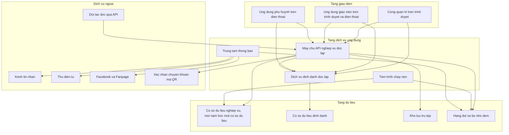
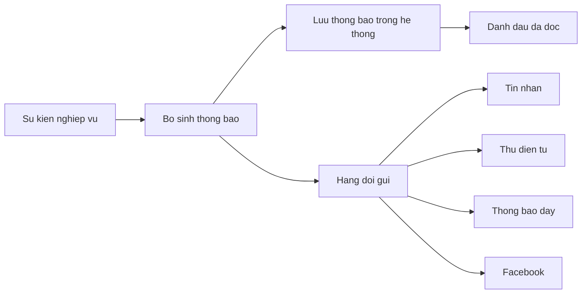

# 12. KIẾN TRÚC HỆ THỐNG

- Mô tả: Kiến trúc tổng thể, thành phần, xác thực, phân quyền, lưu trữ tệp, ghi nhật ký, giám sát, sao lưu, phục hồi, triển khai.
- Phiên bản: 1.9
- Ngày cập nhật: 2026-10-10
- Trạng thái: Đã phê duyệt
- Người phê duyệt: Eric, ngày 2026-10-09

## 1. Kiến trúc tổng thể

Kiến trúc tách biệt ba tầng: tầng giao diện, tầng dịch vụ ứng dụng và tầng dữ liệu. Tầng giao diện và tầng dịch vụ ứng dụng tách rời hoàn toàn; giao diện chỉ giao tiếp với máy chủ qua giao diện lập trình ứng dụng, không truy cập cơ sở dữ liệu.

Nguyên tắc tách tầng:

1. Ba kênh giao diện là ứng dụng chạy trên trình duyệt, không chứa mã nghiệp vụ, không chứa quy tắc tính toán, không truy cập cơ sở dữ liệu.
2. Máy chủ API nghiệp vụ là nơi duy nhất thực thi quy tắc nghiệp vụ và kiểm tra phân quyền.
3. Dịch vụ định danh tách riêng, chịu trách nhiệm xác thực, cấp phiên, quản lý tài khoản, vai trò và phạm vi đơn vị. Đây là dịch vụ tự viết, không dùng sản phẩm định danh bên ngoài và không dùng dịch vụ đám mây.
4. Giao diện chỉ giữ mã phiên ngắn hạn; không giữ khóa bí mật của dịch vụ ngoài và không gọi trực tiếp dịch vụ ngoài.
5. Dịch vụ định danh chạy tiến trình riêng và dùng cơ sở dữ liệu riêng, không theo năm học; ở giai đoạn 1 có thể đặt cùng máy chủ (Q-115, QĐ-15). Máy chủ API nghiệp vụ dùng cơ sở dữ liệu theo năm học và một cơ sở dữ liệu hệ thống nhỏ chứa danh sách cơ sở dữ liệu năm học (QĐ-17). Khóa API của đối tác nằm ở cơ sở dữ liệu định danh. Hai bên dùng tài khoản kết nối riêng.
6. Đối tác bên ngoài chỉ đọc dữ liệu qua máy chủ API nghiệp vụ bằng khóa API có phạm vi (QĐ-16), không truy cập cơ sở dữ liệu.

## 2. Thành phần

| Mã | Thành phần | Tầng | Trách nhiệm |
|---|---|---|---|
| TP-01 | Cổng quản trị | Giao diện | Giao diện cho khối quản lý, tài chính, nhân sự, vận hành. Chỉ gọi API |
| TP-02 | Ứng dụng giáo viên | Giao diện | Giao diện tác nghiệp tại lớp, dùng được trên điện thoại. Chỉ gọi API |
| TP-03 | Ứng dụng phụ huynh | Giao diện | Giao diện theo dõi con, thanh toán, trao đổi. Chỉ gọi API |
| TP-04 | Máy chủ API nghiệp vụ | Dịch vụ ứng dụng | Kiểm tra dữ liệu, thực thi quy tắc nghiệp vụ, phân quyền ba lớp, phục vụ mọi điểm cuối nghiệp vụ. Một máy chủ duy nhất, chia mô đun bên trong |
| TP-11 | Dịch vụ định danh | Dịch vụ ứng dụng | Đăng ký, đăng nhập, cấp và thu hồi phiên, quản lý tài khoản, vai trò và phạm vi đơn vị. Tách riêng khỏi máy chủ API nghiệp vụ |
| TP-05 | Tiến trình chạy nền | Dịch vụ ứng dụng | Tính học phí, tính lương, kiểm tra công nợ quá hạn, tổng hợp báo cáo, xử lý tệp |
| TP-06 | Trung tâm thông báo | Dịch vụ ứng dụng | Sinh thông báo theo sự kiện, phân phối theo kênh, ghi nhận trạng thái đã đọc |
| TP-07 | Cơ sở dữ liệu quan hệ | Dữ liệu | Lưu toàn bộ dữ liệu nghiệp vụ, có ràng buộc và chỉ mục |
| TP-08 | Kho lưu trữ tệp | Dữ liệu | Hình ảnh hoạt động, chứng từ, tệp đính kèm |
| TP-09 | Hàng đợi và bộ nhớ đệm | Dữ liệu | Xử lý tác vụ dài, giảm tải truy vấn đọc nhiều |
| TP-10 | Cổng tích hợp ngoài | Dịch vụ ứng dụng | Tin nhắn, thư điện tử, xác nhận chuyển khoản mã QR; ở giai đoạn 3 thêm Facebook, Zalo, kết nối cơ sở dữ liệu ngành của Bộ Giáo dục và Đào tạo. Chỉ máy chủ API và trung tâm thông báo được gọi. Nhà cung cấp tin nhắn và dịch vụ xác nhận chuyển khoản (trung gian hoặc ngân hàng trực tiếp) cấu hình được, mỗi loại dùng một lớp kết nối chung |

Ranh giới bắt buộc: TP-01, TP-02 và TP-03 không chứa quy tắc nghiệp vụ. Mọi quy tắc tính học phí, tính lương, hạn mức phê duyệt và kiểm tra quyền đều nằm ở TP-04 và TP-11.

## 3. Mô hình nhiều đơn vị

Ba phương án, chọn theo mức độ tách biệt dữ liệu và chi phí vận hành.

| Phương án | Cách làm | Ưu điểm | Nhược điểm |
|---|---|---|---|
| A. Một cơ sở dữ liệu, tách bằng cột đơn vị | Mọi bảng có cột đơn vị, kiểm tra ở tầng truy vấn | Chi phí thấp, báo cáo hợp nhất đơn giản, nâng cấp một lần | Cần kỷ luật kiểm tra đơn vị ở mọi truy vấn; rủi ro rò dữ liệu nếu sót |
| B. Một cơ sở dữ liệu, tách bằng lược đồ theo đơn vị | Mỗi đơn vị một lược đồ riêng | Tách biệt rõ hơn, ít rủi ro sót điều kiện | Nâng cấp phải chạy nhiều lần, báo cáo hợp nhất phức tạp |
| C. Mỗi đơn vị một cơ sở dữ liệu | Tách hoàn toàn | Tách biệt cao nhất | Chi phí và độ phức tạp vận hành cao nhất, báo cáo hợp nhất khó |

**Đã chốt ngày 09/10/2026:** phương án A kèm ràng buộc bắt buộc ở tầng dữ liệu để chống sót điều kiện đơn vị, ví dụ chính sách bảo vệ ở mức bản ghi và chỉ mục bắt buộc trên cột `org_unit_id`.

Theo QĐ-15, mỗi năm học có một cơ sở dữ liệu nghiệp vụ riêng. Khi mở năm học mới, hệ thống tạo cơ sở dữ liệu năm học và chuyển sang dữ liệu dùng chung: cây đơn vị, trẻ đang học, phụ huynh, nhân sự, hợp đồng còn hiệu lực, danh mục, cấu hình, số dư công nợ chưa tất toán, số dư quỹ và tài khoản. Cơ sở dữ liệu năm học đã đóng chuyển sang chỉ đọc. Báo cáo nhiều năm đọc từ nhiều cơ sở dữ liệu năm học.

Quy tắc phạm vi đơn vị (QĐ-23): người dùng được gán ở Trường chính có quyền toàn trường; người dùng được gán ở một Phân hiệu hoặc Điểm trường chỉ có quyền ở đơn vị đó. Người cần quyền ở nhiều đơn vị cấp 2 được gán ở từng đơn vị.

## 4. Xác thực

Xác thực do dịch vụ định danh đảm nhiệm, tách khỏi máy chủ API nghiệp vụ.

| Mã | Nội dung |
|---|---|
| XT-01 | Đăng nhập bằng số điện thoại hoặc tên đăng nhập kèm mật khẩu, thực hiện tại dịch vụ định danh. Phụ huynh có thêm cách đăng nhập bằng số điện thoại và mã một lần gửi qua tin nhắn |
| XT-02 | Cấp phiên ngắn hạn kèm mã làm mới; mã làm mới thu hồi được khi cần. Mã phiên hết hạn sau 15 phút; mã làm mới hết hạn sau 8 giờ với cổng quản trị, 30 ngày với ứng dụng giáo viên và phụ huynh |
| XT-03 | Tài khoản phụ huynh tạo với mật khẩu mặc định chung toàn trường do Hiệu trưởng đặt, lưu dạng băm ở dịch vụ định danh; bắt buộc đổi mật khẩu ở lần đăng nhập đầu; kích hoạt là đăng nhập bằng mật khẩu mặc định rồi đổi mật khẩu (YCTD-43) |
| XT-04 | Mật khẩu lưu dưới dạng băm có muối, không lưu bản rõ |
| XT-05 | Sai mật khẩu 5 lần liên tiếp thì tạm khóa tài khoản 15 phút rồi tự mở; giới hạn 10 yêu cầu đăng nhập mỗi phút trên một địa chỉ mạng (YCTD-35) |
| XT-06 | Mọi yêu cầu tới máy chủ API nghiệp vụ đều kiểm tra phiên còn hiệu lực: kiểm tra chữ ký của mã bằng khóa công khai, sau đó hỏi dịch vụ định danh vai trò và quyền hiện hành qua `GET /api/v1/auth/me` (QĐ-20, QĐ-22) |
| XT-07 | Bỏ ngày 09/10/2026: không dùng xác thực hai lớp (YCTD-31); Hiệu trưởng, Phó Hiệu trưởng, kế toán trưởng và quản trị nền tảng đăng nhập bằng mật khẩu như các vai trò khác |
| XT-08 | Dịch vụ định danh phát hành mã có thời hạn ngắn; máy chủ API nghiệp vụ không lưu mật khẩu và không tự xác thực mật khẩu |
| XT-09 | Mã một lần gồm sáu chữ số, chỉ dùng một lần; mặc định hết hạn sau 5 phút, nhập sai tối đa 5 lần, gửi tối đa 5 lần mỗi giờ cho một số điện thoại, Hiệu trưởng sửa được (YCTD-43); gửi qua lớp gửi tin nhắn của dịch vụ định danh, nối nhà cung cấp thật khi có tài khoản ở việc T1 |

## 5. Phân quyền

Ba lớp kiểm tra, thực hiện ở máy chủ API nghiệp vụ tại mọi yêu cầu:

1. **Vai trò.** Vai trò quyết định nhóm chức năng được gọi. Danh sách vai trò do dịch vụ định danh cung cấp.
2. **Đơn vị.** Người dùng chỉ truy cập dữ liệu của đơn vị được gán và các đơn vị cấp dưới trực thuộc, trừ Hiệu trưởng, cán bộ quản lý cấp trên và kiểm toán viên ở phạm vi toàn trường. Quản trị nền tảng chỉ thao tác cấu hình kỹ thuật, không xem dữ liệu nghiệp vụ.
3. **Bản ghi.** Giáo viên chỉ tới lớp được phân công; tổ trưởng chuyên môn chỉ tới lớp thuộc tổ; phụ huynh chỉ tới trẻ có quan hệ; bảo vệ chỉ tới danh sách đón trả của đơn vị được gán.

Cơ chế bắt buộc: mọi truy vấn dữ liệu nghiệp vụ phải đi qua tầng kiểm tra phạm vi, không viết truy vấn trực tiếp trong tầng giao diện. Tầng giao diện không có thông tin đăng nhập cơ sở dữ liệu.

Phê duyệt theo hạn mức được kiểm tra ở lớp vai trò: vai trò Phó Hiệu trưởng chỉ phê duyệt được chứng từ dưới hạn mức cấu hình; chứng từ từ hạn mức trở lên, chứng từ thuộc loại chưa cấu hình hạn mức và phiếu chi hoàn tiền khi trẻ thôi học do vai trò Hiệu trưởng phê duyệt (BR-24, BR-77 đến BR-80, Q-112).

## 6. Lưu trữ tệp

| Loại tệp | Nơi lưu | Quy tắc |
|---|---|---|
| Hình ảnh hoạt động | Kho lưu trữ tệp | Nén trước khi lưu, sinh nhiều kích thước hiển thị, xóa mềm khi hoạt động bị xóa |
| Chứng từ phiếu thu, phiếu chi | Kho lưu trữ tệp | Không cho sửa hoặc thay thế sau khi phiếu phát hành, chỉ thêm tệp mới |
| Tệp đính kèm trao đổi | Kho lưu trữ tệp | Giới hạn định dạng và dung lượng |
| Tệp xuất báo cáo | Kho lưu trữ tệp | Có thời hạn lưu, ghi nhật ký ai đã xuất |

Truy cập tệp phải qua đường dẫn có thời hạn, không để đường dẫn công khai vĩnh viễn.

## 7. Ghi nhật ký

| Loại nhật ký | Nội dung | Thời gian lưu |
|---|---|---|
| Nhật ký thao tác | Người thực hiện, thời điểm, đối tượng, hành động, giá trị trước, giá trị sau | Tối thiểu hai mươi bốn tháng |
| Nhật ký truy cập dữ liệu nhạy cảm | Ai đọc dữ liệu sức khỏe, dữ liệu tài chính, hồ sơ trẻ; luôn ghi khi đối tác đọc dữ liệu cá nhân qua API và khi xem đầy đủ số định danh (BR-73) | Tối thiểu hai mươi bốn tháng |
| Nhật ký xuất dữ liệu | Ai xuất, loại dữ liệu, bộ lọc, thời điểm | Tối thiểu hai mươi bốn tháng |
| Nhật ký lỗi hệ thống | Lỗi, thời điểm, đường dẫn yêu cầu, mã tương quan | Tối thiểu sáu tháng |

## 8. Thông báo

Kênh gửi và loại sự kiện cấu hình được theo đơn vị. Thông báo quan trọng bắt buộc ghi nhận trạng thái đã đọc theo từng người nhận.

## 9. Tiến trình chạy nền

| Mã | Tác vụ | Tần suất | Ghi chú |
|---|---|---|---|
| CB-01 | Tính học phí theo kỳ và đơn vị | Theo yêu cầu | Chạy theo lô, ghi trạng thái từng lô, cho chạy lại |
| CB-02 | Tính bảng lương theo kỳ | Theo yêu cầu, đầu mỗi tháng | Chỉ chạy khi bảng công của tháng trước đã chốt (BR-43, YCTD-29) |
| CB-03 | Kiểm tra công nợ quá hạn và gửi nhắc nợ | Hằng ngày | Theo mốc cấu hình của đơn vị |
| CB-04 | Bỏ ngày 09/10/2026: trường không có xe đưa đón (Q-62) | — | — |
| CB-05 | Nhắc giáo viên chưa ghi nhật ký | Hằng ngày | Theo giờ cấu hình |
| CB-06 | Tổng hợp số liệu bảng điều khiển | Hằng giờ | Lưu sẵn số liệu tổng hợp để đọc nhanh |
| CB-07 | Gửi lại thông báo thất bại | Mỗi mười lăm phút | Có giới hạn số lần thử |
| CB-08 | Sao lưu dữ liệu | Hằng ngày | Kèm kiểm tra phục hồi định kỳ hằng tháng |
| CB-09 | Khóa tài khoản hết hiệu lực | Hằng ngày | Khóa tài khoản kiểm toán viên quá ngày hết hiệu lực (BM-68) và tài khoản không dùng quá số ngày cấu hình (PQ-07) |
| CB-10 | Mở năm học mới | Theo yêu cầu | Tạo cơ sở dữ liệu năm học, chuyển dữ liệu dùng chung, chuyển cơ sở dữ liệu năm cũ sang chỉ đọc (QĐ-15) |

## 10. Giám sát

1. Theo dõi thời gian phản hồi của các điểm cuối quan trọng: điểm danh, tính học phí, thu học phí, bảng điều khiển.
2. Cảnh báo khi tác vụ chạy nền thất bại hoặc chạy quá thời gian cấu hình.
3. Cảnh báo khi hàng đợi gửi thông báo tồn đọng vượt ngưỡng.
4. Theo dõi tỷ lệ lỗi xác thực và số lần đăng nhập sai bất thường.
5. Bảng theo dõi tình trạng hệ thống dành cho quản trị nền tảng.

## 11. Sao lưu và phục hồi

| Mã | Nội dung |
|---|---|
| SL-01 | Sao lưu toàn bộ hằng ngày, giữ tối thiểu ba mươi ngày; gồm cơ sở dữ liệu định danh, cơ sở dữ liệu hệ thống, cơ sở dữ liệu năm học đang dùng và kho tệp; cơ sở dữ liệu năm học đã đóng sao lưu một lần khi đóng và giữ lâu dài |
| SL-02 | Sao lưu tăng dần mỗi giờ với dữ liệu tài chính |
| SL-03 | Kiểm tra phục hồi định kỳ hằng tháng trên môi trường tách biệt, có ghi biên bản |
| SL-04 | Khôi phục hoạt động trong 4 giờ kể từ khi sự cố, mất tối đa dữ liệu của 1 giờ gần nhất |
| SL-05 | Bản sao lưu phải được mã hóa và không đặt cùng nơi với máy chủ chính |

## 12. Triển khai

| Môi trường | Mục đích | Dữ liệu |
|---|---|---|
| Phát triển | Lập trình và thử nhanh | Dữ liệu mẫu |
| Thử nghiệm | Kiểm thử chức năng, kiểm thử nghiệm thu | Dữ liệu mẫu gần với thật |
| Chạy thật | Vận hành | Dữ liệu thật |

Ba môi trường tách biệt về cơ sở dữ liệu, kho tệp và cấu hình kênh thông báo. Không dùng dữ liệu thật trên môi trường phát triển và thử nghiệm.

Thứ tự dựng (YCTD-32): môi trường phát triển chạy Docker trên máy cục bộ từ đợt DT-00; tích hợp liên tục trên GitHub Actions chỉ chạy kiểm thử; môi trường thử nghiệm và chạy thật dựng trên máy chủ đám mây trong nước khi triển khai (việc T6).

## 13. Quyết định kiến trúc

| Mã | Quyết định | Trạng thái |
|---|---|---|
| QĐ-01 | Dùng một máy chủ ứng dụng cho cả ba kênh, không tách dịch vụ theo kênh | Đã chốt ngày 2026-10-09; cùng nội dung với QĐ-07 |
| QĐ-02 | Chọn phương án A ở mục 3 cho mô hình nhiều đơn vị | Đã chốt ngày 2026-10-09; điều chỉnh bởi QĐ-15 |
| QĐ-03 | Dùng hàng đợi cho mọi tác vụ dài thay vì chạy đồng bộ trong yêu cầu | Đã chốt ngày 2026-10-09 |
| QĐ-04 | Ứng dụng phụ huynh và giáo viên làm dạng web chạy trên trình duyệt điện thoại ở giai đoạn 1; bản cài riêng để giai đoạn 3 | Đã chốt ngày 2026-10-09 |
| QĐ-05 | Không dùng cơ chế sự kiện ở mức cơ sở dữ liệu cho nghiệp vụ; mọi nghiệp vụ đi qua tầng ứng dụng | Đã chốt ngày 2026-10-09 |
| QĐ-06 | Tách hoàn toàn tầng giao diện và tầng máy chủ; giao diện chỉ gọi giao diện lập trình ứng dụng, không truy cập cơ sở dữ liệu | Đã chốt theo yêu cầu ngày 2026-10-09 |
| QĐ-07 | Xây dựng một máy chủ API nghiệp vụ độc lập duy nhất, chia mô đun bên trong, không tách thành nhiều dịch vụ theo miền nghiệp vụ | Đã chốt theo yêu cầu ngày 2026-10-09 |
| QĐ-08 | Xây dựng dịch vụ định danh độc lập tự viết, không dùng sản phẩm định danh bên ngoài và không dùng dịch vụ đám mây cho xác thực | Đã chốt theo yêu cầu ngày 2026-10-09 |
| QĐ-09 | Đơn vị tổ chức ba cấp Trường chính, Phân hiệu, Điểm trường; cả ba cấp đều có thể có lớp; một trẻ gắn với đúng một đơn vị ở cấp thấp nhất nơi trẻ học | Thay bằng QĐ-14 ngày 2026-10-09 |
| QĐ-10 | Ban Giám hiệu tách thành hai vai trò Hiệu trưởng và Phó Hiệu trưởng kèm hạn mức phê duyệt | Đã chốt theo yêu cầu ngày 2026-10-09 |
| QĐ-11 | Bộ công nghệ TypeScript, NestJS, React kèm Vite, PostgreSQL, Redis, Docker theo `13_CONG_NGHE_SU_DUNG.md` mục 2 | Đã chốt ngày 2026-10-09 |
| QĐ-12 | Hạ tầng thuê máy chủ đám mây của nhà cung cấp trong nước; dữ liệu lưu tại Việt Nam | Đã chốt ngày 2026-10-09 |
| QĐ-13 | Mã nguồn quản lý bằng Git trên GitHub, kho riêng; tích hợp và triển khai tự động dựng ngay từ đợt DT-00 | Đã chốt ngày 2026-10-09 |
| QĐ-14 | Đơn vị tổ chức là cây không giới hạn cấp; nhãn mặc định Trường chính, Phân hiệu, Điểm trường; đơn vị ở cấp nào cũng có thể có lớp; trẻ gắn với đơn vị của lớp trẻ đang học | Thay bằng QĐ-23 ngày 2026-10-09 |
| QĐ-15 | Mỗi năm học một cơ sở dữ liệu nghiệp vụ; trong mỗi cơ sở dữ liệu vẫn tách đơn vị bằng `org_unit_id` theo phương án A; dịch vụ định danh dùng một cơ sở dữ liệu riêng không theo năm học | Đã chốt ngày 2026-10-09 |
| QĐ-16 | Mở API chỉ đọc cho đối tác ngay giai đoạn 1, xác thực bằng khóa riêng có phạm vi dữ liệu | Đã chốt ngày 2026-10-09 |
| QĐ-17 | Bảng không theo năm học: khóa API đối tác đặt ở cơ sở dữ liệu định danh; danh sách cơ sở dữ liệu năm học đặt ở một cơ sở dữ liệu hệ thống riêng của máy chủ API; khi mở năm học giữ nguyên mã định danh của bản ghi chuyển sang | Đã chốt ngày 2026-10-09 |
| QĐ-18 | Truy cập dữ liệu và chạy tệp thay đổi cấu trúc dùng Kysely trên PostgreSQL (YCTD-33) | Đã chốt ngày 2026-10-09 |
| QĐ-19 | Nhánh `main` được bảo vệ; mỗi việc làm trên một nhánh riêng, gộp vào `main` qua yêu cầu gộp khi kiểm thử đạt và Eric duyệt (YCTD-33) | Đã chốt ngày 2026-10-09 |
| QĐ-20 | Máy chủ API hỏi dịch vụ định danh vai trò và quyền hiện hành ở mọi yêu cầu, không lưu bộ nhớ đệm, để thu hồi quyền có hiệu lực ngay (PQ-04, YCTD-34) | Đã chốt ngày 2026-10-09 |
| QĐ-21 | Tài khoản kết nối của máy chủ API có quyền tạo cơ sở dữ liệu để mở năm học; không có quyền quản trị toàn hệ thống (YCTD-34) | Đã chốt ngày 2026-10-09 |
| QĐ-22 | Mã phiên ký bằng khóa bất đối xứng Ed25519; dịch vụ định danh giữ khóa bí mật, máy chủ API chỉ giữ khóa công khai (YCTD-34) | Đã chốt ngày 2026-10-09 |
| QĐ-23 | Đơn vị tổ chức là cây hai cấp: cấp 1 là Trường chính, chỉ một đơn vị; cấp 2 là Phân hiệu hoặc Điểm trường, chọn loại cho từng đơn vị, trực thuộc thẳng Trường chính; nhãn cố định; cả hai cấp có lớp; trẻ gắn với đơn vị của lớp trẻ đang học (YCTD-38) | Đã chốt ngày 2026-10-09 |

## 14. Chưa xác minh được

1. Quy mô: dưới 1 000 trẻ, khoảng 100 người dùng đồng thời (Q-31). Số đơn vị, số nhân sự, số giao dịch mỗi ngày: chưa có thông tin.
2. Đã có câu trả lời: thuê máy chủ đám mây của nhà cung cấp trong nước (Q-74). Người vận hành: chưa có thông tin.
3. Đã có câu trả lời: khôi phục trong 4 giờ, mất tối đa dữ liệu của 1 giờ (Q-75).
4. Đã có câu trả lời: dữ liệu lưu tại Việt Nam (Q-76).
5. Ngân sách hạ tầng hằng tháng. Không có thông tin.
6. Số lượng Phân hiệu và Điểm trường thực tế: chưa có thông tin. Không tách máy chủ theo đơn vị hay theo kênh (Q-78, QĐ-02).

## 15. Giả định và câu hỏi mở

| Mã | Nội dung | Cần ai trả lời |
|---|---|---|
| GD-40 | Đã xác nhận ngày 09/10/2026: hệ thống triển khai trên máy chủ đám mây trong nước, có môi trường thử nghiệm tách biệt | Eric |
| GD-41 | Đã xác nhận ngày 09/10/2026: Mọi tác vụ tính toán lớn chạy nền, không chặn giao diện | Eric |
| GD-63 | Đã xác nhận ngày 09/10/2026 (theo QĐ-06): Tầng giao diện và tầng máy chủ triển khai tách biệt, giao tiếp qua giao diện lập trình ứng dụng có phiên bản | Eric |
| GD-64 | Không còn hiệu lực từ ngày 09/10/2026: dịch vụ định danh dùng cơ sở dữ liệu riêng (Q-115, QĐ-15) | Eric |
| Q-74 | Đã trả lời ngày 09/10/2026: thuê máy chủ đám mây của nhà cung cấp trong nước | Eric |
| Q-75 | Đã trả lời ngày 09/10/2026: khôi phục hoạt động trong 4 giờ, mất tối đa dữ liệu của 1 giờ gần nhất | Eric |
| Q-76 | Đã trả lời ngày 09/10/2026: dữ liệu lưu tại Việt Nam | Eric |
| Q-77 | Đã trả lời ngày 09/10/2026: chọn phương án A | Eric |
| Q-78 | Đã trả lời ngày 09/10/2026: không tách máy chủ riêng cho ứng dụng phụ huynh | Eric |
| Q-115 | Đã trả lời ngày 09/10/2026: dịch vụ định danh chạy tiến trình và cơ sở dữ liệu riêng, có thể cùng máy chủ ở giai đoạn 1 | Eric |
| Q-116 | Đã trả lời ngày 09/10/2026: không làm đăng nhập một lần; một tài khoản đăng nhập được vào kênh phù hợp vai trò | Eric |
