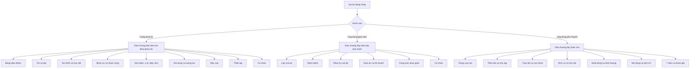

# 14. ĐẶC TẢ GIAO DIỆN

- Mô tả: Danh sách màn hình, điều hướng, bố cục, thành phần, dữ liệu hiển thị, thao tác, trạng thái, thông báo, xử lý lỗi, quyền hiển thị, khả năng thích ứng màn hình.
- Phiên bản: 1.24
- Ngày cập nhật: 2026-10-11
- Trạng thái: Đã phê duyệt
- Người phê duyệt: Eric, ngày 2026-10-09

## 1. Cấu trúc thông tin

Ba kênh, ba cấu trúc điều hướng khác nhau, dùng chung một hệ thống thiết kế.

## 2. Danh sách màn hình theo kênh

### 2.1 Cổng quản trị

| Mã | Màn hình | Vai trò chính |
|---|---|---|
| MH-01 | Bảng điều khiển trên trang chủ: số trẻ, lớp, nhân sự, học phí tháng, công nợ, tỷ lệ đi học; sinh nhật trẻ trong tháng (YCTD-62) | VT-02, VT-15, VT-03; sinh nhật cho cả giáo viên |
| MH-02 | Danh sách trẻ và hồ sơ trẻ | VT-03, VT-04, VT-12 |
| MH-03 | Danh sách lớp, phân công giáo viên và phân lớp (YCTD-44) | VT-03 |
| MH-04 | Biểu phí và danh mục dịch vụ: dịch vụ, biểu phí theo phiên bản, loại miễn giảm (YCTD-49) | VT-04, VT-02 |
| MH-05 | Đăng ký dịch vụ theo kỳ: bảng trẻ nhân dịch vụ, đăng ký học hè, chốt danh sách; duyệt đăng ký trễ và hủy trễ (YCTD-50) | VT-04, VT-15, VT-02 |
| MH-06 | Học phí: tính học phí kỳ, bảng hóa đơn kèm dòng cần kiểm tra, phát hành, hóa đơn bổ sung (YCTD-51) | VT-04 |
| MH-07 | Miễn giảm và học phí đặc biệt: lập miễn giảm và phiếu điều chỉnh trong chi tiết hóa đơn của MH-06; trang Duyệt miễn giảm và điều chỉnh cho Ban Giám hiệu (YCTD-52) | VT-04, VT-05, VT-15, VT-02 |
| MH-08 | Danh sách công nợ, nhắc nợ và xử lý công nợ quá hạn: phần 5d-1 có danh sách công nợ theo trẻ (phải thu, đã thu, còn lại, số dư có, quá hạn), chi tiết của trẻ có lịch sử phiếu thu, biểu mẫu lập phiếu thu và nút dùng số dư có (YCTD-53) | VT-04, VT-03, VT-15, VT-02, VT-05, VT-16 |
| MH-09 | Phiếu thu và màn hình phân bổ: danh sách phiếu thu lọc theo đơn vị và ngày; lập phiếu thu và phân bổ trong chi tiết công nợ của trẻ ở MH-08 (YCTD-53); lập phiếu đảo kèm lý do; Ban Giám hiệu duyệt hoặc từ chối phiếu đảo chờ duyệt (YCTD-54); giao dịch chuyển khoản chờ xử lý (YCTD-57) | VT-04, VT-05, VT-16, VT-15, VT-02 |
| MH-10 | Phiếu chi và phê duyệt: biểu mẫu lập phiếu chi kèm chứng từ, lưu nháp hoặc trình duyệt; danh sách phiếu chi; mục phiếu chi chờ duyệt cho Ban Giám hiệu (YCTD-55); lập phiếu đảo trên phiếu đã phát hành và mục phiếu đảo phiếu chi chờ duyệt (YCTD-56) | VT-04, VT-05, VT-16, VT-15, VT-02 |
| MH-11 | Sổ quỹ và tài khoản ngân hàng: trang Quỹ và ngân hàng để khai báo và xem số dư (YCTD-53), chọn tài khoản nhận thanh toán trực tuyến (YCTD-57); trang Sổ quỹ theo quỹ hoặc tài khoản và khoảng ngày, có số dư đầu kỳ, từng phiếu, tổng thu, tổng chi, số dư cuối kỳ (YCTD-55) | VT-04, VT-05, VT-16 |
| MH-12 | Hồ sơ nhân sự và hợp đồng: danh sách theo đơn vị, tìm theo tên hoặc mã; thêm hồ sơ; chi tiết có liên kết tài khoản, lập và chấm dứt hợp đồng (YCTD-58) | VT-06, VT-02, VT-15, VT-03, VT-04, VT-05 |
| MH-13 | Chấm công: bảng chấm công của đơn vị theo tháng, nhập và sửa giờ, chốt bảng công, đề nghị và duyệt mở lại kỳ công; đơn nghỉ của đơn vị (YCTD-59) | VT-06, VT-15, VT-02, VT-03, VT-04, VT-05 |
| MH-14 | Đơn nghỉ phép | VT-06, VT-03 |
| MH-15 | Bảng lương toàn trường theo tháng: tính, trình, duyệt, trả lại; phiếu từng người kèm căn cứ; danh sách chưa tính lương (YCTD-60); lập phiếu chi lương (YCTD-61) | VT-04, VT-05, VT-06, VT-20, VT-15, VT-02 |
| MH-16 | Hồ sơ sức khỏe và đợt khám | VT-09 |
| MH-17 | Yêu cầu dặn thuốc và cho uống thuốc | VT-09 |
| MH-18 | Thực đơn và định lượng nguyên liệu | VT-10 |
| MH-19 | Suất ăn theo ngày và buffet theo dịp | VT-10 |
| MH-20 | Tài sản, mượn trả, hỏng và mất | VT-11 |
| MH-21 | Đề nghị mua hàng, phiếu mua hàng, nhà cung cấp | VT-11, VT-04 |
| MH-22 | Nhập xuất tồn kho và kiểm kê | VT-11 |
| MH-23 | Danh sách hoạt động và duyệt hoạt động | VT-03 |
| MH-24 | Tin tức, thư viện, thông báo | VT-03 |
| MH-25 | Bình chọn, biểu quyết, khảo sát và kết quả | VT-03 |
| MH-26 | Hồ sơ tuyển sinh và xét duyệt | VT-12, VT-03 |
| MH-27 | Tuyển dụng: tin, ứng viên, phỏng vấn | VT-06 |
| MH-28 | Báo cáo theo phân hệ: học phí, công nợ, thu chi, điểm danh, chấm công, học thứ 7; mỗi báo cáo một thẻ theo quyền (YCTD-62) | VT-02, VT-15, VT-03, VT-04, VT-05, VT-06, VT-07, VT-08, VT-19, VT-20 |
| MH-29 | Báo cáo hợp nhất nhiều đơn vị | VT-02, VT-15, VT-19 |
| MH-30 | Tài khoản, vai trò, quyền, cấu hình đơn vị | VT-02, VT-03 |
| MH-31 | Nhật ký thao tác | VT-02, VT-03 |
| MH-32 | Cây đơn vị tổ chức hai cấp, dạng cây và danh sách phẳng lọc theo loại (YCTD-38) | VT-02 |
| MH-33 | Hạn mức phê duyệt theo đơn vị và loại chứng từ | VT-02 |
| MH-34 | Danh mục phòng học và bậc học | VT-02, VT-03 |
| MH-35 | Đồ bị mất của trẻ | VT-03 |
| MH-36 | Hoạt động ngoại khóa và danh sách đăng ký | VT-03, VT-04 |
| MH-37 | Ngày lễ và lịch bù: ngày nghỉ lễ, ngày học bù thứ bảy, ngày nghỉ bù theo năm (YCTD-59) | VT-06 gán ở Trường chính (ngày nghỉ lễ), VT-02, VT-15 (học bù và nghỉ bù); mọi người xem |
| MH-38 | Phiếu đi chợ và nhà cung cấp thực phẩm | VT-10 |
| MH-39 | Khoản mục và nhóm thu chi | VT-04, VT-05 |
| MH-40 | Nhập dữ liệu ban đầu từ Excel và nhập mã định danh ngành từ tệp; kế toán nhập công nợ đầu kỳ (YCTD-54); nhân sự nhập hồ sơ nhân sự (YCTD-58) | VT-02, VT-04, VT-06, VT-12, VT-03 |
| MH-41 | Giao dịch chuyển khoản trực tuyến cần xử lý | VT-04 |
| MH-42 | Khóa API của đối tác | VT-02 |
| MH-43 | Mở năm học mới và chuyển dữ liệu | VT-02 |
| MH-44 | Cá nhân: chấm công và đơn nghỉ của tôi, phiếu lương của tôi, công việc được giao | Mọi nhân sự dùng cổng quản trị |
| MH-45 | Lịch năm học: học kỳ, kỳ hè, ngày học trong tuần, danh sách tuần và tuần nghỉ | VT-02 |
| MH-46 | Đăng ký học hè theo tháng | VT-04 |
| MH-47 | Đăng nhập, dùng chung cho ba kênh (YCTD-36) | Mọi vai trò |
| MH-48 | Đổi mật khẩu, kể cả khi bắt buộc đổi ở lần đăng nhập đầu hoặc sau khi được đặt lại (YCTD-36) | Mọi vai trò |
| MH-49 | Phòng ban dạng cây và chức danh theo đơn vị (YCTD-42) | VT-02, VT-06 |
| MH-50 | Danh mục dùng chung: chọn loại, thêm, sửa, ngừng sử dụng mục (YCTD-42) | VT-02 |
| MH-51 | Điểm danh của lớp theo ngày: xem, chốt thay, sửa sau khi chốt kèm lý do, mở lại (YCTD-47) | VT-03, VT-02, VT-15 |
| MH-52 | Quy định phép năm theo chức danh và thâm niên; số ngày phép năm của nhân sự trong đơn vị, chỉnh kèm lý do (YCTD-59) | VT-06, VT-02, VT-15, VT-03, VT-04, VT-05 |
| MH-53 | Danh mục lương và biểu thuế: phụ cấp, thưởng, khấu trừ chung toàn trường; các phiên bản biểu thuế thu nhập cá nhân (YCTD-60) | VT-04, VT-05, người xem bảng lương |
| MH-54 | Quyết toán và điều chỉnh lương: hợp đồng đã chấm dứt, bảng quyết toán, trình và duyệt, phiếu chi quyết toán, phiếu thu thu hồi lương; khoản điều chỉnh lương kỳ sau (YCTD-61) | VT-04, VT-15, VT-02, người xem bảng lương |

### 2.2 Ứng dụng giáo viên

| Mã | Màn hình | Vai trò chính |
|---|---|---|
| MG-01 | Lớp của tôi hôm nay | VT-07 |
| MG-02 | Bảng điểm danh của lớp | VT-07 |
| MG-03 | Nhật ký của bé theo ngày | VT-07 |
| MG-04 | Đón trả trẻ: chọn người đón, ảnh bàn giao tùy chọn, trạng thái chờ phụ huynh xác nhận (YCTD-48) | VT-07 |
| MG-05 | Giáo án, bài học, thời khóa biểu | VT-07, VT-08 |
| MG-06 | Tiến độ và kế hoạch giảng dạy | VT-07 |
| MG-07 | Tạo hoạt động và album hình ảnh | VT-07, VT-08 |
| MG-08 | Trao đổi với phụ huynh | VT-07 |
| MG-09 | Yêu cầu dặn thuốc của lớp; nhận thuốc và ghi liều khi đơn vị không có nhân viên y tế; chăm sóc hằng ngày | VT-07 |
| MG-10 | Chấm công hôm nay, đơn nghỉ phép và số ngày phép của tôi (YCTD-59) | Mọi nhân sự dùng ứng dụng giáo viên |
| MG-11 | Phiếu lương của tôi: phiếu đã duyệt, từng dòng kèm căn cứ (YCTD-60) | Mọi nhân sự dùng ứng dụng giáo viên |
| MG-12 | Công việc được giao và kế hoạch | Mọi nhân sự dùng ứng dụng giáo viên |
| MG-13 | Lịch đưa đón của tuyến — Bỏ ngày 09/10/2026: trường không có xe đưa đón (Q-62) | — |
| MG-14 | Suất ăn và báo cơm của lớp | VT-10, VT-07 |
| MG-15 | Đồ bị mất của lớp | VT-07 |
| MG-16 | Xác nhận người đón tại cổng: tìm trẻ trong đơn vị, xác nhận người được đón (YCTD-48) | VT-18 |
| MG-17 | Duyệt giáo án của tổ | VT-17 |

### 2.3 Ứng dụng phụ huynh

| Mã | Màn hình | Vai trò chính |
|---|---|---|
| MP-01 | Trang của con | VT-14 |
| MP-02 | Điểm danh của con | VT-14 |
| MP-03 | Nhật ký của con | VT-14 |
| MP-04 | Thời khóa biểu và lịch hoạt động lớp | VT-14 |
| MP-05 | Tiến độ học tập | VT-14 |
| MP-06 | Báo vắng | VT-14 |
| MP-07 | Dặn thuốc | VT-14 |
| MP-08 | Sức khỏe, kết quả khám, chăm sóc hằng ngày; xác nhận đã biết sự kiện y tế và bỏ liều | VT-14 |
| MP-09 | Trao đổi với nhà trường | VT-14 |
| MP-10 | Góp ý | VT-14 |
| MP-11 | Học phí và công nợ: hóa đơn đã phát hành của con, chi tiết từng khoản, số còn phải nộp, hóa đơn đã thu đủ, số dư có và lịch sử đã nộp (YCTD-51, YCTD-53); nút thanh toán bằng mã QR hiện mã, tài khoản ảo, số tiền, nội dung (YCTD-57) | VT-14 |
| MP-12 | Đăng ký, hủy dịch vụ theo tháng và đăng ký học hè (YCTD-50) | VT-14 |
| MP-13 | Lịch đưa đón — Bỏ ngày 09/10/2026: trường không có xe đưa đón (Q-62) | — |
| MP-14 | Hoạt động và hình ảnh | VT-14 |
| MP-15 | Thực đơn | VT-14 |
| MP-16 | Tin tức, thông báo, thư viện, hình tô màu | VT-14 |
| MP-17 | Bình chọn, biểu quyết, khảo sát | VT-14 |
| MP-18 | Tài khoản, người được ủy quyền đón trẻ, xác nhận người đón ngoài danh sách, đồng ý sử dụng hình ảnh | VT-14 |
| MP-19 | Mất đồ | VT-14 |
| MP-20 | Hoạt động ngoại khóa | VT-14 |

## 3. Quy tắc bố cục

| Mã | Quy tắc |
|---|---|
| BC-01 | Cổng quản trị dùng điều hướng dọc ở cạnh trái, có thanh chọn đơn vị ở đầu trang |
| BC-02 | Ứng dụng giáo viên và phụ huynh dùng điều hướng dưới cùng, tối đa năm mục chính |
| BC-03 | Mọi màn hình danh sách đều có ô tìm kiếm, bộ lọc, sắp xếp và phân trang |
| BC-04 | Mọi màn hình chi tiết đều có đường dẫn quay lại danh sách và tiêu đề cố định khi cuộn |
| BC-05 | Mọi thao tác thay đổi dữ liệu đều phải có bước xác nhận khi không hoàn tác được |
| BC-06 | Thanh chọn đơn vị chỉ hiển thị với người dùng có nhiều hơn một đơn vị |
| BC-07 | Màn hình tài chính luôn hiển thị đơn vị tiền tệ và định dạng số theo tiếng Việt |
| BC-08 | Trong màn hình người dùng được phép vào, nút của thao tác không có quyền hiển thị ở trạng thái không cho thao tác kèm lý do; màn hình không có quyền thì không hiện trong điều hướng (mục 6) |

## 4. Trạng thái màn hình

Mọi màn hình phải xử lý đủ năm trạng thái sau:

| Mã | Trạng thái | Cách hiển thị |
|---|---|---|
| TT-01 | Đang tải | Khung xương giữ chỗ, không dùng vòng xoay toàn trang |
| TT-02 | Rỗng | Hình minh họa nhỏ, một câu giải thích, một nút hành động chính nếu có |
| TT-03 | Có lỗi | Thông báo lỗi cụ thể, nút thử lại, mã tương quan để tra cứu |
| TT-04 | Không có quyền | Thông báo không có quyền và gợi ý liên hệ quản lý đơn vị |
| TT-05 | Thành công | Thông báo ngắn ở góc trên, tự ẩn, có thể mở lại chi tiết |

## 5. Xử lý lỗi trên giao diện

| Mã | Loại lỗi | Cách xử lý |
|---|---|---|
| XL-01 | Lỗi kiểm tra dữ liệu | Hiển thị ngay dưới trường tương ứng, giữ nguyên dữ liệu người dùng đã nhập |
| XL-02 | Lỗi quyền | Thông báo không có quyền, không tiết lộ dữ liệu của bản ghi |
| XL-03 | Lỗi không tìm thấy | Thông báo bản ghi không tồn tại hoặc không thuộc phạm vi, kèm nút quay lại |
| XL-04 | Lỗi trùng dữ liệu | Chỉ rõ trường bị trùng và liên kết tới bản ghi đã tồn tại nếu được phép |
| XL-05 | Lỗi mạng | Giữ dữ liệu đã nhập, cho gửi lại, cảnh báo khi dữ liệu chưa được lưu; riêng điểm danh được lưu tạm trên thiết bị và tự gửi lại khi có mạng (Q-09) |
| XL-06 | Lỗi hệ thống | Thông báo chung, kèm mã tương quan, ghi nhật ký lỗi |
| XL-07 | Lỗi tác vụ chạy nền | Hiển thị trạng thái thất bại, lý do tóm tắt, nút chạy lại |

## 6. Quyền hiển thị

1. Giao diện đọc quyền từ máy chủ khi đăng nhập và cập nhật lại khi quyền thay đổi.
2. Nút không có quyền hiển thị ở trạng thái không cho thao tác, kèm lý do ngắn.
3. Màn hình không có quyền truy cập thì không hiển thị trong điều hướng.
4. Không dùng việc ẩn nút để thay thế kiểm tra quyền ở máy chủ; mọi điểm cuối đều kiểm tra độc lập.

## 7. Ranh giới với máy chủ

Ba kênh giao diện là ba ứng dụng chạy trên trình duyệt, tách hoàn toàn khỏi máy chủ.

| Mã | Quy tắc |
|---|---|
| RG-01 | Giao diện chỉ giao tiếp với máy chủ qua giao diện lập trình ứng dụng có phiên bản; không kết nối trực tiếp cơ sở dữ liệu |
| RG-02 | Giao diện không chứa quy tắc nghiệp vụ, không tự tính học phí, lương, giảm trừ hay công nợ |
| RG-03 | Giao diện không quyết định quyền; mọi quyết định quyền do máy chủ trả về và máy chủ kiểm tra lại ở từng yêu cầu |
| RG-04 | Giao diện giữ mã phiên ngắn hạn do dịch vụ định danh phát hành trong bộ nhớ của trang; mã làm mới nằm trong cookie httpOnly, mã giao diện không đọc được (BM-71); không giữ mật khẩu và không giữ khóa bí mật của dịch vụ ngoài |
| RG-05 | Gói mã dùng chung giữa các kênh chỉ chứa kiểu dữ liệu, hằng số và thành phần giao diện; không chứa truy vấn dữ liệu |
| RG-06 | Khi máy chủ trả lỗi quyền hoặc lỗi quy tắc nghiệp vụ, giao diện hiển thị nguyên văn thông điệp tiếng Việt của máy chủ, không tự diễn giải lại |

## 8. Khả năng thích ứng màn hình

| Mã | Kích thước | Quy tắc |
|---|---|---|
| TN-01 | Dưới bốn trăm tám mươi điểm ảnh | Một cột, điều hướng dưới cùng, bảng chuyển thành danh sách thẻ |
| TN-02 | Từ bốn trăm tám mươi đến một nghìn không trăm hai mươi bốn điểm ảnh | Một đến hai cột, bảng cuộn ngang có cột đầu cố định |
| TN-03 | Trên một nghìn không trăm hai mươi bốn điểm ảnh | Bố cục đầy đủ, thanh điều hướng bên trái, bảng nhiều cột |
| TN-04 | Mọi kích thước | Vùng bấm tối thiểu bốn mươi tư điểm ảnh, chữ tối thiểu mười bốn điểm ảnh |

## 9. Chưa xác minh được

1. Mong muốn cụ thể của nhà trường về giao diện và nhận diện thương hiệu. Chỉ có tám ảnh giới thiệu chức năng có màu sắc riêng. Đã tìm trong: tám ảnh sơ đồ chức năng.
2. Đã có câu trả lời: giao diện tiếng Việt, xưng hô trung tính với phụ huynh (GD-44).
3. Đã có câu trả lời: phiên bản 1.0 chưa có chế độ tối (Q-85).
4. Đã có câu trả lời: ứng dụng giáo viên ưu tiên điện thoại, vẫn dùng tốt trên máy tính (Q-84).

## 10. Giả định và câu hỏi mở

| Mã | Nội dung | Cần ai trả lời |
|---|---|---|
| GD-44 | Đã xác nhận ngày 09/10/2026: Giao diện tiếng Việt, dùng cách xưng hô trung tính với phụ huynh | Eric |
| GD-45 | Đã xác nhận ngày 09/10/2026: Danh sách màn hình ở mục 2 là đề xuất đầy đủ cho cả ba giai đoạn | Eric |
| GD-68 | Đã xác nhận ngày 09/10/2026: màn hình chọn đơn vị có dạng cây và dạng danh sách phẳng có lọc, mặc định dạng cây (Q-119) | Eric |
| Q-83 | Đã trả lời ngày 09/10/2026: chưa có; dùng bảng màu đề xuất tới khi có nhận diện chính thức | Eric |
| Q-84 | Đã trả lời ngày 09/10/2026: ứng dụng giáo viên thiết kế ưu tiên điện thoại, vẫn dùng tốt trên máy tính | Eric |
| Q-85 | Đã trả lời ngày 09/10/2026: phiên bản 1.0 chưa có chế độ tối | Eric |
| Q-86 | Đã trả lời ngày 09/10/2026: giữ toàn bộ màn hình | Eric |
| Q-119 | Đã trả lời ngày 09/10/2026: có cả dạng cây và danh sách phẳng có lọc, người dùng chuyển đổi; mặc định dạng cây | Eric |
| Q-146 | Đã trả lời ngày 09/10/2026: nhân sự tự xem chấm công, phiếu lương và xin nghỉ ở cả hai kênh; thêm MH-44 cho người dùng cổng quản trị | Eric |
