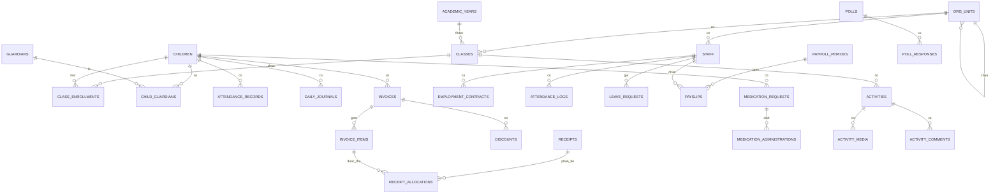

# 16. CƠ SỞ DỮ LIỆU

- Mô tả: Thực thể, trường, kiểu dữ liệu, khóa chính, khóa ngoại, quan hệ, ràng buộc, chỉ mục, trạng thái, lịch sử thay đổi, chính sách xóa dữ liệu.
- Phiên bản: 1.26
- Ngày cập nhật: 2026-10-10
- Trạng thái: Đã phê duyệt
- Người phê duyệt: Eric, ngày 2026-10-09

## 1. Quy ước chung

1. Khóa chính dùng mã định danh duy nhất toàn trường, kiểu mã định danh.
2. Mọi bảng nghiệp vụ có bốn trường chung: `id`, `created_at`, `updated_at`, `created_by`. Bảng thuộc một đơn vị có thêm `org_unit_id` tham chiếu tới `org_units.id`.
3. Không xóa cứng dữ liệu nghiệp vụ. Bảng cần ngừng sử dụng có trường `status` hoặc `deleted_at` để xóa mềm.
4. Mọi bảng có `org_unit_id` phải có chỉ mục trên cột này và phải được kiểm tra phạm vi đơn vị ở tầng truy vấn.
5. Mọi số tiền lưu kiểu số thập phân có hai chữ số phần thập phân, đơn vị đồng.
6. Mọi mốc thời gian lưu theo giờ Việt Nam kèm múi giờ; trường chỉ ghi ngày dùng kiểu ngày.
7. Mã chứng từ như số phiếu thu, số phiếu chi, mã hóa đơn sinh theo quy tắc của từng đơn vị, có ràng buộc duy nhất theo đơn vị và kỳ.
8. Đơn vị tổ chức lưu trong bảng `org_units` thành cây hai cấp (QĐ-23); `unit_type` là loại đơn vị; Trường chính có `parent_id` trống, Phân hiệu và Điểm trường có `parent_id` là Trường chính.
9. Mỗi năm học một cơ sở dữ liệu nghiệp vụ (QĐ-15). Có ba loại cơ sở dữ liệu:
   - Cơ sở dữ liệu định danh, không theo năm học: `users`, `roles`, `permissions`, `role_permissions`, `user_roles`, `sessions`, `one_time_codes`, `api_clients`, `security_events` (YCTD-35), `identity_audit_logs` (YCTD-39), `identity_settings` (YCTD-40).
   - Cơ sở dữ liệu hệ thống của máy chủ API, không theo năm học: `academic_year_databases` (QĐ-17), `academic_years`, `academic_terms`, `school_weeks` (YCTD-30).
   - Cơ sở dữ liệu năm học: mọi bảng còn lại.
10. Khi mở năm học mới, dữ liệu chuyển sang giữ nguyên mã định danh (`id`) của đơn vị, trẻ, phụ huynh, nhân sự, danh mục và tài khoản quỹ, để phân quyền ở cơ sở dữ liệu định danh và báo cáo nhiều năm tham chiếu đúng.

## 2. Phân hệ P01 — Nền tảng, đơn vị và phân quyền

| Bảng | Mục đích | Trường chính |
|---|---|---|
| org_units | Đơn vị tổ chức hai cấp của trường (QĐ-23) | code (duy nhất), name, unit_type (truong_chinh, phan_hieu, diem_truong; cố định), parent_id (trỏ tới org_units.id, trống với Trường chính), address, phone, manager_user_id, status |
| files | Tệp đính kèm lưu ở kho tệp: giấy khai sinh, giấy đồng ý hình ảnh (YCTD-45), tệp nhập dữ liệu (YCTD-46), ảnh bàn giao trẻ (YCTD-48) | org_unit_id, purpose, file_name, content_type, size_bytes, storage_key (duy nhất) |
| academic_years | Năm học, một lịch chung toàn trường, lưu ở cơ sở dữ liệu hệ thống | name, start_date, end_date, school_days_of_week (mặc định thứ hai đến thứ sáu), status (chưa mở, đang dùng, đã đóng; chỉ một năm đang dùng, BR-93) |
| academic_terms | Học kỳ và kỳ hè của năm học (BR-91) | academic_year_id, term_type (học kỳ 1, học kỳ 2, kỳ hè), start_date, end_date |
| school_weeks | Tuần học tự đánh số (BR-91) | academic_year_id, week_no, start_date, end_date, is_off (tuần nghỉ), note |
| departments | Phòng ban | org_unit_id, parent_id (phòng ban cha cùng đơn vị, không tạo vòng), name, status |
| job_titles | Chức danh | org_unit_id, name (duy nhất trong đơn vị), level (cấp bậc, chữ tự do), status |
| users | Tài khoản đăng nhập | full_name, phone (duy nhất), username (duy nhất), password_hash (để trống khi phụ huynh còn dùng mật khẩu mặc định chung, YCTD-43), status, last_login_at, failed_login_count, locked_until (hết hạn tạm khóa do sai mật khẩu, YCTD-35), must_change_password, valid_until (bắt buộc với VT-20) |
| roles | Vai trò | code (duy nhất), name, is_system |
| permissions | Quyền theo chức năng | code (duy nhất), module_code, description |
| role_permissions | Gán quyền cho vai trò | role_id, permission_id |
| user_roles | Gán vai trò cho tài khoản | user_id, role_id, org_unit_id (cho phép trống nghĩa là toàn trường; tham chiếu theo mã, không có khóa ngoại vì nằm khác cơ sở dữ liệu) |
| sessions | Phiên đăng nhập và mã làm mới | user_id, channel, refresh_token_hash, issued_at, expires_at, revoked_at, ip_address, user_agent, login_method (mật khẩu hoặc mã một lần; phiên bằng mã một lần không bị giới hạn đổi mật khẩu, YCTD-43) |
| one_time_codes | Mã một lần đăng nhập của phụ huynh | user_id, phone, purpose (đăng nhập; xác thực hai lớp đã bỏ theo YCTD-31), code_hash, expires_at, attempt_count, used_at, created_at; số lần gửi đếm theo số điện thoại trong bộ nhớ đệm, không lưu cột riêng (YCTD-43) |
| security_events | Nhật ký bảo mật của dịch vụ định danh: đăng nhập sai, tạm khóa, làm mới bằng mã đã thu hồi (BM-36, YCTD-35) | event_type, user_id (trống khi không tìm thấy tài khoản), login_identifier, ip_address, created_at |
| identity_audit_logs | Nhật ký thao tác của dịch vụ định danh: tạo, sửa, khóa, mở khóa tài khoản, đặt lại mật khẩu, gán và gỡ vai trò, sửa quyền của vai trò (PQ-05, YCTD-39) | actor_user_id, entity_name, entity_id, action, before_data, after_data, ip_address, created_at |
| identity_settings | Cấu hình chung toàn trường của dịch vụ định danh: số ngày không đăng nhập thì tự khóa (PQ-07, YCTD-40), giá trị băm của mật khẩu mặc định của phụ huynh, ba thông số mã một lần (YCTD-43) | key (duy nhất), value, updated_at, updated_by |
| settings | Cấu hình theo đơn vị; mục chưa cấu hình lấy từ Trường chính, rồi mặc định (YCTD-40) | org_unit_id, key, value, value_type, updated_at, updated_by; duy nhất theo org_unit_id kèm key |
| audit_logs | Nhật ký thao tác | actor_user_id, actor_name (tên lúc thao tác, YCTD-40), org_unit_id, entity_name, entity_id, action, before_data, after_data, ip_address, created_at |
| data_access_logs | Nhật ký truy cập dữ liệu nhạy cảm | actor_user_id, actor_name, api_client_id (khi đối tác đọc qua API), org_unit_id, entity_name, entity_id, scope (ví dụ số định danh, giấy khai sinh), record_count, purpose, ip_address, created_at |
| approval_thresholds | Hạn mức phê duyệt | org_unit_id, document_type, threshold_amount, effective_from (ngày lưu, có hiệu lực ngay), status (đang hiệu lực hoặc hết hiệu lực; mỗi đơn vị và loại chứng từ chỉ một bản đang hiệu lực), updated_by (YCTD-42) |
| api_clients | Khóa API của đối tác | name, partner_type, scopes, legal_basis, key_hash, allowed_ips, valid_until, status, created_by |
| academic_year_databases | Cơ sở dữ liệu theo năm học | academic_year_id, database_name, status (đang dùng hoặc chỉ đọc), opened_at, closed_at, carried_over_by |
| data_import_jobs | Lần nhập dữ liệu ban đầu và nhập mã ngành | org_unit_id, import_type (lớp, trẻ, mã ngành), file_id (tệp gốc ở kho tệp), status (đã kiểm tra, còn lỗi, đã ghi), total_rows, error_rows, errors (báo cáo dòng lỗi, không chứa số định danh), error_report_file_id, created_by, created_at, committed_by, committed_at (YCTD-46) |
| notification_templates | Mẫu thông báo | code (duy nhất), channel, subject, body_template, status |
| notifications | Thông báo đã sinh | org_unit_id, template_code, title, body, target_type, target_id, created_at |
| notification_recipients | Người nhận thông báo | notification_id, user_id (trống khi gửi theo vai trò), role_code và org_unit_id (mọi tài khoản có vai trò ở đơn vị, YCTD-47), channel (trong ứng dụng hoặc tin nhắn, YCTD-45), is_read, read_at, channel_status, sent_at |
| rooms | Phòng học | org_unit_id, code (duy nhất trong đơn vị), name, capacity (lớn hơn 0), status |
| grade_levels | Bậc học | code (duy nhất, không đổi sau khi tạo), name, age_from_months, age_to_months (tháng tuổi, YCTD-42), order_no, status |
| catalog_items | Mục danh mục dùng chung, không thuộc đơn vị (P01-05, YCTD-42) | catalog_type (loại do hệ thống định nghĩa), code (duy nhất trong loại), name, order_no, status |

Ràng buộc: `org_units.parent_id` trỏ tới `org_units.id`. Chỉ một đơn vị `truong_chinh`, có `parent_id` trống; đơn vị `phan_hieu`, `diem_truong` có `parent_id` là Trường chính. Kiểm tra ở tầng ứng dụng và ở tầng dữ liệu (YCTD-38).

## 3. Phân hệ P02 — Trẻ, phụ huynh và lớp học

| Bảng | Mục đích | Trường chính |
|---|---|---|
| children | Hồ sơ trẻ | moet_student_code (mã do cơ sở dữ liệu ngành cấp, duy nhất khi có), national_id_hash (băm có khóa, duy nhất, bắt buộc), national_id_encrypted, national_id_last4 (hiển thị dạng che), org_unit_id, full_name, dob, gender, place_of_birth, address, status (nháp, chờ duyệt, đang học, tạm nghỉ, thôi học, đã tốt nghiệp), is_staff_child, related_staff_user_id và related_staff_name (tạm theo tài khoản, YCTD-44), special_needs_note, photo_consent (chờ xác nhận, đồng ý, không đồng ý), photo_consent_method (ứng dụng hoặc giấy ký tay), photo_consent_by, photo_consent_at, photo_consent_file_id, birth_certificate_file_id (trống được với trẻ nhập từ dữ liệu ban đầu, YCTD-46), enroll_date, leave_date, leave_reason, note, reject_reason, submitted_by, submitted_at, approved_by, approved_at (YCTD-45) |
| photo_consent_histories | Lịch sử đồng ý sử dụng hình ảnh | child_id, action (đồng ý hoặc rút), method, file_id, actor_user_id, created_at |
| guardians | Hồ sơ phụ huynh | full_name, phone (duy nhất khi có tài khoản), email, occupation, address, user_id |
| child_guardians | Quan hệ trẻ và phụ huynh | child_id, guardian_id, relationship, is_primary, can_pickup |
| authorized_pickups | Người được ủy quyền đón trẻ | child_id, full_name, relationship, phone (bắt buộc), valid_from, valid_to (trống là không thời hạn), status (đang hiệu lực hoặc đã hủy), source (phụ huynh hoặc nhà trường), created_by, revoked_by, revoked_at (YCTD-48) |
| classes | Lớp học | org_unit_id, academic_year_id, code (duy nhất trong đơn vị), name, grade_level (tham chiếu grade_levels.code), room_id (phòng cùng đơn vị), max_size, status (đang dùng hoặc đã đóng); giáo viên của lớp ở `class_staff_assignments` (YCTD-44) |
| class_enrollments | Lịch sử lớp của trẻ | child_id, class_id, from_date, to_date, reason, is_current |
| class_staff_assignments | Phân công giáo viên vào lớp | class_id, staff_user_id (tạm là mã tài khoản đến khi có hồ sơ nhân sự), staff_name, assignment_role (chủ nhiệm hoặc bộ môn), subject_name, from_date, to_date, status; một lớp có thể có nhiều giáo viên chủ nhiệm (YCTD-44) |
| teaching_groups | Tổ chuyên môn | org_unit_id, name, leader_staff_id, status |
| teaching_group_members | Thành viên tổ chuyên môn | group_id, staff_id, from_date, to_date |
| health_profiles | Hồ sơ sức khỏe cơ bản | child_id (duy nhất), blood_type, has_allergies (trống là chưa khai báo, BR-06), allergies, chronic_conditions, note |
| health_measurements | Chỉ số sức khỏe theo lần đo | child_id, measured_on, height_cm, weight_kg, vision_left, vision_right, bmi, note |
| lost_items | Đồ bị mất của trẻ | child_id, class_id, description, report_type (báo mất hoặc nhặt được), reported_by, reported_at, photo_file_id, status, closed_by, closed_at, result_note |

## 4. Phân hệ P03 — Giảng dạy

| Bảng | Mục đích | Trường chính |
|---|---|---|
| themes | Chủ đề giảng dạy | org_unit_id, name, age_group, start_date, end_date |
| lessons | Bài học | org_unit_id, theme_id, domain_id, lesson_group_id, name, age_group, objectives, materials, status |
| lesson_plans | Giáo án theo lớp | lesson_id, class_id, teacher_id, planned_date, content, status, approved_by, approved_at |
| timetables | Thời khóa biểu | class_id, academic_year_id, weekday, period_no, activity_name, teacher_id, effective_from |
| teaching_plans | Kế hoạch giảng dạy | class_id, period_type, period_value, objectives, content, status |
| child_progress | Tiến độ học tập của trẻ | child_id, period_type, period_value, indicator_code, level, comment, published_at |
| lesson_domains | Lĩnh vực bài học | org_unit_id, name, order_no, status |
| lesson_groups | Nhóm bài học | org_unit_id, domain_id, name, order_no, status |
| class_activity_schedules | Lịch hoạt động lớp | class_id, activity_date, start_time, end_time, activity_name, note, status, published_at, created_by |

## 5. Phân hệ P04 — Điểm danh và chăm sóc hằng ngày

| Bảng | Mục đích | Trường chính |
|---|---|---|
| attendance_records | Bản ghi điểm danh | child_id, class_id, org_unit_id, attendance_date, status (có mặt, nghỉ có báo, nghỉ không báo, đi muộn, về sớm, đi muộn và về sớm), note, source (giáo viên, quản lý, phụ huynh, hệ thống), recorded_by, recorded_at (thời điểm trên thiết bị), is_backfilled (gửi bù khi có mạng lại) |
| absence_records | Bản ghi nghỉ | child_id, org_unit_id, absence_date, reason, is_advised (báo trước giờ bắt đầu học), advised_at, source, reported_by |
| attendance_days | Trạng thái điểm danh của lớp theo ngày (YCTD-47) | class_id, attendance_date (duy nhất cùng class_id), status (chưa chốt hoặc đã chốt), locked_by, locked_at, unlocked_by, unlocked_at, unlock_reason |
| pickup_records | Nhật ký đón trả trẻ | child_id, class_id, org_unit_id, pickup_date, pickup_type (bàn giao chiều hoặc bảo vệ xác nhận tại cổng), person_kind (phụ huynh, người được ủy quyền, phụ huynh đã xác nhận), person_name, relationship, phone, guardian_id, authorized_pickup_id, confirmation_request_id, photo_file_id, recorded_by, recorded_at; mỗi trẻ một lượt bàn giao mỗi ngày (YCTD-48) |
| pickup_confirmation_requests | Yêu cầu phụ huynh xác nhận người đón ngoài danh sách (BR-56, YCTD-48) | child_id, pickup_date, person_name, relationship, phone, status (chờ, đã xác nhận, từ chối), requested_by, requested_at, responded_by, responded_at |
| daily_journals | Nhật ký của bé | child_id, class_id, journal_date, meal_note, sleep_note, hygiene_note, mood, activity_note, status, published_at, published_by |
| journal_amendments | Lịch sử sửa nhật ký | journal_id, reason, before_data, after_data, amended_by, amended_at |

Ràng buộc duy nhất: `attendance_records` trên bộ đôi trẻ, ngày; `absence_records` trên bộ đôi trẻ, ngày; `daily_journals` trên bộ đôi trẻ, ngày.

## 6. Phân hệ P05 — Học phí, khoản thu và giảm trừ

| Bảng | Mục đích | Trường chính |
|---|---|---|
| fee_schedules | Phiên bản biểu phí dùng chung toàn trường (YCTD-49) | name, effective_from (ngày 1 của tháng, duy nhất), effective_to (ngày trước phiên bản sau, trống là đang áp dụng tới nay) |
| fee_schedule_items | Mức phí của phiên bản theo bậc học | fee_schedule_id, grade_level, fee_type (học phí chính khóa hoặc dịch vụ), service_id, amount (đồng, không âm); duy nhất theo phiên bản, bậc học, khoản phí |
| services | Danh mục dịch vụ dùng chung toàn trường | code (duy nhất), name, unit, calculation_method (theo tháng hoặc theo ngày có mặt), is_mandatory, is_system (bán trú tạo sẵn), status |
| service_registrations | Đăng ký dịch vụ theo kỳ | child_id, org_unit_id, period_year, period_month, service_id, status (đang hiệu lực, chờ duyệt đăng ký trễ, chờ duyệt hủy, đã hủy, bị từ chối), source (phụ huynh, nhà trường, hệ thống, tự giữ từ tháng trước), registered_by, registered_at, is_late, service_start_date (bắt buộc khi đăng ký trễ, Q-150), late_charge_method (cả tháng hoặc theo ngày thực tế), decided_by, decided_at, decision_note, cancel_requested_by, cancel_requested_at, cancelled_by, cancelled_at (YCTD-50) |
| registration_periods | Trạng thái chốt danh sách đăng ký của kỳ theo đơn vị (YCTD-50) | org_unit_id, period_year, period_month (duy nhất cùng đơn vị), status (đang mở hoặc đã chốt), locked_by, locked_at |
| summer_registrations | Đăng ký học hè theo tháng (P05-13, BR-92) | child_id, org_unit_id, period_year, period_month (duy nhất cùng trẻ), status (đang hiệu lực hoặc đã hủy), source, registered_by, registered_at, cancelled_by, cancelled_at |
| invoices | Hóa đơn học phí | code (cấp khi phát hành, dạng HD-000001), child_id, org_unit_id, period_year, period_month, invoice_kind (chính, bổ sung hoặc đầu kỳ; mỗi trẻ tối đa một hóa đơn đầu kỳ, YCTD-54), status (nháp hoặc đã phát hành), calculation_run_id, total_amount, basis (số ngày học, số ngày đang học, số ngày có mặt, bậc học, biểu phí), review_flags (dòng cần kiểm tra), due_date, issued_at, issued_by; số đã giảm trừ, điều chỉnh, đã thu tính từ bảng liên quan (YCTD-51) |
| invoice_items | Dòng khoản phải thu | invoice_id, item_type (học phí chính khóa hoặc dịch vụ), service_id, service_registration_id (đăng ký đã lập khoản thu), description, quantity, unit_price, amount, basis_note |
| discounts | Miễn giảm trên hóa đơn (YCTD-52) | invoice_id, child_id, org_unit_id, discount_type_id, basis, calculation_method, rate_value, base_amount, applied_amount, status (chờ duyệt, đã duyệt, bị từ chối), requires_principal, copied_from_id, created_by, decided_by, decided_at, reject_reason |
| discount_types | Danh mục loại miễn giảm dùng chung toàn trường | code (duy nhất), name, calculation_method (phần trăm hoặc số tiền), value, applies_to (học phí chính khóa và mã các dịch vụ), condition_note, status |
| invoice_adjustments | Phiếu điều chỉnh hóa đơn (YCTD-52) | code (dạng DC-000001), invoice_id, child_id, org_unit_id, reason, amount (dương tăng, âm giảm), status (chờ duyệt, đã duyệt, bị từ chối), requires_principal, created_by, decided_by, decided_at, reject_reason |
| fee_calculation_runs | Lần chạy tính học phí | org_unit_id, period_year, period_month, status (đang chạy, thành công, thất bại), started_at, finished_at, error_detail, child_count, total_amount, run_by |
| document_sequences | Số chứng từ liên tục trong năm học theo loại (YCTD-30, YCTD-51) | document_type, last_value |
| debt_resolutions | Đề xuất và quyết định xử lý công nợ quá hạn (P05-12) | org_unit_id, child_id, invoice_id, proposal, proposed_by, proposed_at, decision, decided_by, decided_at, status (chờ quyết định, đã quyết định) |

Ràng buộc duy nhất: `invoices` loại chính trên bộ ba trẻ, kỳ năm, kỳ tháng; hóa đơn bổ sung không giới hạn số lượng (BR-85); `service_registrations` trên bộ ba trẻ, kỳ, dịch vụ.

## 7. Phân hệ P06 — Tài chính

| Bảng | Mục đích | Trường chính |
|---|---|---|
| receipts | Phiếu thu (YCTD-53) | code (dạng PT-000001, một dãy số toàn trường trong năm học), org_unit_id, child_id (trống với phiếu thu thu hồi lương, BR-90), staff_id (với phiếu thu thu hồi lương), payer_name, amount, method (tiền mặt, chuyển khoản, khác), account_id, category_id, receipt_date, content, status (đã phát hành, chờ duyệt đảo, đã đảo), request_key (duy nhất, chống gửi lặp), created_by; trường phiếu đảo thêm ở phần 5d-2 |
| receipt_allocations | Phân bổ phiếu thu vào hóa đơn (YCTD-53) | receipt_id, invoice_id, amount, created_by, created_at; tiền chưa phân bổ là số dư có của trẻ |
| receipt_reversals | Phiếu đảo phiếu thu (YCTD-54) | code (dạng DPT-000001), receipt_id, org_unit_id, child_id, amount, reason, status (chờ duyệt, đã duyệt, bị từ chối), requires_principal, created_by, decided_by, decided_at, reject_reason; mỗi phiếu thu tối đa một phiếu đảo đang chờ hoặc đã duyệt |
| online_payment_transactions | Giao dịch chuyển khoản trực tuyến | provider, provider_transaction_ref (duy nhất), invoice_id, amount, transfer_content, received_at, match_status (khớp, sai số tiền, không xác định hóa đơn), receipt_id, handled_by, handled_at |
| payments | Phiếu chi (YCTD-55) | code (cấp khi phát hành, dạng PC-000001), org_unit_id, payment_type (thường, hoàn tiền thôi học, lương), child_id (bắt buộc khi hoàn tiền), payee_name, amount, content, account_id, category_id, payment_date (ngày phát hành), status (nháp, chờ duyệt, đã phát hành, chờ duyệt đảo, đã đảo), requires_principal, request_key, created_by, submitted_at, approved_by, approved_at, reject_reason; supplier_id, voucher_ref thêm khi có P06-07 |
| payment_attachments | Chứng từ kèm phiếu chi (YCTD-55) | payment_id, file_id (tệp mục đích `payment_voucher`) |
| payment_refund_sources | Nguồn tiền của phiếu chi hoàn tiền (YCTD-55) | payment_id, receipt_id, amount; trừ vào số dư có của trẻ |
| cash_accounts | Quỹ tiền mặt và tài khoản ngân hàng (YCTD-53) | org_unit_id, account_type (tiền mặt hoặc ngân hàng), name (duy nhất trong đơn vị), bank_name, account_number (bắt buộc với ngân hàng), opening_balance, current_balance (quỹ tiền mặt không âm), status |
| account_transactions | Giao dịch trên tài khoản | account_id, transaction_date, transaction_type, amount, balance_after, reference_type, reference_id, description |
| payables | Công nợ phải trả | org_unit_id, supplier_id, reference_type, reference_id, amount, paid_amount, due_date, status |
| suppliers | Nhà cung cấp | org_unit_id, name, supplier_type (chung hoặc thực phẩm), tax_code, contact_name, phone, email, address, payment_terms, status |
| fiscal_periods | Kỳ tài chính | org_unit_id, period_year, period_month, status, close_requested_by, close_requested_at, closed_by, closed_at |
| cashflow_categories | Khoản mục và nhóm thu chi dùng chung toàn trường | code (duy nhất), name, group_name, flow_type (thu hoặc chi), status |

Ràng buộc duy nhất: `receipts` trên bộ đôi đơn vị và mã phiếu thu; `payments` trên bộ đôi đơn vị và mã phiếu chi.

## 8. Phân hệ P07 — Nhân sự

| Bảng | Mục đích | Trường chính |
|---|---|---|
| staff | Hồ sơ nhân sự | org_unit_id, code (duy nhất), full_name, dob, gender, phone, email, address, id_number, department_id, job_title_id, start_date, end_date, status, user_id |
| employment_contracts | Hợp đồng lao động | staff_id, contract_type, contract_no (duy nhất), start_date, end_date, base_salary, allowances_data, status, signed_at, terminated_at, terminate_reason |
| staff_work_history | Quá trình công tác | staff_id, from_date, to_date, department_id, job_title_id, note |
| staff_certificates | Chứng chỉ | staff_id, name, issued_by, issued_date, expire_date, file_id |

## 9. Phân hệ P08 — Chấm công và tiền lương

| Bảng | Mục đích | Trường chính |
|---|---|---|
| attendance_logs | Chấm công | staff_id, work_date, check_in, check_out, worked_hours, status, note, source, overtime_minutes |
| work_schedules | Lịch nghỉ và lịch công tác | staff_id, schedule_date, schedule_type, note |
| leave_requests | Đơn xin nghỉ phép | staff_id, leave_type, from_date, to_date, days, reason, status, requested_at, approved_by, approved_at, reject_reason |
| leave_balances | Số ngày phép | staff_id, balance_year, leave_type, entitled_days, used_days, remaining_days |
| leave_policies | Quy định số ngày phép năm | org_unit_id, job_title_id, seniority_from_years, seniority_to_years, leave_type, entitled_days, effective_from, status |
| payroll_periods | Kỳ lương | org_unit_id, period_year, period_month, payroll_type (trả trước hoặc quyết toán), adjustment_year, adjustment_month (tháng công dùng để điều chỉnh), status, approved_by, approved_at |
| payslips | Bảng lương từng người | payroll_period_id, staff_id, base_salary, allowances_amount, bonus_amount, deduction_amount, adjustment_amount (điều chỉnh theo công tháng trước), recovery_amount (khoản phải thu hồi khi quyết toán), net_amount, note, status |
| payslip_lines | Chi tiết bảng lương | payslip_id, line_type, code, name, amount, basis |
| allowance_types | Danh mục phụ cấp | org_unit_id, code, name, calculation_method, rate_value, status |
| deduction_types | Danh mục khấu trừ | org_unit_id, code, name, calculation_method, rate_value, status |
| holidays | Ngày nghỉ lễ | org_unit_id, holiday_date, name, is_paid, year |
| saturday_schedules | Lịch nghỉ thứ 7 và lịch học bù, một lịch chung toàn trường | org_unit_id (luôn là đơn vị gốc), saturday_date, schedule_type (nghỉ định kỳ hoặc học bù), note, created_by |

Ràng buộc duy nhất: `attendance_logs` trên bộ đôi nhân sự và ngày; `payslips` trên bộ đôi kỳ lương và nhân sự.

## 10. Phân hệ P09 — Công việc, kế hoạch và đánh giá

| Bảng | Mục đích | Trường chính |
|---|---|---|
| tasks | Công việc | org_unit_id, title, description, assigner_id, assignee_id, due_date, priority, status, progress_percent, related_type, related_id |
| task_updates | Cập nhật tiến độ công việc | task_id, content, progress_percent, created_by, created_at |
| plans | Kế hoạch | org_unit_id, period_type, period_value, title, objectives, status, created_by |
| plan_items | Đầu việc trong kế hoạch | plan_id, content, owner_id, due_date, status |
| evaluations | Đánh giá nhân sự | staff_id, period_type, period_value, total_score, comment, status, evaluated_by, published_at |
| evaluation_criteria | Chỉ số đánh giá | org_unit_id, code, name, weight, max_score, status |

## 11. Phân hệ P10 — Y tế học đường

| Bảng | Mục đích | Trường chính |
|---|---|---|
| medicines | Danh mục thuốc | org_unit_id, code, name, active_ingredient, unit, stock_qty, status |
| pharmacies | Nhà thuốc | org_unit_id, name, phone, address, status |
| medication_requests | Yêu cầu dặn thuốc | child_id, requested_by_user_id, medicine_name, dosage, times_data, from_date, to_date, allergy_note, note, medicine_photo_ids (ít nhất một), prescription_photo_id (tùy chọn), assigned_role (y tế hoặc giáo viên chủ nhiệm), status, received_qty, received_note, received_by, received_at, reject_reason |
| medication_administrations | Nhật ký cho uống thuốc | request_id, scheduled_at, administered_at, administered_by, dose_note, is_skipped, skip_reason, parent_acknowledged_at, parent_acknowledged_by |
| health_check_campaigns | Đợt khám sức khỏe | org_unit_id, name, from_date, to_date, status |
| health_check_results | Kết quả khám | campaign_id, child_id, result_data, conclusion, note, recorded_by, published_at |
| medical_events | Sự kiện y tế tại trường | child_id, occurred_at, symptoms, handling, handler_id, severity, notified_guardians_at, parent_acknowledged_at, parent_acknowledged_by, status |
| medicine_purchase_requests | Đề nghị mua thuốc | org_unit_id, medicine_id, quantity, reason, status, approved_by, approved_at |
| medicine_purchase_orders | Phiếu mua thuốc | code, org_unit_id, request_id, pharmacy_id, order_date, total_amount, status, created_by |
| medicine_purchase_order_items | Thuốc đã mua | order_id, medicine_id, quantity, unit_price, amount, received_qty |
| health_check_schedules | Lịch khám | campaign_id, class_id, check_date, location, published_at |
| health_standards | Tiêu chuẩn sức khỏe theo Bộ Y tế | indicator_code, gender, age_month_from, age_month_to, lower_value, upper_value, source_document |
| daily_care_logs | Nhật ký chăm sóc hằng ngày (P10-12) | child_id, care_date, recorded_at, temperature, condition_note, special_care_note, recorded_by |

## 12. Phân hệ P11 — Xe đưa đón (đã bỏ)

Bỏ ngày 09/10/2026: trường không có xe đưa đón (Q-62). Các bảng `bus_routes`, `bus_stops`, `vehicles`, `route_assignments`, `bus_registrations`, `bus_trips`, `bus_trip_confirmations`, `bus_incidents` đã gỡ khỏi thiết kế.

## 13. Phân hệ P12 — Bếp và dinh dưỡng

| Bảng | Mục đích | Trường chính |
|---|---|---|
| dishes | Món ăn | org_unit_id, name, group_name, ingredients_data, recipe_note, status |
| menus | Thực đơn tuần | org_unit_id, week_start_date, age_group, status, approved_by, approved_at, published_at |
| menu_items | Món trong thực đơn | menu_id, weekday, meal_type, dish_id, note |
| ingredients | Nguyên liệu | org_unit_id, code, name, unit, current_stock, status |
| ingredient_norms | Định lượng trên một suất | org_unit_id, dish_id, ingredient_id, quantity_per_serving, unit |
| meal_plans | Số suất ăn theo ngày | org_unit_id, meal_date, meal_type (sáng, trưa, xế), headcount lấy từ số trẻ có mặt, computed_from, status |
| buffet_events | Tiệc buffet theo dịp | org_unit_id, buffet_date, occasion, class_id (trống khi toàn trường), menu_note, status, created_by |
| market_purchases | Phiếu đi chợ | code, org_unit_id, purchase_date, supplier_id, total_amount, status, created_by, received_at |
| market_purchase_items | Dòng phiếu đi chợ | purchase_id, ingredient_id, quantity, unit_price, amount |

Ràng buộc duy nhất: `menus` trên bộ ba đơn vị, tuần, độ tuổi; `meal_plans` trên bộ ba đơn vị, ngày, bữa.

Bỏ ngày 09/10/2026 (YCTD-20): bảng `meal_registrations` đã gỡ vì không có đăng ký bữa riêng; `buffet_registrations` thay bằng `buffet_events` vì buffet không đăng ký theo trẻ.

## 14. Phân hệ P13 — Kho, tài sản và mua hàng

| Bảng | Mục đích | Trường chính |
|---|---|---|
| assets | Tài sản | org_unit_id, code, name, category, unit, original_cost, purchase_date, location_type, location_id, status |
| asset_assignments | Cấp phát và thu hồi | asset_id, assigned_to_type, assigned_to_id, assigned_at, returned_at, handed_by, received_by, note |
| asset_loans | Mượn trả | asset_id, borrower_staff_id, from_date, due_date, returned_at, status, note |
| asset_damages | Hỏng và mất | asset_id, incident_type, severity, description, occurred_at, reported_by, proposed_handling, approved_by, status |
| purchase_requests | Đề nghị mua hàng | org_unit_id, requester_id, needed_by, reason, status, approved_by, approved_at, reject_reason |
| purchase_request_items | Mặt hàng đề nghị | request_id, item_name, quantity, unit, estimated_price, note |
| purchase_orders | Phiếu mua hàng | code, org_unit_id, supplier_id, order_date, total_amount, status, created_by, approved_by |
| purchase_order_items | Mặt hàng đã mua | order_id, item_name, quantity, unit_price, amount, received_qty |
| stock_items | Mặt hàng trong kho | org_unit_id, code, name, unit, min_qty, current_qty, status |
| stock_transactions | Nhập xuất kho | stock_item_id, transaction_type (gồm tồn ban đầu), quantity, unit_price, reference_type, reference_id, transaction_date, created_by |
| stock_counts | Kỳ kiểm kê | org_unit_id, count_date, status, created_by, approved_by |
| stock_count_lines | Chi tiết kiểm kê | count_id, stock_item_id, system_qty, actual_qty, difference, note |

## 15. Phân hệ P14 — Hoạt động, nội dung và truyền thông

| Bảng | Mục đích | Trường chính |
|---|---|---|
| activities | Hoạt động của lớp | org_unit_id, class_id, title, content, category_id, activity_date, status, created_by, submitted_at, approved_by, approved_at, reject_reason, published_at, view_count, like_count |
| activity_categories | Danh mục hoạt động | org_unit_id, name, order_no, status |
| activity_media | Hình ảnh và tệp của hoạt động | activity_id, file_id, media_type, caption, order_no, excluded_child_ids |
| activity_likes | Lượt thích | activity_id, user_id, created_at |
| activity_comments | Bình luận | activity_id, user_id, content, created_at, moderation_note, moderated_by |
| news | Tin tức | org_unit_id, title, summary, content, cover_file_id, scope_type, scope_id, status, published_at, created_by |
| news_categories | Danh mục tin tức | org_unit_id, name, order_no, status |
| library_items | Nội dung thư viện | org_unit_id, title, description, topic_id, age_group, file_id, scope_type, scope_id, status |
| library_topics | Chủ đề thư viện | org_unit_id, name, order_no, status |
| coloring_pages | Hình tô màu | org_unit_id, title, topic, age_group, file_id, status |
| announcements | Thông báo | org_unit_id, title, content, scope_type, scope_id, importance, published_at, created_by, status |
| announcement_reads | Trạng thái đã đọc thông báo | announcement_id, user_id, is_read, read_at |
| extracurricular_activities | Hoạt động ngoại khóa | org_unit_id, name, description, start_at, end_at, target_scope, quota, fee_type (theo hoạt động hoặc theo tháng), fee_amount, status |
| extracurricular_registrations | Đăng ký hoạt động ngoại khóa | activity_id, child_id, registered_by, registered_at, effective_from, effective_to, status |
| library_albums | Album thư viện | org_unit_id, topic_id, title, cover_file_id, status |
| content_comments | Bình luận thư viện và tin tức | target_type, target_id, user_id, content, created_at, moderation_note, moderated_by |

Ràng buộc duy nhất: `activity_likes` trên bộ đôi hoạt động và tài khoản.

## 16. Phân hệ P15 — Tương tác và ý kiến

| Bảng | Mục đích | Trường chính |
|---|---|---|
| message_threads | Luồng trao đổi | org_unit_id, child_id, teacher_id, guardian_user_id, last_message_at, status |
| messages | Tin nhắn | thread_id, sender_user_id, content, attachment_file_id, sent_at, is_read, read_at |
| feedbacks | Góp ý | org_unit_id, child_id, submitted_by_user_id, category, content, privacy_level, status, handled_by, handled_at, handling_note |
| polls | Bình chọn, biểu quyết, khảo sát | org_unit_id, poll_type, title, description, scope_type, scope_id, start_at, end_at, is_anonymous, status, created_by |
| poll_options | Phương án lựa chọn | poll_id, label, order_no |
| poll_questions | Câu hỏi khảo sát | poll_id, question_text, answer_type, order_no, is_required |
| poll_responses | Phiếu trả lời | poll_id, user_id, submitted_at |
| poll_answers | Câu trả lời chi tiết | response_id, question_id, option_id, answer_text, answer_number |

Ràng buộc duy nhất: `poll_responses` trên bộ đôi bình chọn và tài khoản, để mỗi tài khoản chỉ gửi một phiếu.

## 17. Phân hệ P16 và P18 — Tuyển sinh, tuyển dụng

| Bảng | Mục đích | Trường chính |
|---|---|---|
| admission_campaigns | Đợt tuyển sinh | org_unit_id, name, academic_year_id, quota, open_from, open_to, status |
| admission_applications | Hồ sơ tuyển sinh | code, campaign_id, child_full_name, child_dob, child_gender, guardian_full_name, guardian_phone, guardian_email, note, status, reviewed_by, reviewed_at, reject_reason, created_child_id |
| admission_posts | Tin tuyển sinh | campaign_id, title, content, publish_from, publish_to, status, created_by |
| recruitment_requests | Đề nghị tuyển dụng | org_unit_id, position, quantity, requirements, reason, status, approved_by, approved_at |
| job_postings | Tin tuyển dụng | request_id, title, description, requirements, deadline, status, published_at |
| candidates | Hồ sơ ứng viên | posting_id, full_name, phone, email, source, cv_file_id, status, note |
| interviews | Phỏng vấn | candidate_id, scheduled_at, interviewer_ids, result, score, note, status |

## 18. Phân hệ P17 — Báo cáo

| Bảng | Mục đích | Trường chính |
|---|---|---|
| report_snapshots | Số liệu tổng hợp sẵn | org_unit_id, snapshot_type, period_type, period_value, payload_data, generated_at |
| export_logs | Nhật ký xuất dữ liệu | user_id, report_code, filters_data, file_id, exported_at |

## 19. Quan hệ chính giữa các bảng

## 20. Chỉ mục bắt buộc

| Bảng | Chỉ mục | Lý do |
|---|---|---|
| children | org_unit_id, status, full_name | Danh sách trẻ theo đơn vị và trạng thái |
| class_enrollments | child_id kèm is_current | Tìm lớp hiện tại của trẻ |
| attendance_records | child_id kèm attendance_date, class_id kèm attendance_date | Tính tiền ăn và báo cáo điểm danh |
| invoices | child_id kèm period_year kèm period_month, org_unit_id kèm status | Tra công nợ và báo cáo học phí |
| receipt_allocations | receipt_id; invoice_id | Tính số dư công nợ |
| account_transactions | account_id kèm transaction_date | Sổ quỹ và sổ ngân hàng |
| attendance_logs | staff_id kèm work_date | Chốt bảng công |
| payslips | payroll_period_id, staff_id | Bảng lương và phiếu lương |
| activities | class_id kèm status kèm published_at | Danh sách hoạt động cho phụ huynh |
| audit_logs | entity_name kèm entity_id, actor_user_id kèm created_at | Tra nhật ký thao tác |
| notifications | target_type kèm target_id | Tra thông báo theo đối tượng |
| class_staff_assignments | staff_user_id kèm status, class_id | Giới hạn phạm vi giáo viên theo lớp được phân công |
| data_access_logs | api_client_id kèm created_at, entity_name kèm entity_id | Tra nhật ký đọc dữ liệu nhạy cảm |

## 21. Chính sách xóa dữ liệu

| Mã | Quy tắc |
|---|---|
| XD-01 | Không xóa cứng bản ghi đã phát sinh nghiệp vụ. Dùng trạng thái ngừng sử dụng hoặc xóa mềm |
| XD-02 | Bản ghi tài chính đã phát hành tuyệt đối không xóa; sai thì đảo hoặc điều chỉnh |
| XD-03 | Hồ sơ trẻ đã từng phát sinh học phí không xóa, chỉ đổi trạng thái |
| XD-04 | Hồ sơ trẻ giữ 5 năm sau khi trẻ rời trường, cấu hình được; hết hạn thì ẩn danh dữ liệu cá nhân của trẻ và phụ huynh, giữ số liệu tài chính. Xóa sớm hơn chỉ khi có yêu cầu hợp pháp |
| XD-05 | Khi xóa mềm, mọi truy vấn nghiệp vụ mặc định loại trừ bản ghi đã xóa mềm |
| XD-06 | Nhật ký thao tác không xóa trong thời hạn lưu trữ |

## 22. Chưa xác minh được

1. Quy mô dưới 1 000 trẻ (Q-31); mỗi năm học một cơ sở dữ liệu nên không cần phân vùng bảng theo năm.
2. Đã có câu trả lời: dữ liệu tách theo năm học (Q-90, QĐ-15).
3. Đã có câu trả lời: giữ 5 năm sau khi trẻ rời trường, sau đó ẩn danh (Q-91, XD-04).
4. Đã có câu trả lời: không có yêu cầu riêng ngoài quy định dữ liệu nhạy cảm đã có (Q-92).

## 23. Giả định và câu hỏi mở

| Mã | Nội dung | Cần ai trả lời |
|---|---|---|
| GD-48 | Đã xác nhận ngày 09/10/2026: Lược đồ ở tài liệu này là bản đầy đủ cho cả ba giai đoạn, chưa phải bản chốt để tạo bảng | Eric |
| GD-49 | Đã xác nhận ngày 09/10/2026: Mọi bảng nghiệp vụ đều thuộc một đơn vị trong nhiều cấp Trường chính, Phân hiệu, Điểm trường, và không xóa cứng | Eric |
| GD-62 | Đã xác nhận ngày 09/10/2026: Đơn vị của một bản ghi nghiệp vụ là đơn vị của lớp hoặc của đối tượng liên quan ở cấp thấp nhất, không phải đơn vị cấp trên | Eric |
| Q-90 | Đã trả lời ngày 09/10/2026: mỗi năm học một cơ sở dữ liệu (QĐ-15) | Eric |
| Q-91 | Đã trả lời ngày 09/10/2026: giữ hồ sơ trẻ 5 năm sau khi trẻ rời trường, cấu hình được; sau đó ẩn danh dữ liệu cá nhân, giữ số liệu tài chính | Eric |
| Q-92 | Đã trả lời ngày 09/10/2026: không có yêu cầu riêng ngoài quy định dữ liệu nhạy cảm đã có | Eric |
| Q-93 | Đã trả lời ngày 09/10/2026: danh mục phụ cấp và chỉ số đánh giá do nhà trường tự cấu hình | Eric |
| Q-114 | Đã trả lời ngày 09/10/2026: có, lưu trong bảng riêng `approval_thresholds` | Eric |
