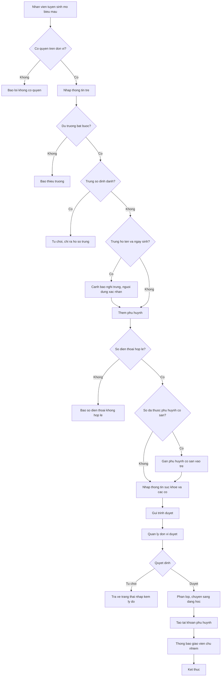
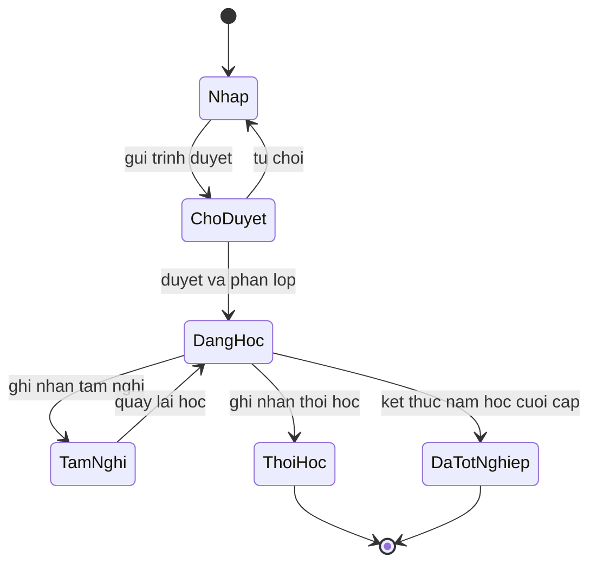

# [QT-01] Tiếp nhận trẻ mới và lập hồ sơ trẻ

| Mục | Giá trị |
|-----|---------|
| Dự án | School Management - Hệ thống quản lý trường mầm non |
| Phiên bản | 1.3 - 2026-10-09 |
| Trạng thái | Đã phê duyệt |
| Người phê duyệt | Eric, ngày 2026-10-09 |
| Người yêu cầu | Eric |
| Ưu tiên | Gấp |
| Loại | Mới |

## 1. Tóm tắt

Nhân viên tuyển sinh tiếp nhận thông tin của trẻ và phụ huynh, lập hồ sơ trẻ ở trạng thái nháp rồi trình quản lý đơn vị duyệt. Khi hồ sơ được duyệt, trẻ được phân vào một lớp của đơn vị và trở thành trẻ đang học, sẵn sàng cho điểm danh và tính học phí.

## 2. Tác nhân và quyền

| Tác nhân | Vai trò trong hệ thống | Được làm gì trong quy trình |
|----------|------------------------|------------------------------|
| Nhân viên tuyển sinh | VT-12 | Tạo hồ sơ trẻ, tạo hồ sơ phụ huynh, gửi trình duyệt |
| Quản lý đơn vị | VT-03 | Duyệt hoặc từ chối hồ sơ, phân lớp, quyết định trường hợp ngoại lệ |
| Kế toán | VT-04 | Xem hồ sơ để chuẩn bị đăng ký dịch vụ và khoản phải thu |
| Phụ huynh | VT-14 | Cung cấp thông tin; sau khi hồ sơ được duyệt, đăng nhập bằng mật khẩu mặc định chung và đổi mật khẩu ở lần đầu |
| Giáo viên chủ nhiệm | VT-07 | Nhận trẻ vào lớp, xem thông tin dị ứng và bệnh nền |

## 3. Điều kiện trước

- Đơn vị và năm học đang mở đã được cấu hình.
- Danh mục khối lớp và danh sách lớp đang hoạt động của đơn vị đã có.
- Nhân viên tuyển sinh đã đăng nhập và có quyền trên đơn vị tương ứng.
- Trẻ chưa có hồ sơ trong hệ thống. Trẻ đã có hồ sơ thì không tạo hồ sơ trùng (BR-07).

## 4. Luồng chính

| Bước | Ai | Hành động | Hệ thống xử lý | Kết quả người dùng thấy | Đã có / Mới |
|------|----|-----------|----------------|--------------------------|-------------|
| 1 | Nhân viên tuyển sinh | Mở màn hình danh sách trẻ và bấm tạo hồ sơ mới | Kiểm tra quyền trên đơn vị đang chọn, mở biểu mẫu trống | Biểu mẫu hồ sơ trẻ | Mới |
| 2 | Nhân viên tuyển sinh | Nhập thông tin định danh của trẻ: họ tên, ngày sinh, giới tính, nơi sinh, địa chỉ, số định danh cá nhân, bản chụp giấy khai sinh, mã định danh ngành nếu có | Kiểm tra trường bắt buộc; từ chối khi số định danh cá nhân trùng trên toàn trường (BR-07); kiểm tra trùng theo họ tên và ngày sinh trong cùng đơn vị | Báo hồ sơ trùng số định danh; cảnh báo nếu nghi trùng họ tên và ngày sinh, kèm liên kết tới hồ sơ | Mới |
| 3 | Nhân viên tuyển sinh | Thêm một hoặc nhiều phụ huynh, chọn phụ huynh liên hệ chính | Kiểm tra số điện thoại hợp lệ; nếu số đã thuộc một phụ huynh có sẵn thì gắn phụ huynh đó vào trẻ, không tạo phụ huynh mới (BR-08) | Danh sách phụ huynh của trẻ | Mới |
| 4 | Nhân viên tuyển sinh | Nhập thông tin sức khỏe cơ bản: dị ứng, bệnh nền, ghi chú chăm sóc | Lưu vào hồ sơ sức khỏe của trẻ | Khối thông tin sức khỏe | Mới |
| 5 | Nhân viên tuyển sinh | Ghi nhận cờ trẻ con nhân viên và cờ đồng ý sử dụng hình ảnh | Lưu cờ kèm ngày ghi nhận | Cờ hiển thị trên hồ sơ | Mới |
| 6 | Nhân viên tuyển sinh | Bấm gửi trình duyệt | Đổi trạng thái hồ sơ sang chờ duyệt, gửi thông báo cho quản lý đơn vị | Hồ sơ ở trạng thái chờ duyệt | Mới |
| 7 | Quản lý đơn vị | Mở danh sách hồ sơ chờ duyệt, kiểm tra thông tin | Kiểm tra quyền duyệt theo đơn vị | Chi tiết hồ sơ kèm nút duyệt và từ chối | Mới |
| 8 | Quản lý đơn vị | Bấm duyệt và chọn lớp cho trẻ | Kiểm tra lại số định danh không trùng, đổi trạng thái sang đang học, ghi lịch sử lớp, tăng sĩ số lớp | Hồ sơ trẻ đã duyệt; mã ngành tô đỏ nếu còn trống | Mới |
| 9 | Hệ thống | Tạo tài khoản cho mọi phụ huynh có số điện thoại chưa có tài khoản | Tạo tài khoản với mật khẩu mặc định chung, bắt buộc đổi ở lần đăng nhập đầu; gửi tin nhắn báo tài khoản đã tạo, không gửi mật khẩu | Thông báo gửi thành công | Mới |
| 10 | Hệ thống | Thông báo cho giáo viên chủ nhiệm của lớp | Gửi thông báo trong ứng dụng | Giáo viên thấy trẻ mới trong danh sách lớp | Mới |

## 5. Sơ đồ

## 6. Luồng phụ và lỗi

| Mã | Tình huống | Hệ thống phản hồi | Thông báo cho người dùng |
|----|-----------|-------------------|--------------------------|
| E1 | Người dùng không có quyền trên đơn vị | Từ chối yêu cầu ở máy chủ, không trả dữ liệu | Không có quyền thực hiện thao tác này trên đơn vị đã chọn |
| E2 | Không tìm thấy hồ sơ khi mở để sửa | Trả về không tìm thấy | Hồ sơ không tồn tại hoặc đã bị xóa khỏi phạm vi của bạn |
| E3 | Thiếu trường bắt buộc | Không lưu, trả danh sách trường thiếu | Vui lòng bổ sung các thông tin còn thiếu |
| E4 | Nghi trùng trẻ đã có hồ sơ | Không chặn, nhưng cảnh báo và yêu cầu xác nhận | Đã có hồ sơ trùng họ tên và ngày sinh, kiểm tra trước khi tiếp tục |
| E5 | Số điện thoại đã thuộc một phụ huynh có sẵn | Gắn phụ huynh có sẵn vào trẻ, không tạo tài khoản mới; phụ huynh thấy thêm trẻ trong tài khoản của mình (BR-08) | Số điện thoại đã có tài khoản phụ huynh, trẻ được gắn vào tài khoản này |
| E10 | Số định danh cá nhân trùng hồ sơ đã có | Không lưu, chỉ ra hồ sơ trùng | Số định danh cá nhân đã có trong hồ sơ khác |
| E6 | Lớp được chọn đã đủ sĩ số | Cảnh báo, yêu cầu xác nhận của quản lý đơn vị | Lớp đã đủ sĩ số, xác nhận để tiếp tục |
| E7 | Hồ sơ ở trạng thái đang học bị sửa thông tin định danh | Chặn, yêu cầu quyền cao hơn và lý do | Không sửa được thông tin định danh của trẻ đang học, cần quản lý đơn vị thực hiện |
| E8 | Người duyệt không phải quản lý đơn vị của hồ sơ | Từ chối ở máy chủ | Bạn không có quyền duyệt hồ sơ của đơn vị này |
| E9 | Gửi tin nhắn báo tài khoản đã tạo thất bại | Lưu hàng đợi gửi lại, đánh dấu chưa gửi được | Chưa gửi được thông báo tài khoản, hệ thống sẽ thử lại |

## 7. Trạng thái

| Từ | Sang | Khi nào | Ai được làm |
|----|------|---------|-------------|
| Nháp | Chờ duyệt | Nhân viên tuyển sinh gửi trình duyệt | VT-12 |
| Chờ duyệt | Nháp | Quản lý đơn vị từ chối | VT-03 |
| Chờ duyệt | Đang học | Quản lý đơn vị duyệt và chọn lớp | VT-03 |
| Đang học | Tạm nghỉ | Ghi nhận trẻ tạm nghỉ có thời hạn | VT-03 |
| Đang học | Thôi học | Ghi nhận thôi học kèm lý do | VT-03 |
| Đang học | Đã tốt nghiệp | Kết thúc năm học cuối cấp | VT-03 |

## 8. Quy tắc nghiệp vụ

| Mã | Quy tắc |
|----|---------|
| BR-06 | Hồ sơ trẻ chỉ được duyệt khi có tối thiểu họ tên, ngày sinh, giới tính và một người liên hệ có số điện thoại; phải khai báo dị ứng hoặc chọn không có dị ứng |
| BR-07 | Trẻ nhận diện bằng số định danh cá nhân bắt buộc và mã định danh ngành không bắt buộc, tô đỏ khi trống |
| BR-08 | Một trẻ có thể có nhiều phụ huynh cùng theo dõi; một phụ huynh có thể theo dõi nhiều trẻ |
| BR-09 | Trẻ là con của nhân sự trong trường được gắn cờ riêng để áp dụng chính sách miễn giảm |
| BR-11 | Người được ủy quyền đón trẻ phải được khai báo trước trong hồ sơ |
| BR-65 | Hình ảnh của trẻ chỉ công bố khi phụ huynh đồng ý trên ứng dụng hoặc bằng giấy ký tay; phụ huynh rút lại được |
| BR-81 | Số định danh cá nhân và giấy khai sinh bắt buộc khi tạo hồ sơ; chỉ Ban Giám hiệu, quản lý đơn vị và nhân viên tuyển sinh xem đầy đủ; mỗi lần xem đầy đủ ghi nhật ký |

## 9. Thông báo, thời gian thực và nhật ký

| Sự kiện | Ai nhận | Kênh | Nội dung | Ghi nhật ký |
|---------|---------|------|----------|-------------|
| Hồ sơ được gửi trình duyệt | Quản lý đơn vị | Trong ứng dụng | Có hồ sơ trẻ mới chờ duyệt | Có |
| Hồ sơ bị từ chối | Nhân viên tuyển sinh | Trong ứng dụng | Hồ sơ bị từ chối kèm lý do | Có |
| Hồ sơ được duyệt | Nhân viên tuyển sinh, giáo viên chủ nhiệm, kế toán | Trong ứng dụng | Trẻ đã được tiếp nhận vào lớp | Có |
| Tài khoản phụ huynh được tạo | Mọi phụ huynh có số điện thoại | Tin nhắn tới số điện thoại | Tài khoản đã được tạo, đăng nhập bằng mật khẩu mặc định nhà trường cung cấp | Có |
| Mọi thay đổi thông tin định danh của trẻ | Không gửi | Không áp dụng | Không áp dụng | Có, kèm giá trị trước và sau |

## 10. Dữ liệu

| Thông tin | Bắt buộc | Ràng buộc | Ví dụ |
|-----------|----------|-----------|-------|
| Họ tên trẻ | Có | Tối đa một trăm ký tự | Nguyễn Gia Bảo |
| Ngày sinh | Có | Không lớn hơn ngày hiện tại | 2022-04-18 |
| Giới tính | Có | Nam hoặc nữ | Nam |
| Đơn vị | Có | Thuộc phạm vi quyền của người tạo | Đơn vị Thảo Điền |
| Lớp | Chỉ khi duyệt | Lớp đang hoạt động của cùng đơn vị | Mầm 1 |
| Họ tên phụ huynh | Có, tối thiểu một | Tối đa một trăm ký tự | Nguyễn Tiến Vinh |
| Quan hệ | Có | Cha, mẹ, người giám hộ | Cha |
| Số điện thoại phụ huynh | Có | Số Việt Nam hợp lệ; số đã có tài khoản thì gắn phụ huynh có sẵn | 0905694283 |
| Dị ứng | Không | Tối đa năm trăm ký tự | Dị ứng đậu phộng |
| Số định danh cá nhân | Có | Mười hai chữ số, không trùng, lưu mã hóa, hiển thị che với vai trò không được xem đầy đủ | 0792xxxxxxxx |
| Bản chụp giấy khai sinh | Có | Tệp ảnh hoặc PDF | Tệp đính kèm |
| Mã định danh ngành | Không | Do cơ sở dữ liệu ngành cấp, không trùng khi có; tô đỏ khi trống | Mã do ngành cấp |
| Đồng ý hình ảnh | Có | Đồng ý hoặc không đồng ý; cách đồng ý là trên ứng dụng hoặc giấy ký tay | Đồng ý trên ứng dụng |
| Cờ trẻ con nhân viên | Không | Kèm nhân sự liên quan | Không |

## 11. Màn hình liên quan

1. **Danh sách trẻ** — lọc theo đơn vị, lớp, trạng thái; nút tạo hồ sơ mới; nút xem chi tiết.
2. **Biểu mẫu hồ sơ trẻ** — bốn khối: định danh, phụ huynh, sức khỏe, cờ và ghi chú.
3. **Danh sách hồ sơ chờ duyệt** — chỉ hiển thị với quản lý đơn vị; nút duyệt và từ chối.
4. **Màn hình phân lớp khi duyệt** — chọn lớp, hiển thị sĩ số hiện tại và sĩ số tối đa.
5. **Màn hình chi tiết trẻ** — hiển thị mã trẻ, lịch sử lớp, danh sách phụ huynh, tình trạng học phí.

## 12. Tiêu chí nghiệm thu

- AC-07: Cho nhân viên tuyển sinh / Khi tạo hồ sơ trẻ thiếu ngày sinh / Thì hệ thống từ chối và chỉ rõ trường còn thiếu.
- AC-08: Cho hồ sơ trẻ có số định danh cá nhân trùng / Khi lưu / Thì hệ thống từ chối và chỉ ra hồ sơ trùng.
- AC-09: Cho một trẻ đang học lớp Mầm 1 / Khi quản lý đơn vị chuyển trẻ sang lớp Mầm 2 / Thì sĩ số hai lớp thay đổi tương ứng và lịch sử lớp ghi thêm một dòng.
- AC-10: Cho lớp đã đủ sĩ số tối đa / Khi phân thêm một trẻ / Thì hệ thống cảnh báo và yêu cầu xác nhận của quản lý đơn vị.
- AC-94: Cho một nhân viên tuyển sinh của đơn vị A / Khi gửi yêu cầu duyệt hồ sơ trẻ thuộc đơn vị B / Thì bị từ chối ở máy chủ.
- AC-95: Cho một tài khoản giáo viên bộ môn / Khi gọi điểm cuối duyệt hồ sơ trẻ / Thì bị từ chối.
- AC-201: Cho trẻ chưa có mã định danh ngành / Khi mở danh sách trẻ hoặc hồ sơ trẻ / Thì ô mã ngành được tô đỏ.
- AC-96: Cho hồ sơ trẻ được duyệt thành công / Khi mở danh sách phụ huynh của trẻ / Thì mọi phụ huynh có số điện thoại đã có tài khoản, bắt buộc đổi mật khẩu ở lần đăng nhập đầu.

## 13. Ảnh hưởng tới phần có sẵn

Không áp dụng. Đây là dự án mới, chưa có mã nguồn và dữ liệu cũ.

## 14. Giả định và câu hỏi mở

| Mã | Nội dung | Cần ai trả lời |
|----|----------|----------------|
| GD-20 | Không còn hiệu lực từ ngày 09/10/2026: mã trẻ theo mã định danh của Bộ Giáo dục và Đào tạo, xem BR-07 | Eric |
| GD-21 | Không còn hiệu lực từ ngày 09/10/2026: tạo tài khoản cho mọi phụ huynh có số điện thoại với mật khẩu mặc định chung, xem PQ-06 | Eric |
| GD-90 | Đã xác nhận ngày 09/10/2026: Khi mở năm học mới, hồ sơ trẻ đang học được chuyển sang cơ sở dữ liệu năm học mới cùng lịch sử lớp gần nhất; lịch sử đầy đủ tra ở cơ sở dữ liệu năm cũ | Eric |
| GD-88 | Không còn hiệu lực từ ngày 09/10/2026: số định danh cá nhân và giấy khai sinh bắt buộc khi tạo hồ sơ, xem BR-81 | Eric |
| Q-35 | Đã trả lời ngày 09/10/2026: có lưu số định danh cá nhân và bản chụp giấy khai sinh, xem BR-81 | Eric |
| Q-36 | Đã trả lời ngày 09/10/2026: hồ sơ trẻ có trường nhu cầu đặc biệt và lưu ý chăm sóc, xem như dữ liệu sức khỏe | Eric |
| Q-37 | Đã trả lời ngày 09/10/2026: chỉ Ban Giám hiệu, quản lý đơn vị và nhân viên tuyển sinh xem đầy đủ; vai trò khác thấy số đã che | Eric |

## 15. Ghi chú kỹ thuật

- Điểm cuối dự kiến: tạo hồ sơ trẻ, cập nhật hồ sơ trẻ, gửi trình duyệt, duyệt hồ sơ, từ chối hồ sơ, tìm kiếm trẻ nghi trùng.
- Bảng dữ liệu dự kiến: trẻ, phụ huynh, quan hệ trẻ và phụ huynh, người được ủy quyền, lịch sử lớp của trẻ, hồ sơ sức khỏe.
- Việc chạy nền: gửi tin nhắn báo tài khoản đã tạo, gửi thông báo.
- Thời gian thực: thông báo chờ duyệt cho quản lý đơn vị.
- Chưa có mã nguồn nên chưa tham chiếu được tệp và số dòng.

## Lịch sử thay đổi

| Phiên bản | Ngày | Thay đổi |
|-----------|------|----------|
| 1.0 | 2026-10-09 | Tạo mới |
| 1.1 | 2026-10-09 | Thêm số định danh cá nhân, giấy khai sinh, cách đồng ý hình ảnh (Q-20, Q-35, Q-37) |
| 1.2 | 2026-10-09 | Trẻ nhận diện bằng số định danh và mã ngành; tạo tài khoản cho mọi phụ huynh với mật khẩu mặc định chung |
| 1.3 | 2026-10-09 | Rà duyệt: nhập và kiểm tra trùng số định danh khi lưu; số điện thoại đã có tài khoản thì gắn phụ huynh có sẵn; bỏ chữ kích hoạt; thêm AC-201; Eric phê duyệt |
