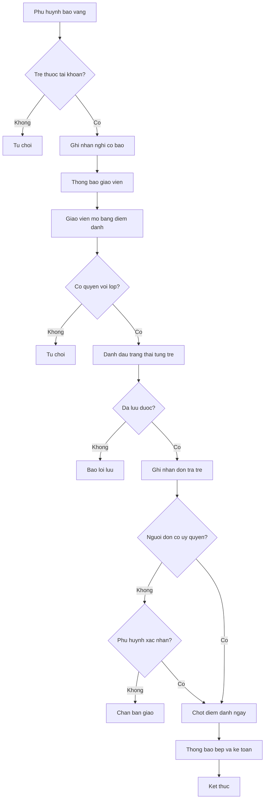
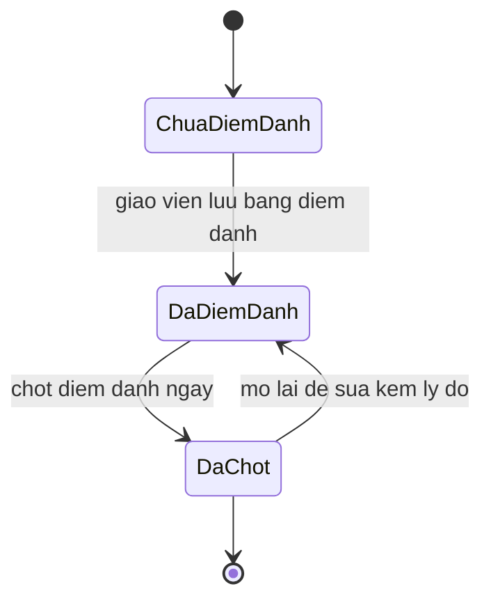

# [QT-02] Điểm danh, báo vắng và đón trả trẻ

| Mục | Giá trị |
|-----|---------|
| Dự án | School Management - Hệ thống quản lý trường mầm non |
| Phiên bản | 1.5 - 2026-10-09 |
| Trạng thái | Đã phê duyệt |
| Người phê duyệt | Eric, ngày 2026-10-09 |
| Người yêu cầu | Eric |
| Ưu tiên | Gấp |
| Loại | Mới |

## 1. Tóm tắt

Giáo viên chủ nhiệm điểm danh trẻ một lần mỗi ngày; phụ huynh có thể báo vắng trước cho con. Cuối ngày giáo viên chốt điểm danh và ghi nhận việc đón trả trẻ. Số liệu điểm danh là căn cứ để tính tiền ăn, số suất ăn cho bếp và tỷ lệ đi học trong báo cáo.

## 2. Tác nhân và quyền

| Tác nhân | Vai trò trong hệ thống | Được làm gì trong quy trình |
|----------|------------------------|------------------------------|
| Giáo viên chủ nhiệm | VT-07 | Điểm danh, ghi nhận nghỉ, chốt ngày, bàn giao trẻ |
| Giáo viên bộ môn | VT-08 | Xem bảng điểm danh của lớp được phân công, không sửa |
| Phụ huynh | VT-14 | Báo vắng cho con, xem trạng thái điểm danh của con |
| Ban Giám hiệu | VT-02, VT-15 | Xem điểm danh trong phạm vi được gán |
| Quản lý đơn vị | VT-03 | Xem toàn bộ điểm danh của đơn vị, chốt ngày thay giáo viên, sửa điểm danh đã chốt kèm lý do |
| Bảo vệ | VT-18 | Xác nhận người đón tại cổng theo danh sách ủy quyền |
| Nhân viên bếp | VT-10 | Xem số trẻ đi học để tính suất ăn |
| Kế toán | VT-04 | Xem số ngày ăn thực tế để tính tiền ăn |

## 3. Điều kiện trước

- Trẻ đang ở trạng thái đang học và đã được phân vào một lớp.
- Giáo viên chủ nhiệm đã được phân công cho lớp đó.
- Ngày điểm danh thuộc năm học đang mở và là ngày học theo lịch năm học (BR-91), không thuộc tuần nghỉ; trong kỳ hè chỉ trẻ đã đăng ký học hè tháng đó (BR-92); ngày thường hoặc ngày học bù thứ 7 do Ban Giám hiệu lập (BR-84).
- Lớp chưa bị đóng.

## 4. Luồng chính

| Bước | Ai | Hành động | Hệ thống xử lý | Kết quả người dùng thấy | Đã có / Mới |
|------|----|-----------|----------------|--------------------------|-------------|
| 1 | Phụ huynh | Báo vắng cho con, chọn ngày và lý do | Kiểm tra trẻ thuộc tài khoản phụ huynh, lưu bản ghi nghỉ ở trạng thái nghỉ có báo | Báo vắng đã ghi nhận | Mới |
| 2 | Hệ thống | Ghi nhận báo vắng | Đánh dấu trẻ nghỉ có báo cho ngày tương ứng, thông báo cho giáo viên chủ nhiệm | Giáo viên thấy trẻ đã báo nghỉ | Mới |
| 3 | Giáo viên chủ nhiệm | Mở bảng điểm danh trong ngày của lớp | Trả danh sách trẻ đang học của lớp kèm trạng thái mặc định và các báo vắng đã có | Bảng điểm danh trong ngày | Mới |
| 4 | Giáo viên chủ nhiệm | Đánh dấu trạng thái từng trẻ: có mặt, nghỉ có báo, nghỉ không báo, đi muộn, về sớm | Lưu bản ghi điểm danh, chống trùng theo trẻ và ngày | Trạng thái từng trẻ đã lưu | Mới |
| 5 | Giáo viên chủ nhiệm | Ghi chú lý do cho trẻ nghỉ không báo | Lưu ghi chú vào bản ghi | Ghi chú hiển thị trên bảng | Mới |
| 6 | Bảo vệ | Xác nhận người đón tại cổng | Kiểm tra người đón có trong danh sách ủy quyền, ghi nhận xác nhận | Người đón đã được xác nhận | Mới |
| 7 | Giáo viên chủ nhiệm | Ghi nhận đón trả trẻ cuối ngày, chọn người đón, chụp ảnh bàn giao nếu muốn | Kiểm tra người đón có trong danh sách ủy quyền; người đón ngoài danh sách thì yêu cầu xác nhận của phụ huynh; lưu nhật ký bàn giao | Nhật ký đón trả | Mới |
| 8 | Giáo viên chủ nhiệm hoặc quản lý đơn vị | Bấm chốt điểm danh ngày | Khóa bản ghi trong ngày, tổng hợp số liệu, thông báo cho bếp và kế toán | Ngày đã chốt kèm số liệu tổng | Mới |
| 9 | Hệ thống | Công bố trạng thái điểm danh cho phụ huynh | Cập nhật dữ liệu hiển thị trên ứng dụng phụ huynh | Phụ huynh thấy con đã được điểm danh | Mới |

## 5. Sơ đồ

## 6. Luồng phụ và lỗi

| Mã | Tình huống | Hệ thống phản hồi | Thông báo cho người dùng |
|----|-----------|-------------------|--------------------------|
| E1 | Giáo viên không được phân công lớp | Từ chối ở máy chủ | Bạn không phụ trách lớp này |
| E2 | Không tìm thấy trẻ trong lớp khi điểm danh | Bỏ qua bản ghi, ghi nhận cảnh báo | Có trẻ không còn trong lớp, tải lại bảng điểm danh |
| E3 | Ngày điểm danh nằm ngoài năm học | Từ chối lưu | Ngày này không thuộc năm học đang mở |
| E4 | Bấm lưu hai lần hoặc mạng chậm gây gửi lại | Chống trùng theo trẻ và ngày, chỉ ghi một bản ghi | Không hiển thị lỗi, dữ liệu không bị nhân đôi |
| E5 | Sửa điểm danh sau khi đã chốt ngày | Yêu cầu nhập lý do, ghi nhật ký kèm giá trị trước và sau | Nhập lý do để sửa điểm danh đã chốt |
| E6 | Người đến đón không có trong danh sách ủy quyền | Chặn bàn giao, gửi yêu cầu xác nhận cho phụ huynh; phụ huynh xác nhận thì cho bàn giao và ghi nhật ký (BR-56) | Người này không có trong danh sách được ủy quyền, đang chờ phụ huynh xác nhận |
| E7 | Phụ huynh báo vắng cho trẻ không thuộc tài khoản | Từ chối ở máy chủ | Bạn không có quyền báo vắng cho trẻ này |
| E8 | Phụ huynh báo vắng sau khi lớp đã điểm danh trong ngày | Vẫn ghi nhận nhưng đánh dấu báo muộn | Báo vắng đã ghi nhận, tính là báo muộn |
| E9 | Mất mạng khi giáo viên đang điểm danh | Lưu tạm trên thiết bị, đồng bộ khi có mạng, đánh dấu thời điểm nhập bù | Dữ liệu chưa đồng bộ, sẽ tự gửi khi có mạng |

## 7. Trạng thái

| Từ | Sang | Khi nào | Ai được làm |
|----|------|---------|-------------|
| Chưa điểm danh | Đã điểm danh | Giáo viên lưu bảng điểm danh trong ngày | VT-07 |
| Đã điểm danh | Đã chốt | Giáo viên hoặc quản lý đơn vị chốt điểm danh ngày | VT-07, VT-03 |
| Đã chốt | Đã điểm danh | Sửa lại kèm lý do | VT-07, VT-03 |

Trạng thái của từng trẻ trong ngày: có mặt, nghỉ có báo, nghỉ không báo, đi muộn, về sớm, đi muộn và về sớm.

## 8. Quy tắc nghiệp vụ

| Mã | Quy tắc |
|----|---------|
| BR-12 | Điểm danh một lần mỗi ngày, mỗi trẻ một bản ghi cho mỗi ngày; sửa sau khi chốt phải có lý do và ghi nhật ký thao tác |
| BR-13 | Báo vắng có trước giờ học được coi là nghỉ có báo; báo sau được đánh dấu báo muộn |
| BR-14 | Tiền ăn tính theo số ngày ăn thực tế của trẻ, lấy từ điểm danh đã chốt |
| BR-16 | Không cho phép nhập điểm danh cho trẻ không thuộc lớp mà người dùng phụ trách |
| BR-56 | Trẻ chỉ được bàn giao cho phụ huynh hoặc người được ủy quyền có trong hồ sơ. Trường hợp khác phải có xác nhận của phụ huynh và ghi nhật ký |
| BR-58 | Suất ăn một ngày gồm ba bữa sáng, trưa, xế, thuộc bán trú. Số suất ăn mỗi ngày bằng số trẻ có mặt theo điểm danh; trẻ vắng ngày nào không tính tiền ăn ngày đó (BR-14). Bếp và kế toán dùng cùng một con số |
| BR-84 | Lịch học bù thứ bảy do Ban Giám hiệu lập cho toàn trường; ngày học bù là ngày học bình thường, có điểm danh |

## 9. Thông báo, thời gian thực và nhật ký

| Sự kiện | Ai nhận | Kênh | Nội dung | Ghi nhật ký |
|---------|---------|------|----------|-------------|
| Phụ huynh báo vắng | Giáo viên chủ nhiệm | Trong ứng dụng | Phụ huynh đã báo vắng cho trẻ trong ngày | Có |
| Trẻ được điểm danh | Phụ huynh của trẻ | Trong ứng dụng | Con đã được điểm danh hôm nay | Không |
| Trẻ vắng không báo | Phụ huynh của trẻ | Trong ứng dụng và tin nhắn | Trẻ vắng mặt hôm nay, nhà trường chưa nhận được báo vắng | Có |
| Ngày đã chốt điểm danh | Nhân viên bếp, kế toán | Trong ứng dụng | Số liệu điểm danh của ngày đã chốt | Có |
| Sửa điểm danh sau khi chốt | Quản lý đơn vị | Trong ứng dụng | Điểm danh ngày đã được sửa kèm lý do | Có, kèm giá trị trước và sau |
| Người đón ngoài danh sách ủy quyền | Phụ huynh của trẻ | Trong ứng dụng | Yêu cầu xác nhận người đón | Có |
| Bàn giao trẻ | Phụ huynh của trẻ | Trong ứng dụng | Trẻ đã được bàn giao cho người đón | Có |

## 10. Dữ liệu

| Thông tin | Bắt buộc | Ràng buộc | Ví dụ |
|-----------|----------|-----------|-------|
| Trẻ | Có | Thuộc lớp đang điểm danh | Nguyễn Gia Bảo |
| Ngày điểm danh | Có | Thuộc năm học đang mở, là ngày học; mỗi trẻ một bản ghi mỗi ngày | 2026-10-09 |
| Trạng thái | Có | Một trong các trạng thái ở mục 7 | Có mặt |
| Lý do nghỉ | Không | Tối đa năm trăm ký tự | Sốt, nghỉ tại nhà |
| Nguồn ghi nhận | Có | Giáo viên, phụ huynh, hệ thống | Phụ huynh |
| Người đón | Chỉ khi trả trẻ | Có trong danh sách ủy quyền hoặc là phụ huynh | Nguyễn Tiến Vinh |
| Thời điểm đón | Chỉ khi trả trẻ | Không nhỏ hơn thời điểm điểm danh | 17:05 |
| Ảnh bàn giao | Không | Tùy chọn (Q-40) | Tệp ảnh |
| Xác nhận của phụ huynh | Chỉ khi người đón ngoài danh sách | Phụ huynh của trẻ xác nhận trên ứng dụng | Đã xác nhận lúc 17:02 |
| Lý do sửa sau khi chốt | Chỉ khi sửa | Tối đa năm trăm ký tự | Ghi nhầm trạng thái của hai trẻ |

## 11. Màn hình liên quan

1. **Bảng điểm danh của lớp** — dạng lưới, một dòng một trẻ, các nút trạng thái nhanh, nút lưu và nút chốt ngày.
2. **Màn hình báo vắng của phụ huynh** — chọn trẻ, chọn ngày, nhập lý do.
3. **Màn hình đón trả trẻ** — danh sách trẻ chưa trả, ô chọn người đón, hiển thị cảnh báo nếu không có ủy quyền.
4. **Màn hình trạng thái của con trên ứng dụng phụ huynh** — hiển thị trạng thái điểm danh trong ngày.
5. **Bảng tổng hợp điểm danh ngày** — số có mặt, số nghỉ có báo, số nghỉ không báo, tỷ lệ đi học.

## 12. Tiêu chí nghiệm thu

- AC-14: Cho giáo viên chủ nhiệm lớp Mầm 1 / Khi điểm danh trong ngày và bấm lưu hai lần / Thì hệ thống tạo đúng một bản ghi cho mỗi trẻ trong ngày.
- AC-15: Cho ngày đã chốt điểm danh / Khi giáo viên sửa trạng thái của một trẻ / Thì hệ thống yêu cầu lý do và ghi nhật ký thao tác kèm giá trị trước và sau.
- AC-16: Cho phụ huynh báo vắng trước giờ học / Khi giáo viên mở bảng điểm danh / Thì trẻ ở trạng thái nghỉ có báo.
- AC-17: Cho giáo viên không phụ trách lớp Mầm 1 / Khi gọi điểm cuối điểm danh của lớp Mầm 1 / Thì bị từ chối.
- AC-20: Cho người đến đón không có trong danh sách ủy quyền / Khi giáo viên bàn giao / Thì hệ thống chặn và yêu cầu xác nhận của phụ huynh.
- AC-97: Cho một phụ huynh của trẻ A / Khi gửi báo vắng cho trẻ B / Thì bị từ chối ở máy chủ.
- AC-98: Cho một ngày đã có bản ghi điểm danh / Khi giáo viên tải lại bảng và lưu lần nữa mà không đổi trạng thái / Thì số bản ghi của ngày không tăng.
- AC-99: Cho một ngày đã chốt điểm danh / Khi nhân viên bếp mở số suất ăn của ngày / Thì số suất khớp với số trẻ có mặt trong bảng điểm danh đã chốt.

## 13. Ảnh hưởng tới phần có sẵn

Không áp dụng. Đây là dự án mới, chưa có mã nguồn và dữ liệu cũ.

## 14. Giả định và câu hỏi mở

| Mã | Nội dung | Cần ai trả lời |
|----|----------|----------------|
| GD-22 | Không còn hiệu lực từ ngày 09/10/2026: điểm danh một lần mỗi ngày, không chia buổi (Q-38) | Eric |
| GD-23 | Đã xác nhận ngày 09/10/2026: Giờ học bắt đầu dùng để xác định báo vắng sớm hay muộn do đơn vị cấu hình | Eric |
| Q-38 | Đã trả lời ngày 09/10/2026: điểm danh một lần mỗi ngày | Eric |
| Q-39 | Đã trả lời ngày 09/10/2026: trẻ đi muộn hoặc về sớm vẫn tính đủ một ngày ăn | Eric |
| Q-40 | Đã trả lời ngày 09/10/2026: chụp ảnh khi bàn giao trẻ là tùy chọn | Eric |

## 15. Ghi chú kỹ thuật

- Điểm cuối dự kiến: lấy bảng điểm danh của lớp, lưu điểm danh trong ngày, ghi báo vắng, chốt ngày, ghi nhận đón trả, lấy tổng hợp ngày.
- Bảng dữ liệu dự kiến: bản ghi điểm danh, bản ghi nghỉ, nhật ký đón trả, lịch sử sửa điểm danh.
- Ràng buộc duy nhất dự kiến trên cặp trẻ và ngày để chống trùng.
- Việc chạy nền: tổng hợp số liệu sau khi chốt ngày, gửi thông báo cho bếp và kế toán.
- Thời gian thực: thông báo báo vắng tới giáo viên chủ nhiệm.
- Chưa có mã nguồn nên chưa tham chiếu được tệp và số dòng.

## Lịch sử thay đổi

| Phiên bản | Ngày | Thay đổi |
|-----------|------|----------|
| 1.0 | 2026-10-09 | Tạo mới |
| 1.1 | 2026-10-09 | Điểm danh một lần mỗi ngày thay cho hai buổi sáng và chiều (Q-38) |
| 1.2 | 2026-10-09 | Bỏ bước xác nhận trẻ lên xe vì trường không có xe đưa đón; thêm bảo vệ xác nhận người đón tại cổng |
| 1.3 | 2026-10-09 | Số suất ăn bằng số trẻ có mặt; bỏ bữa tối (BR-58) |
| 1.4 | 2026-10-09 | Rà duyệt: người đón ngoài danh sách cần phụ huynh xác nhận (BR-56); ngày học bù thứ 7 (BR-84); quản lý đơn vị chốt và sửa sau chốt; gộp dòng dữ liệu trùng; Eric phê duyệt |
| 1.5 | 2026-10-09 | YCTD-30: ngày học theo lịch năm học, tuần nghỉ, kỳ hè |
