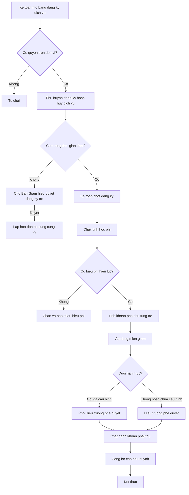
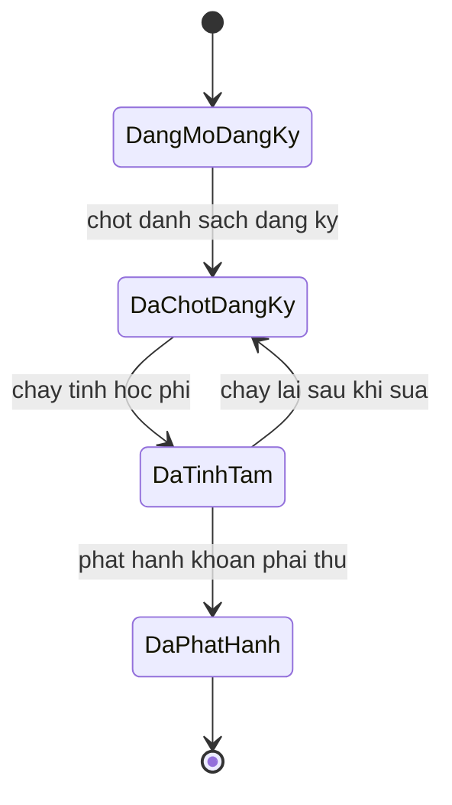

# [QT-03] Đăng ký dịch vụ và tính học phí theo tháng

| Mục | Giá trị |
|-----|---------|
| Dự án | School Management - Hệ thống quản lý trường mầm non |
| Phiên bản | 1.9 - 2026-10-09 |
| Trạng thái | Đã phê duyệt |
| Người phê duyệt | Eric, ngày 2026-10-09 |
| Người yêu cầu | Eric |
| Ưu tiên | Gấp |
| Loại | Mới |

## 1. Tóm tắt

Kế toán chốt danh sách dịch vụ mà từng trẻ đăng ký trong tháng, chạy tính học phí dựa trên biểu phí đang hiệu lực, số ngày đi học thực tế và các khoản miễn giảm đã được duyệt. Kết quả là khoản phải thu của từng trẻ trong kỳ, sẵn sàng cho việc thu tiền.

## 2. Tác nhân và quyền

| Tác nhân | Vai trò trong hệ thống | Được làm gì trong quy trình |
|----------|------------------------|------------------------------|
| Kế toán | VT-04 | Cấu hình biểu phí, chốt đăng ký, chạy tính, phát hành khoản phải thu |
| Kế toán trưởng | VT-05 | Xem bảng tính học phí, lập phiếu điều chỉnh hóa đơn; không phê duyệt |
| Quản lý đơn vị | VT-03 | Xem học phí và miễn giảm của đơn vị; không lập, không phê duyệt (Q-134) |
| Phụ huynh | VT-14 | Xem khoản phải thu của con, đăng ký hoặc hủy dịch vụ khi còn trong thời gian cho phép |
| Phó Hiệu trưởng | VT-15 | Phê duyệt miễn giảm và phiếu điều chỉnh dưới hạn mức, trong các đơn vị được gán; duyệt đăng ký trễ (BR-26) |
| Hiệu trưởng | VT-02 | Phê duyệt miễn giảm và phiếu điều chỉnh từ hạn mức trở lên hoặc khi chưa cấu hình hạn mức; duyệt đăng ký trễ (BR-26); xem báo cáo học phí toàn trường |

## 3. Điều kiện trước

- Biểu phí dùng chung toàn trường đã được cấu hình và có hiệu lực trong kỳ tính (BR-17).
- Danh mục dịch vụ đã có, mỗi dịch vụ có cách tính rõ ràng.
- Trẻ đang ở trạng thái đang học và đã được phân lớp.
- Số liệu điểm danh của kỳ đã được chốt.
- Kỳ chưa phát hành hóa đơn chính. Nếu đã phát hành thì sửa sai bằng phiếu điều chỉnh (BR-25); khoản phát sinh sau phát hành lập hóa đơn bổ sung cùng kỳ (BR-85).

## 4. Luồng chính

| Bước | Ai | Hành động | Hệ thống xử lý | Kết quả người dùng thấy | Đã có / Mới |
|------|----|-----------|----------------|--------------------------|-------------|
| 1 | Kế toán | Mở màn hình đăng ký dịch vụ của kỳ và đơn vị | Kiểm tra quyền, tải danh sách trẻ và đăng ký hiện có | Bảng đăng ký dịch vụ theo trẻ | Mới |
| 2 | Phụ huynh | Đăng ký hoặc hủy dịch vụ cho con trước ngày chốt | Kiểm tra còn trong thời gian cho phép; không cho bỏ bán trú (BR-83); từ chối đăng ký thêm khi đơn vị bật chặn và trẻ còn nợ quá hạn (BR-33); cập nhật bản đăng ký | Đăng ký của con đã cập nhật | Mới |
| 3 | Kế toán | Bấm chốt danh sách đăng ký của kỳ | Khóa đăng ký; đăng ký dịch vụ không bắt buộc sau ngày chốt chuyển Ban Giám hiệu duyệt (BR-26) | Danh sách đăng ký đã chốt | Mới |
| 4 | Kế toán | Bấm chạy tính học phí | Tạo tác vụ chạy nền, tính cho từng trẻ theo quy tắc | Tiến trình tính và kết quả tạm | Mới |
| 5 | Hệ thống | Tính khoản phải thu cho từng trẻ | Cộng học phí chính khóa, tiền ăn theo số ngày thực tế, dịch vụ khác; trừ giảm trừ đã duyệt | Bảng tính học phí của kỳ | Mới |
| 6 | Kế toán | Kiểm tra bảng tính, xem các dòng bất thường | Đánh dấu các trường hợp cần xem: chênh lệch lớn so với kỳ trước, trẻ không có đăng ký, trẻ nghỉ nhiều | Danh sách cần kiểm tra | Mới |
| 7 | Kế toán | Áp dụng hoặc điều chỉnh miễn giảm cho từng trẻ | Kiểm tra hạn mức phê duyệt, lưu căn cứ và người phê duyệt | Dòng giảm trừ trên hóa đơn | Mới |
| 8 | Phó Hiệu trưởng hoặc Hiệu trưởng | Phê duyệt giảm trừ theo hạn mức: Phó Hiệu trưởng duyệt dưới hạn mức, Hiệu trưởng duyệt từ hạn mức trở lên hoặc khi chưa cấu hình hạn mức (Q-112) | Kiểm tra hạn mức và phạm vi đơn vị, ghi nhận người phê duyệt và thời điểm | Trạng thái giảm trừ đã duyệt | Mới |
| 9 | Kế toán | Bấm phát hành khoản phải thu | Sinh hóa đơn chính và các dòng khoản phải thu cho từng trẻ, khóa kỳ; khoản phát sinh sau đó lập hóa đơn bổ sung cùng kỳ (BR-85) | Hóa đơn đã phát hành | Mới |
| 10 | Hệ thống | Công bố khoản phải thu cho phụ huynh | Cập nhật dữ liệu hiển thị trên ứng dụng phụ huynh | Phụ huynh thấy số tiền phải nộp của kỳ | Mới |

## 5. Sơ đồ

## 6. Luồng phụ và lỗi

| Mã | Tình huống | Hệ thống phản hồi | Thông báo cho người dùng |
|----|-----------|-------------------|--------------------------|
| E1 | Kế toán đơn vị A cố tính học phí cho đơn vị B | Từ chối ở máy chủ | Bạn không có quyền tính học phí cho đơn vị này |
| E2 | Kỳ đã phát hành, không tìm thấy bảng tính để sửa | Trả về không tìm thấy, gợi ý dùng phiếu điều chỉnh | Kỳ đã phát hành, cần lập phiếu điều chỉnh |
| E3 | Thiếu biểu phí hiệu lực cho một khối lớp trong kỳ | Chặn phát hành, chỉ rõ khối lớp thiếu | Chưa có biểu phí cho khối lớp này trong kỳ |
| E4 | Hai trẻ trùng mã hoặc trùng khoản phải thu trong cùng kỳ | Chặn phát hành, chỉ rõ bản ghi trùng | Phát hiện khoản phải thu trùng, kiểm tra trước khi phát hành |
| E5 | Giảm trừ vượt tổng khoản phải thu của trẻ | Chặn, yêu cầu điều chỉnh | Tổng giảm trừ vượt khoản phải thu của trẻ |
| E6 | Giảm trừ có giá trị từ hạn mức trở lên | Chuyển sang Hiệu trưởng phê duyệt | Giảm trừ cần phê duyệt của Hiệu trưởng |
| E7 | Tác vụ tính học phí chạy thất bại giữa đường | Ghi nhận trạng thái thất bại, giữ nguyên kết quả cũ, cho chạy lại | Tính học phí thất bại, xem chi tiết và chạy lại |
| E8 | Năm học chưa có lịch năm học nên không tính được số ngày học của tháng | Chặn tính, yêu cầu Hiệu trưởng cấu hình lịch năm học (BR-91) | Chưa có lịch năm học, cấu hình trước khi tính học phí |
| E9 | Phụ huynh đăng ký dịch vụ không bắt buộc sau ngày chốt | Chuyển Ban Giám hiệu duyệt, chưa sinh khoản phải thu; khi duyệt thì ghi cách thu phí cả tháng hoặc theo ngày thực tế và lập hóa đơn bổ sung cùng kỳ nếu hóa đơn chính đã phát hành (BR-85) | Đăng ký trễ đang chờ Ban Giám hiệu duyệt |
| E10 | Phụ huynh hoặc kế toán bỏ chọn bán trú | Không cho bỏ (BR-83) | Bán trú là dịch vụ bắt buộc |
| E12 | Còn lớp có ngày chưa chốt điểm danh trong kỳ khi chạy tính học phí | Chặn tính, liệt kê lớp và ngày chưa chốt (Q-151) | Còn ngày chưa chốt điểm danh, chốt xong mới tính được |
| E11 | Đơn vị bật chặn và trẻ còn nợ quá hạn khi đăng ký thêm dịch vụ | Từ chối; trẻ vẫn được điểm danh bình thường (BR-33) | Không đăng ký thêm được vì còn công nợ quá hạn |

## 7. Trạng thái

| Từ | Sang | Khi nào | Ai được làm |
|----|------|---------|-------------|
| Đang mở đăng ký | Đã chốt đăng ký | Kế toán chốt danh sách | VT-04 |
| Đã chốt đăng ký | Đã tính tạm | Kế toán chạy tính học phí | VT-04 |
| Đã tính tạm | Đã chốt đăng ký | Kế toán mở lại để sửa đăng ký trước khi phát hành | VT-04 |
| Đã tính tạm | Đã phát hành | Kế toán phát hành khoản phải thu | VT-04 |

## 8. Quy tắc nghiệp vụ

| Mã | Quy tắc |
|----|---------|
| BR-17 | Học phí tính theo tháng dương lịch, dựa trên biểu phí dùng chung cho mọi đơn vị, theo khối lớp và bản đăng ký dịch vụ của trẻ |
| BR-18 | Biểu phí có hiệu lực theo khoảng ngày; hóa đơn đã phát hành không bị tính lại tự động khi biểu phí thay đổi |
| BR-19 | Khoản phải thu gồm học phí chính khóa, tiền ăn, dịch vụ khác đã đăng ký và các khoản phát sinh |
| BR-20 | Loại giảm trừ, cách tính và mức do nhà trường cấu hình (P05-11, Q-16), ví dụ trẻ con nhân sự, anh chị em ruột cùng học, học phí đặc biệt theo thỏa thuận, học bổng; mỗi khoản phải ghi căn cứ và người phê duyệt |
| BR-21 | Giảm trừ theo tỷ lệ phần trăm và theo số tiền cố định là hai cách khác nhau; hệ thống lưu cả căn cứ và kết quả tính |
| BR-22 | Tổng giảm trừ của một trẻ trong một kỳ không vượt quá tổng khoản phải thu của kỳ |
| BR-23 | Trẻ nhập học hoặc thôi học giữa tháng: học phí chính khóa bằng học phí tháng nhân số ngày học thực tế trong tháng, chia số ngày học của tháng |
| BR-25 | Hóa đơn đã phát hành không sửa trực tiếp, phải lập phiếu điều chỉnh |
| BR-26 | Sau ngày chốt chỉ đăng ký thêm dịch vụ không bắt buộc; đăng ký trễ phải được Ban Giám hiệu duyệt và Ban Giám hiệu quyết định thu cả tháng hoặc theo ngày thực tế |
| BR-83 | Bán trú là dịch vụ bắt buộc với mọi trẻ đang học |
| BR-92 | Tháng hè chỉ tính học phí cho trẻ đã đăng ký học hè tháng đó, theo biểu phí hiện hành |
| BR-85 | Mỗi trẻ mỗi kỳ có một hóa đơn chính; khoản phát sinh sau khi hóa đơn chính đã phát hành, gồm đăng ký trễ được duyệt và phí hoạt động ngoại khóa thu theo từng hoạt động, lập thành hóa đơn bổ sung cùng kỳ |
| BR-27 | Bỏ ngày 09/10/2026: học thứ bảy không còn là dịch vụ thu phí; thứ bảy chỉ có lịch học bù toàn trường do Ban Giám hiệu lập (BR-84) |

## 9. Thông báo, thời gian thực và nhật ký

| Sự kiện | Ai nhận | Kênh | Nội dung | Ghi nhật ký |
|---------|---------|------|----------|-------------|
| Danh sách đăng ký được chốt | Quản lý đơn vị | Trong ứng dụng | Đăng ký dịch vụ kỳ đã chốt | Có |
| Tác vụ tính học phí hoàn thành | Kế toán | Trong ứng dụng | Đã tính xong học phí kỳ, xem kết quả | Có |
| Tác vụ tính học phí thất bại | Kế toán | Trong ứng dụng | Tính học phí thất bại, xem chi tiết | Có |
| Giảm trừ chờ phê duyệt | Phó Hiệu trưởng hoặc Hiệu trưởng theo hạn mức | Trong ứng dụng | Có giảm trừ cần phê duyệt | Có |
| Khoản phải thu được phát hành | Phụ huynh của từng trẻ | Trong ứng dụng và tin nhắn | Học phí kỳ đã phát hành, xem chi tiết và thanh toán | Có |
| Đăng ký trễ chờ duyệt | Ban Giám hiệu | Trong ứng dụng | Có đăng ký dịch vụ sau ngày chốt cần duyệt | Có |
| Hóa đơn bổ sung được phát hành | Phụ huynh của trẻ, kế toán | Trong ứng dụng | Có hóa đơn bổ sung trong kỳ | Có |

## 10. Dữ liệu

| Thông tin | Bắt buộc | Ràng buộc | Ví dụ |
|-----------|----------|-----------|-------|
| Kỳ học phí | Có | Tháng dương lịch | Tháng 10 năm 2026 |
| Biểu phí | Có | Có hiệu lực trong kỳ, dùng chung toàn trường, theo khối lớp | Biểu phí năm học 2026-2027 |
| Dịch vụ đăng ký | Có | Thuộc danh mục dịch vụ đang hoạt động | Bán trú, STEM, Anh văn |
| Ngày bắt đầu học dịch vụ | Có khi đăng ký trễ | Thuộc kỳ đăng ký; dùng khi thu theo ngày thực tế (Q-150) | 2026-10-20 |
| Số ngày đi học thực tế | Có | Lấy từ điểm danh đã chốt | 21 ngày |
| Số ngày ăn thực tế | Có | Bằng số ngày có mặt theo điểm danh đã chốt (BR-58) | 21 ngày |
| Loại giảm trừ | Không | Thuộc danh mục giảm trừ | Con nhân sự |
| Căn cứ giảm trừ | Có khi có giảm trừ | Tối đa năm trăm ký tự | Con của nhân sự Nguyễn Tiến Vinh |
| Người phê duyệt giảm trừ | Có khi có giảm trừ | Phó Hiệu trưởng khi dưới hạn mức, Hiệu trưởng khi từ hạn mức trở lên hoặc chưa cấu hình hạn mức | Phó Hiệu trưởng |
| Số tiền khoản phải thu | Có | Số không âm, đơn vị đồng | 4 500 000 |
| Ngày đến hạn | Có | Không nhỏ hơn ngày phát hành | 2026-10-15 |
| Loại hóa đơn | Có | Hóa đơn chính hoặc hóa đơn bổ sung (BR-85) | Hóa đơn chính |

## 11. Màn hình liên quan

1. **Cấu hình biểu phí** — dùng chung toàn trường, theo khối lớp, loại phí và khoảng hiệu lực.
2. **Bảng đăng ký dịch vụ theo kỳ** — lưới trẻ nhân dịch vụ, nút chốt danh sách.
3. **Màn hình chạy tính học phí** — chọn kỳ và đơn vị, xem tiến trình, xem kết quả tạm.
4. **Bảng tính học phí** — một dòng một trẻ, các cột thành phần và tổng, đánh dấu dòng cần kiểm tra.
5. **Màn hình giảm trừ** — chọn loại, nhập căn cứ, hiển thị hạn mức phê duyệt.
6. **Màn hình học phí của phụ huynh** — chi tiết từng khoản, tổng phải nộp, trạng thái thanh toán.

## 12. Tiêu chí nghiệm thu

- AC-21: Cho trẻ đăng ký bán trú, STEM và Anh văn / Khi kế toán chạy tính học phí / Thì khoản phải thu gồm đúng ba khoản dịch vụ cộng học phí chính khóa theo biểu phí đang hiệu lực.
- AC-22: Cho trẻ có mười tám ngày ăn thực tế trong tháng / Khi tính học phí kỳ / Thì tiền ăn bằng đơn giá suất ăn nhân mười tám và hiển thị số ngày ăn làm căn cứ.
- AC-23: Cho trẻ là con của nhân sự / Khi áp dụng giảm trừ / Thì mức giảm trừ theo chính sách trẻ con nhân sự được áp dụng và ghi rõ người phê duyệt.
- AC-26: Cho trẻ nhập học ngày mười lăm của tháng / Khi tính học phí kỳ / Thì học phí tính theo tỷ lệ ngày học thực tế theo công thức đã được phê duyệt.
- AC-27: Cho kế toán đơn vị A / Khi gọi điểm cuối phát hành khoản phải thu của đơn vị B / Thì bị từ chối.
- AC-29: Cho kỳ đã phát hành khoản phải thu / Khi kế toán đăng ký thêm dịch vụ không bắt buộc cho một trẻ / Thì đăng ký ở trạng thái chờ Ban Giám hiệu duyệt theo BR-26 và hóa đơn đã phát hành không bị sửa.
- AC-100: Cho một khối lớp chưa có biểu phí hiệu lực trong kỳ / Khi kế toán bấm phát hành / Thì hệ thống chặn và chỉ rõ khối lớp thiếu biểu phí.
- AC-101: Cho một trẻ có tổng giảm trừ lớn hơn tổng khoản phải thu / Khi kế toán lưu giảm trừ / Thì hệ thống chặn và yêu cầu điều chỉnh.
- AC-102: Cho một kế toán / Khi chạy tính học phí hai lần cho cùng một kỳ và cùng một đơn vị / Thì hệ thống không sinh khoản phải thu trùng.
- AC-182: Cho đơn vị đã bật chặn đăng ký dịch vụ khi nợ quá hạn và trẻ còn công nợ quá hạn / Khi phụ huynh đăng ký thêm dịch vụ / Thì bị từ chối kèm thông báo công nợ; trẻ vẫn được điểm danh bình thường.
- AC-198: Cho kỳ đã qua ngày chốt / Khi phụ huynh đăng ký thêm lớp STEM / Thì đăng ký ở trạng thái chờ Ban Giám hiệu duyệt, chưa sinh khoản phải thu.
- AC-200: Cho một trẻ đang học / Khi phụ huynh hoặc kế toán bỏ chọn bán trú / Thì hệ thống không cho bỏ.
- AC-210: Cho trẻ đã có hóa đơn chính đã phát hành và một đăng ký trễ vừa được Ban Giám hiệu duyệt / Khi kế toán phát hành khoản phát sinh / Thì hệ thống sinh hóa đơn bổ sung cùng kỳ, hóa đơn chính giữ nguyên.
- AC-103: Cho một phụ huynh / Khi mở màn hình học phí / Thì chỉ thấy khoản phải thu của con mình và không thấy của trẻ khác.

## 13. Ảnh hưởng tới phần có sẵn

Không áp dụng. Đây là dự án mới, chưa có mã nguồn và dữ liệu cũ.

## 14. Giả định và câu hỏi mở

| Mã | Nội dung | Cần ai trả lời |
|----|----------|----------------|
| GD-24 | Đã xác nhận ngày 09/10/2026: Một kỳ học phí tương ứng một tháng dương lịch | Eric |
| GD-25 | Đã xác nhận ngày 09/10/2026: Kế toán là người chốt đăng ký dịch vụ và phát hành khoản phải thu | Eric |
| Q-41 | Đã trả lời ngày 09/10/2026: tính theo ngày học thực tế, xem BR-23 | Eric |
| Q-42 | Đã trả lời ngày 09/10/2026: mức miễn giảm do nhà trường cấu hình (P05-11); Ban Giám hiệu phê duyệt theo hạn mức, chưa đặt mức hạn mức | Eric |
| Q-43 | Đã trả lời ngày 09/10/2026: tiền ăn tính theo số ngày ăn thực tế | Eric |
| Q-44 | Đã trả lời ngày 09/10/2026: không tính lãi chậm nộp | Eric |

## 15. Ghi chú kỹ thuật

- Điểm cuối dự kiến: lấy bảng đăng ký theo kỳ, lưu đăng ký, chốt đăng ký, duyệt đăng ký trễ, chạy tính học phí, lấy kết quả tính, áp dụng giảm trừ, phát hành khoản phải thu, phát hành hóa đơn bổ sung.
- Bảng dữ liệu dự kiến: biểu phí, danh mục dịch vụ, đăng ký dịch vụ, hóa đơn, dòng khoản phải thu, giảm trừ, lịch sử tính học phí.
- Việc chạy nền: tính học phí theo lô, gửi thông báo phát hành.
- Ràng buộc duy nhất dự kiến trên trẻ, kỳ và loại hóa đơn chính để chống phát hành trùng hóa đơn chính; hóa đơn bổ sung không giới hạn số lượng.
- Chưa có mã nguồn nên chưa tham chiếu được tệp và số dòng.

## Lịch sử thay đổi

| Phiên bản | Ngày | Thay đổi |
|-----------|------|----------|
| 1.0 | 2026-10-09 | Tạo mới |
| 1.1 | 2026-10-09 | Bỏ kế toán trưởng và quản lý đơn vị khỏi luồng phê duyệt giảm trừ; Ban Giám hiệu phê duyệt theo hạn mức |
| 1.2 | 2026-10-09 | Tiền ăn tính theo ngày ăn thực tế; công thức học phí giữa tháng đã chốt; biểu phí dùng chung |
| 1.3 | 2026-10-09 | Bán trú bắt buộc; đăng ký trễ do Ban Giám hiệu duyệt (BR-26, BR-83) |
| 1.4 | 2026-10-09 | Bỏ dịch vụ học thứ bảy; thứ bảy chỉ có lịch học bù toàn trường (BR-27 bỏ, BR-84) |
| 1.5 | 2026-10-09 | Loại giảm trừ do nhà trường cấu hình (BR-20) |
| 1.6 | 2026-10-09 | Bỏ dịch vụ ăn sáng và ăn tối; ba bữa thuộc bán trú (BR-83) |
| 1.7 | 2026-10-09 | Rà duyệt: đăng ký trễ chờ Ban Giám hiệu duyệt và lập hóa đơn bổ sung cùng kỳ (BR-26, BR-85); biểu phí dùng chung; không bỏ bán trú; chặn khi nợ quá hạn; quản lý đơn vị chỉ xem; Eric phê duyệt |
| 1.8 | 2026-10-09 | YCTD-27: đăng ký trễ ghi ngày bắt đầu học dịch vụ (Q-150); chặn tính học phí khi còn ngày chưa chốt điểm danh (Q-151) |
| 1.9 | 2026-10-09 | YCTD-30: số ngày học theo lịch năm học; tháng hè chỉ tính cho trẻ đăng ký học hè |
