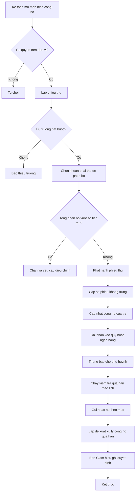
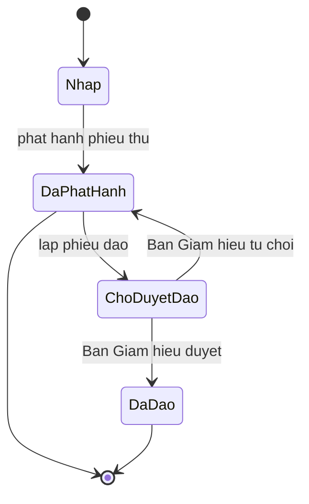

# [QT-04] Thu học phí và quản lý công nợ phải thu

| Mục | Giá trị |
|-----|---------|
| Dự án | School Management - Hệ thống quản lý trường mầm non |
| Phiên bản | 1.5 - 2026-10-09 |
| Trạng thái | Đã phê duyệt |
| Người phê duyệt | Eric, ngày 2026-10-09 |
| Người yêu cầu | Eric |
| Ưu tiên | Gấp |
| Loại | Mới |

## 1. Tóm tắt

Kế toán ghi nhận tiền phụ huynh nộp cho các khoản phải thu của trẻ, lập phiếu thu và phân bổ số tiền vào từng khoản. Hệ thống theo dõi số dư công nợ của từng trẻ, đưa ra danh sách nhắc nợ theo mốc quá hạn và ghi nhận tiền vào quỹ hoặc tài khoản ngân hàng.

## 2. Tác nhân và quyền

| Tác nhân | Vai trò trong hệ thống | Được làm gì trong quy trình |
|----------|------------------------|------------------------------|
| Kế toán | VT-04 | Lập phiếu thu, phân bổ vào khoản phải thu, xem công nợ, lập phiếu đảo, lập đề xuất xử lý công nợ quá hạn |
| Thủ quỹ | VT-16 | Lập phiếu thu tiền mặt vào quỹ của đơn vị được gán, chọn hóa đơn và phân bổ (P06-01, P06-02, Q-152) |
| Kế toán trưởng | VT-05 | Lập phiếu đảo, theo dõi công nợ khó thu; không phê duyệt |
| Quản lý đơn vị | VT-03 | Xem công nợ của đơn vị, lập đề xuất xử lý công nợ quá hạn (P05-12); không quyết định |
| Phụ huynh | VT-14 | Xem công nợ của con, thanh toán và xem lịch sử đã nộp |
| Phó Hiệu trưởng | VT-15 | Phê duyệt phiếu đảo phiếu thu dưới hạn mức; ghi quyết định xử lý công nợ quá hạn; trong các đơn vị được gán |
| Hiệu trưởng | VT-02 | Phê duyệt phiếu đảo phiếu thu từ hạn mức trở lên hoặc khi chưa cấu hình hạn mức; ghi quyết định xử lý công nợ quá hạn; xem báo cáo công nợ toàn trường |

## 3. Điều kiện trước

- Khoản phải thu của kỳ đã được phát hành theo quy trình tính học phí.
- Trẻ đang ở trạng thái đang học hoặc còn công nợ chưa tất toán.
- Kế toán đã đăng nhập và có quyền trên đơn vị của trẻ.
- Quỹ tiền mặt hoặc tài khoản ngân hàng nhận tiền đã được cấu hình.

## 4. Luồng chính

| Bước | Ai | Hành động | Hệ thống xử lý | Kết quả người dùng thấy | Đã có / Mới |
|------|----|-----------|----------------|--------------------------|-------------|
| 1 | Kế toán | Mở màn hình công nợ của trẻ hoặc danh sách công nợ theo lớp | Truy vấn công nợ theo quyền và bộ lọc | Danh sách trẻ kèm số dư công nợ | Mới |
| 2 | Kế toán | Bấm lập phiếu thu, chọn trẻ và nhập số tiền, phương thức, tài khoản nhận | Kiểm tra trường bắt buộc, tạm giữ số phiếu | Biểu mẫu phiếu thu | Mới |
| 3 | Kế toán | Chọn các khoản phải thu cần thanh toán | Hiển thị danh sách khoản phải thu còn lại của trẻ kèm số dư từng khoản | Danh sách khoản để phân bổ | Mới |
| 4 | Kế toán | Bấm phân bổ và kiểm tra tổng phân bổ | Kiểm tra tổng phân bổ không vượt số tiền thu | Tổng phân bổ và số còn lại | Mới |
| 5 | Kế toán | Bấm phát hành phiếu thu | Cấp số phiếu, lưu phiếu, cập nhật công nợ, ghi nhận vào quỹ hoặc ngân hàng | Phiếu thu đã phát hành | Mới |
| 6 | Hệ thống | Cập nhật công nợ của trẻ | Trừ số đã phân bổ, đổi trạng thái hóa đơn sang đã thu đủ | Số dư công nợ mới | Mới |
| 7 | Hệ thống | Thông báo cho phụ huynh | Gửi thông báo và biên nhận trong ứng dụng | Phụ huynh thấy đã thanh toán và còn lại bao nhiêu | Mới |
| 8 | Hệ thống | Chạy kiểm tra công nợ quá hạn theo lịch (P05-10, giai đoạn 2) | Lọc công nợ vượt mốc cấu hình, đưa vào danh sách nhắc nợ | Danh sách nhắc nợ | Mới |
| 9 | Kế toán | Gửi nhắc nợ cho phụ huynh theo danh sách | Ghi nhận lần nhắc, thời điểm, kênh gửi | Lịch sử nhắc nợ của trẻ | Mới |
| 10 | Quản lý đơn vị hoặc kế toán | Lập đề xuất xử lý cho trẻ có công nợ quá hạn dài ngày (P05-12, giai đoạn 2) | Lưu đề xuất ở trạng thái chờ quyết định, thông báo Ban Giám hiệu | Đề xuất chờ quyết định | Mới |
| 10a | Phó Hiệu trưởng hoặc Hiệu trưởng | Ghi quyết định xử lý | Kiểm tra vai trò và phạm vi đơn vị; lưu quyết định, không thay đổi số tiền công nợ; muốn giảm số tiền phải qua miễn giảm hoặc điều chỉnh hóa đơn | Đề xuất đã có quyết định | Mới |
| 11 | Phụ huynh | Quét mã QR chuyển khoản đủ số còn phải nộp của hóa đơn | Nhận thông báo tiền vào, đối chiếu số tiền và nội dung, tự lập và phát hành phiếu thu, phân bổ vào hóa đơn | Hóa đơn đã thu đủ, phụ huynh nhận biên nhận | Mới |

## 5. Sơ đồ

## 6. Luồng phụ và lỗi

| Mã | Tình huống | Hệ thống phản hồi | Thông báo cho người dùng |
|----|-----------|-------------------|--------------------------|
| E1 | Kế toán đơn vị A thao tác trên trẻ của đơn vị B | Từ chối ở máy chủ | Bạn không có quyền thu tiền cho trẻ của đơn vị này |
| E2 | Không tìm thấy khoản phải thu của trẻ | Trả về không tìm thấy | Trẻ này không có khoản phải thu nào trong kỳ đã chọn |
| E3 | Tổng phân bổ vượt số tiền thu | Chặn phát hành | Tổng phân bổ vượt số tiền đã thu, điều chỉnh lại |
| E4 | Trẻ đã thu đủ, kế toán thu thêm | Cho phép, số dư ghi thành số dư có cho kỳ sau | Trẻ đã thu đủ, số tiền thừa sẽ chuyển sang kỳ sau |
| E5 | Phát hành phiếu thu hai lần do mạng chậm | Chống trùng theo mã yêu cầu, chỉ tạo một phiếu | Không hiển thị lỗi, dữ liệu không bị nhân đôi |
| E6 | Kế toán bấm xóa phiếu thu đã phát hành | Chặn, yêu cầu lập phiếu đảo | Không xóa được phiếu đã phát hành, lập phiếu đảo để điều chỉnh |
| E7 | Phiếu đảo không có lý do | Chặn lưu | Nhập lý do đảo phiếu |
| E8 | Quỹ tiền mặt không đủ số dư khi lập phiếu chi từ tiền vừa thu | Chặn ở mọi đơn vị | Số dư quỹ không đủ |
| E9 | Gửi nhắc nợ thất bại | Ghi hàng đợi gửi lại, đánh dấu chưa gửi được | Chưa gửi được nhắc nợ, hệ thống sẽ thử lại |
| E10 | Chuyển khoản mã QR có số tiền hoặc nội dung không khớp hóa đơn | Không tự lập phiếu thu, đưa giao dịch vào danh sách chờ kế toán xử lý (BM-62) | Có giao dịch chuyển khoản cần kế toán xử lý |
| E11 | Nhà cung cấp gửi lại thông báo cùng mã giao dịch | Không lập phiếu thu thứ hai | Không hiển thị lỗi |
| E12 | Phiếu đảo chưa được Ban Giám hiệu duyệt | Phiếu gốc và công nợ chưa thay đổi; kế toán trưởng, kế toán, quản lý đơn vị gọi điểm cuối duyệt bị từ chối | Phiếu đảo đang chờ Ban Giám hiệu duyệt |
| E13 | Quản lý đơn vị hoặc kế toán ghi quyết định xử lý công nợ | Từ chối ở máy chủ | Chỉ Ban Giám hiệu ghi quyết định xử lý công nợ |

## 7. Trạng thái

| Từ | Sang | Khi nào | Ai được làm |
|----|------|---------|-------------|
| Nháp | Đã phát hành | Kế toán hoặc thủ quỹ bấm phát hành | VT-04, VT-16 |
| Đã phát hành | Chờ duyệt đảo | Kế toán hoặc kế toán trưởng lập phiếu đảo kèm lý do | VT-04, VT-05 |
| Chờ duyệt đảo | Đã đảo | Phó Hiệu trưởng phê duyệt dưới hạn mức, Hiệu trưởng phê duyệt từ hạn mức trở lên hoặc khi chưa cấu hình hạn mức | VT-15, VT-02 |
| Chờ duyệt đảo | Đã phát hành | Ban Giám hiệu từ chối kèm lý do | VT-15, VT-02 |

Trạng thái của hóa đơn học phí: nháp, đã phát hành, đã thu đủ, quá hạn. Không có trạng thái thu một phần vì phụ huynh luôn phải trả đủ (Q-47).

Trạng thái của đề xuất xử lý công nợ quá hạn: chờ quyết định, đã quyết định.

## 8. Quy tắc nghiệp vụ

| Mã | Quy tắc |
|----|---------|
| BR-28 | Mọi khoản thu đều phải có phiếu; không ghi nhận thu không có phiếu |
| BR-29 | Phiếu thu đã phát hành không được xóa; sai thì lập phiếu đảo có tham chiếu tới phiếu gốc; phiếu đảo phiếu thu do Ban Giám hiệu phê duyệt theo hạn mức (mục 12.1 của tài liệu 07) |
| BR-30 | Số phiếu thu do hệ thống sinh, không trùng trong phạm vi đơn vị và năm học |
| BR-31 | Phiếu thu phải thanh toán đủ số còn phải nộp của từng hóa đơn được chọn; không nhận thanh toán một phần |
| BR-32 | Số dư công nợ bằng tổng khoản phải thu trừ tổng đã phân bổ từ phiếu thu trừ giảm trừ đã duyệt |
| BR-33 | Công nợ quá hạn xác định theo số ngày quá hạn so với ngày đến hạn của kỳ; mỗi đơn vị tự bật hoặc tắt việc chặn đăng ký thêm dịch vụ khi còn nợ quá hạn, không chặn trẻ đi học |
| BR-34 | Số dư quỹ và ngân hàng tính từ phiếu thu, phiếu chi và giao dịch đã ghi nhận; số dư quỹ tiền mặt không được âm |
| BR-35 | Mọi thao tác thay đổi số liệu tài chính phải ghi nhật ký thao tác kèm giá trị trước và sau |

## 9. Thông báo, thời gian thực và nhật ký

| Sự kiện | Ai nhận | Kênh | Nội dung | Ghi nhật ký |
|---------|---------|------|----------|-------------|
| Phiếu thu được phát hành | Phụ huynh của trẻ | Trong ứng dụng và tin nhắn | Đã nhận số tiền, xem biên nhận | Có |
| Trẻ đã thu đủ khoản phải thu | Kế toán, quản lý đơn vị | Trong ứng dụng | Trẻ đã tất toán công nợ của kỳ | Có |
| Công nợ chuyển sang quá hạn | Kế toán, quản lý đơn vị | Trong ứng dụng | Có công nợ quá hạn cần xử lý | Có |
| Nhắc nợ được gửi | Phụ huynh của trẻ | Trong ứng dụng và tin nhắn | Nhắc thanh toán khoản học phí còn lại | Có |
| Phiếu thu bị đảo | Phụ huynh của trẻ, kế toán trưởng | Trong ứng dụng | Phiếu thu đã được đảo kèm lý do | Có, kèm giá trị trước và sau |
| Phiếu đảo chờ duyệt | Phó Hiệu trưởng hoặc Hiệu trưởng theo hạn mức | Trong ứng dụng | Có phiếu đảo phiếu thu cần duyệt | Có |
| Đề xuất xử lý công nợ chờ quyết định | Phó Hiệu trưởng, Hiệu trưởng | Trong ứng dụng | Có đề xuất xử lý công nợ quá hạn | Có |
| Công nợ được xử lý theo quyết định | Kế toán, quản lý đơn vị | Trong ứng dụng | Ban Giám hiệu đã ghi quyết định xử lý công nợ | Có |

## 10. Dữ liệu

| Thông tin | Bắt buộc | Ràng buộc | Ví dụ |
|-----------|----------|-----------|-------|
| Trẻ | Có | Đang học hoặc còn công nợ | Nguyễn Gia Bảo |
| Người nộp | Có | Phụ huynh của trẻ hoặc người được ủy quyền | Nguyễn Tiến Vinh |
| Số tiền thu | Có | Lớn hơn không, đơn vị đồng | 4 500 000 |
| Phương thức | Có | Tiền mặt, chuyển khoản, khác | Tiền mặt |
| Tài khoản nhận | Có | Quỹ tiền mặt hoặc tài khoản ngân hàng đang hoạt động | Quỹ tiền mặt đơn vị Thảo Điền |
| Danh sách khoản phân bổ | Có | Tổng không vượt số tiền thu | Hai dòng, tổng 4 500 000 |
| Số phiếu thu | Có | Do hệ thống sinh, không trùng | PT-2026-000318 |
| Ngày thu | Có | Không lớn hơn ngày hiện tại | 2026-10-09 |
| Lý do đảo phiếu | Có khi đảo | Tối đa năm trăm ký tự | Ghi nhầm số tiền |
| Số lần nhắc nợ | Không | Số nguyên không âm | 2 |
| Đề xuất xử lý công nợ | Có khi lập đề xuất | Tối đa một nghìn ký tự | Làm việc với phụ huynh, cam kết nộp trước ngày 30 |
| Quyết định xử lý công nợ | Có khi quyết định | Tối đa một nghìn ký tự; người quyết định là VT-15 hoặc VT-02 | Đồng ý gia hạn đến ngày 30 |

## 11. Màn hình liên quan

1. **Danh sách công nợ** — lọc theo đơn vị, lớp, kỳ, mốc quá hạn; cột số phải thu, đã thu, còn lại.
2. **Biểu mẫu phiếu thu** — thông tin trẻ, người nộp, số tiền, phương thức, tài khoản nhận.
3. **Màn hình phân bổ** — danh sách khoản phải thu còn lại, ô nhập số tiền phân bổ từng dòng, tổng và số còn lại.
4. **Chi tiết công nợ của trẻ** — lịch sử hóa đơn, lịch sử phiếu thu, số dư theo kỳ.
5. **Danh sách nhắc nợ** — trẻ quá hạn, số ngày quá hạn, số lần đã nhắc, nút gửi nhắc, nút lập đề xuất xử lý; Ban Giám hiệu có nút ghi quyết định (MH-08).
6. **Màn hình công nợ của phụ huynh** — số còn phải nộp, lịch sử đã nộp, biên nhận.

## 12. Tiêu chí nghiệm thu

- AC-30: Cho một phiếu thu mới / Khi phát hành / Thì hệ thống cấp số phiếu không trùng trong phạm vi đơn vị và năm học.
- AC-31: Cho phiếu thu một triệu đồng / Khi phân bổ vào ba khoản có tổng một triệu hai trăm nghìn đồng / Thì hệ thống từ chối.
- AC-32: Cho trẻ có hai hóa đơn còn phải nộp một triệu và hai triệu đồng / Khi thu một triệu đồng cho hóa đơn một triệu / Thì hóa đơn đó đã thu đủ và công nợ của trẻ còn hai triệu đồng.
- AC-33: Cho phiếu thu đã phát hành / Khi kế toán bấm xóa / Thì hệ thống không cho xóa và yêu cầu lập phiếu đảo.
- AC-34: Cho phiếu đảo lập từ phiếu gốc / Khi mở phiếu đảo / Thì thấy tham chiếu tới phiếu gốc và phiếu gốc còn nguyên vẹn.
- AC-104: Cho một kế toán đơn vị A / Khi gọi điểm cuối lập phiếu thu cho trẻ của đơn vị B / Thì bị từ chối ở máy chủ.
- AC-105: Cho một tài khoản giáo viên / Khi gọi điểm cuối danh sách phiếu thu của đơn vị / Thì bị từ chối.
- AC-106: Cho một phụ huynh / Khi mở chi tiết công nợ / Thì chỉ thấy công nợ của con mình và lịch sử phiếu thu của con mình.
- AC-107: Cho một trẻ có công nợ vượt mốc nhắc nợ cấu hình / Khi tác vụ kiểm tra quá hạn chạy / Thì trẻ xuất hiện trong danh sách nhắc nợ kèm số ngày quá hạn.
- AC-186: Cho hóa đơn còn phải nộp hai triệu đồng / Khi phụ huynh chuyển khoản đủ hai triệu theo mã QR và hệ thống nhận thông báo tiền vào / Thì phiếu thu được tự lập và hóa đơn đã thu đủ.
- AC-187: Cho một thông báo tiền vào đã xử lý / Khi nhà cung cấp gửi lại cùng mã giao dịch / Thì hệ thống không tạo phiếu thu thứ hai.
- AC-188: Cho chuyển khoản có số tiền khác số còn phải nộp / Khi hệ thống nhận thông báo tiền vào / Thì không tự lập phiếu thu, giao dịch vào danh sách chờ kế toán xử lý.
- AC-189: Cho hóa đơn còn phải nộp hai triệu đồng / Khi kế toán lập phiếu thu một triệu cho hóa đơn đó / Thì hệ thống từ chối vì không nhận thanh toán một phần.
- AC-212: Cho phiếu đảo phiếu thu vừa được lập / Khi chưa được Ban Giám hiệu duyệt / Thì phiếu gốc và công nợ chưa thay đổi, và kế toán trưởng gọi điểm cuối duyệt bị từ chối.
- AC-213: Cho đề xuất xử lý công nợ quá hạn do quản lý đơn vị lập / Khi quản lý đơn vị gọi điểm cuối ghi quyết định / Thì bị từ chối; khi Phó Hiệu trưởng ghi quyết định thì đề xuất chuyển sang đã quyết định và số tiền công nợ không đổi.
- AC-108: Cho một phiếu thu được phát hành / Khi mở sổ quỹ của ngày / Thì số tiền của phiếu thu đã được ghi nhận vào tài khoản nhận tiền.

## 13. Ảnh hưởng tới phần có sẵn

Không áp dụng. Đây là dự án mới, chưa có mã nguồn và dữ liệu cũ.

## 14. Giả định và câu hỏi mở

| Mã | Nội dung | Cần ai trả lời |
|----|----------|----------------|
| GD-26 | Đã xác nhận ngày 09/10/2026: Ngày đến hạn của khoản phải thu do đơn vị cấu hình, áp dụng cho mọi trẻ trong kỳ | Eric |
| GD-27 | Đã xác nhận ngày 09/10/2026: Tiền thừa của trẻ được ghi thành số dư có và bù trừ vào kỳ sau | Eric |
| Q-45 | Đã trả lời ngày 09/10/2026: mặc định 3, 7 và 15 ngày sau ngày đến hạn, cấu hình được theo đơn vị | Eric |
| Q-46 | Đã trả lời ngày 09/10/2026: không dừng việc học của trẻ; mỗi đơn vị tự cấu hình có chặn đăng ký thêm dịch vụ hay không | Eric |
| Q-47 | Đã trả lời ngày 09/10/2026: không nhận thanh toán một phần; phụ huynh luôn phải trả đủ số còn phải nộp của hóa đơn | Eric |
| Q-48 | Đã trả lời ngày 09/10/2026: phụ huynh tự thanh toán trực tuyến bằng chuyển khoản mã QR ngay giai đoạn 1, hoặc nộp trực tiếp cho kế toán | Eric |

## 15. Ghi chú kỹ thuật

- Điểm cuối dự kiến: lấy danh sách công nợ, lập phiếu thu, lấy khoản phải thu của trẻ, phát hành phiếu thu, đảo phiếu thu, duyệt và từ chối phiếu đảo, lấy lịch sử nhắc nợ, gửi nhắc nợ, lập đề xuất và ghi quyết định xử lý công nợ.
- Bảng dữ liệu dự kiến: phiếu thu, dòng phân bổ phiếu thu, hóa đơn, dòng khoản phải thu, lịch sử nhắc nợ, đề xuất xử lý công nợ (`debt_resolutions`), sổ quỹ, giao dịch ngân hàng.
- Việc chạy nền: kiểm tra công nợ quá hạn theo lịch, gửi nhắc nợ.
- Ràng buộc duy nhất dự kiến trên số phiếu thu theo đơn vị và năm học.
- Chưa có mã nguồn nên chưa tham chiếu được tệp và số dòng.

## Lịch sử thay đổi

| Phiên bản | Ngày | Thay đổi |
|-----------|------|----------|
| 1.0 | 2026-10-09 | Tạo mới |
| 1.1 | 2026-10-09 | Bỏ kế toán trưởng khỏi luồng phê duyệt phiếu đảo; Ban Giám hiệu phê duyệt theo hạn mức |
| 1.2 | 2026-10-09 | Không nhận thanh toán một phần; thêm thanh toán trực tuyến bằng mã QR (bước 11) |
| 1.3 | 2026-10-09 | Rà duyệt: phiếu đảo phiếu thu chờ Ban Giám hiệu duyệt theo hạn mức; xử lý công nợ quá hạn do Ban Giám hiệu quyết định qua P05-12 (YCTD-23); thêm thủ quỹ; luồng lỗi thanh toán mã QR; Eric phê duyệt |
| 1.4 | 2026-10-09 | YCTD-28: thủ quỹ chọn hóa đơn và phân bổ khi lập phiếu thu tiền mặt (Q-152) |
| 1.5 | 2026-10-09 | YCTD-30: số phiếu không trùng trong đơn vị và năm học |
