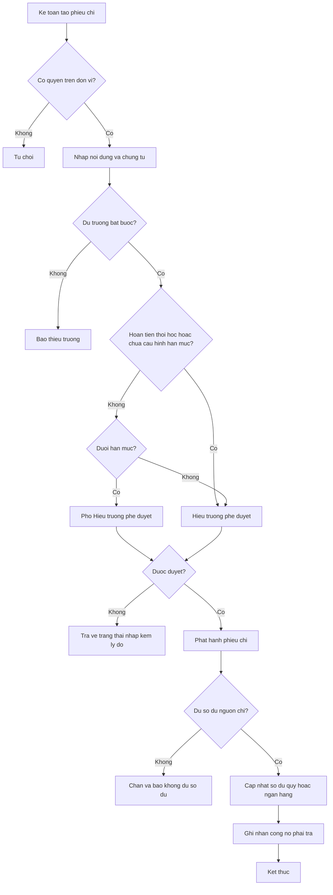
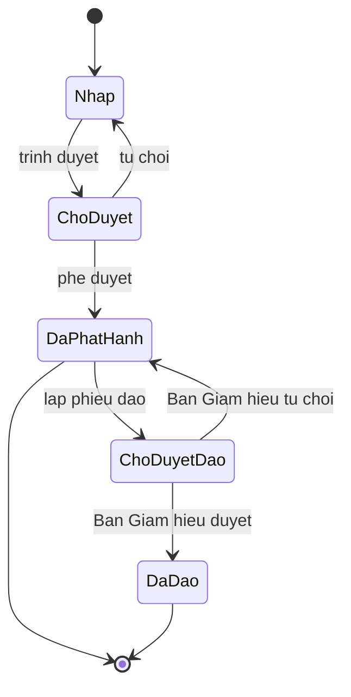

# [QT-05] Lập phiếu chi và quản lý quỹ, tài khoản ngân hàng

| Mục | Giá trị |
|-----|---------|
| Dự án | School Management - Hệ thống quản lý trường mầm non |
| Phiên bản | 1.3 - 2026-10-09 |
| Trạng thái | Đã phê duyệt |
| Người phê duyệt | Eric, ngày 2026-10-09 |
| Người yêu cầu | Eric |
| Ưu tiên | Bình thường |
| Loại | Mới |

## 1. Tóm tắt

Kế toán lập phiếu chi cho các khoản phải trả của trường như mua nguyên liệu, mua thuốc, sửa chữa tài sản, chi lương. Mọi phiếu chi phải được Ban Giám hiệu phê duyệt theo hạn mức: Phó Hiệu trưởng duyệt dưới hạn mức, Hiệu trưởng duyệt từ hạn mức trở lên; loại chứng từ chưa cấu hình hạn mức và phiếu chi hoàn tiền khi trẻ thôi học do Hiệu trưởng duyệt. Phiếu chi và quỹ tiền mặt thuộc giai đoạn 1; tài khoản ngân hàng, công nợ phải trả và chốt kỳ tài chính thuộc giai đoạn 2. Hệ thống theo dõi số dư quỹ tiền mặt và tài khoản ngân hàng, đồng thời ghi nhận công nợ phải trả với nhà cung cấp.

## 2. Tác nhân và quyền

| Tác nhân | Vai trò trong hệ thống | Được làm gì trong quy trình |
|----------|------------------------|------------------------------|
| Kế toán | VT-04 | Lập phiếu chi, lập phiếu đảo, ghi nhận giao dịch ngân hàng |
| Thủ quỹ | VT-16 | Lập phiếu chi tiền mặt từ quỹ của đơn vị được gán; xem sổ quỹ (P06-04, P06-05) |
| Kế toán trưởng | VT-05 | Lập phiếu chi và phiếu đảo, đề nghị chốt kỳ tài chính; không phê duyệt |
| Quản lý đơn vị | VT-03 | Xem thu chi của đơn vị; không phê duyệt đề nghị mua hàng |
| Nhân viên kho | VT-11 | Xem phiếu chi liên quan tới mua hàng của mình |
| Phó Hiệu trưởng | VT-15 | Phê duyệt phiếu chi và đề nghị mua hàng dưới hạn mức, trong các đơn vị được gán |
| Hiệu trưởng | VT-02 | Phê duyệt phiếu chi và đề nghị mua hàng từ hạn mức trở lên hoặc khi chưa cấu hình hạn mức; phê duyệt mọi phiếu chi hoàn tiền khi trẻ thôi học (BR-24); xem báo cáo thu chi toàn trường |

## 3. Điều kiện trước

- Quỹ tiền mặt hoặc tài khoản ngân hàng nguồn chi đã được cấu hình và đang hoạt động.
- Hạn mức phê duyệt có thể đã hoặc chưa được cấu hình; chưa cấu hình thì Hiệu trưởng duyệt (Q-112).
- Có chứng từ kèm theo: đề nghị mua hàng đã duyệt, phiếu mua hàng, hợp đồng hoặc biên bản.
- Kỳ tài chính chưa bị chốt.

## 4. Luồng chính

| Bước | Ai | Hành động | Hệ thống xử lý | Kết quả người dùng thấy | Đã có / Mới |
|------|----|-----------|----------------|--------------------------|-------------|
| 1 | Kế toán | Mở màn hình phiếu chi và bấm tạo phiếu | Kiểm tra quyền, mở biểu mẫu, tạm giữ số phiếu | Biểu mẫu phiếu chi | Mới |
| 2 | Kế toán | Chọn loại phiếu chi (thường, hoàn tiền thôi học, lương); nhập người nhận, số tiền, nội dung, nguồn chi, khoản mục, chứng từ kèm theo | Kiểm tra trường bắt buộc, tính tổng tiền theo chứng từ | Phiếu chi ở trạng thái nháp | Mới |
| 3 | Kế toán | Bấm trình duyệt | Phiếu chi hoàn tiền thôi học chuyển Hiệu trưởng, không xét hạn mức (BR-24); chưa cấu hình hạn mức thì chuyển Hiệu trưởng; còn lại so với hạn mức: dưới hạn mức chuyển Phó Hiệu trưởng, từ hạn mức trở lên chuyển Hiệu trưởng | Phiếu chi ở trạng thái chờ duyệt | Mới |
| 4 | Phó Hiệu trưởng hoặc Hiệu trưởng | Phê duyệt phiếu chi | Kiểm tra hạn mức, phạm vi đơn vị và người phê duyệt không phải người lập; ghi nhận người phê duyệt và thời điểm; cấp số phiếu, ghi công nợ phải trả nếu có | Phiếu chi đã phát hành | Mới |
| 5 | Phó Hiệu trưởng hoặc Hiệu trưởng | Từ chối phiếu chi kèm lý do | Trả phiếu về trạng thái nháp, thông báo cho kế toán lập phiếu | Phiếu chi ở trạng thái nháp kèm lý do | Mới |
| 6 | Hệ thống | Cập nhật số dư quỹ hoặc tài khoản ngân hàng | Trừ số tiền đã chi, ghi vào lịch sử giao dịch | Số dư mới | Mới |
| 7 | Kế toán | Ghi nhận thanh toán cho nhà cung cấp (giai đoạn 2) | Bù trừ công nợ phải trả tương ứng | Công nợ phải trả đã giảm | Mới |
| 8 | Kế toán hoặc kế toán trưởng | Lập phiếu đảo khi phiếu chi sai, kèm lý do | Sinh phiếu đảo tham chiếu phiếu gốc ở trạng thái chờ duyệt; Ban Giám hiệu duyệt theo hạn mức (YCTD-24); số dư chỉ được hoàn lại khi đã duyệt | Phiếu đảo chờ duyệt | Mới |
| 9 | Kế toán trưởng, Hiệu trưởng | Kế toán trưởng đề nghị chốt kỳ tài chính, Hiệu trưởng phê duyệt (P06-09, giai đoạn 2) | Khóa số liệu của kỳ, chặn phát hành phiếu ngược ngày | Kỳ đã chốt | Mới |

## 5. Sơ đồ

## 6. Luồng phụ và lỗi

| Mã | Tình huống | Hệ thống phản hồi | Thông báo cho người dùng |
|----|-----------|-------------------|--------------------------|
| E1 | Kế toán đơn vị A lập phiếu chi cho đơn vị B | Từ chối ở máy chủ | Bạn không có quyền lập phiếu chi cho đơn vị này |
| E2 | Không tìm thấy nguồn chi | Trả về không tìm thấy | Nguồn chi không tồn tại hoặc đã ngừng sử dụng |
| E3 | Thiếu chứng từ kèm theo | Chặn phát hành | Vui lòng đính kèm chứng từ trước khi phát hành |
| E4 | Số tiền chi vượt số dư nguồn chi | Chặn luôn với quỹ tiền mặt ở mọi đơn vị, không tắt được; với tài khoản ngân hàng chặn theo cấu hình của đơn vị (BR-34) | Số dư nguồn chi không đủ |
| E5 | Phát hành hai lần do mạng chậm | Chống trùng theo mã yêu cầu | Không hiển thị lỗi, dữ liệu không bị nhân đôi |
| E6 | Phiếu chi đã phát hành bị yêu cầu xóa | Chặn, yêu cầu lập phiếu đảo | Không xóa được phiếu đã phát hành |
| E7 | Phiếu chi ngược ngày trong kỳ đã chốt | Chặn | Kỳ này đã chốt, không phát hành được phiếu ngược ngày |
| E8 | Số phiếu chi trùng | Sinh lại số khác, ghi nhận cảnh báo kỹ thuật | Không hiển thị cho người dùng |
| E9 | Phê duyệt phiếu chi đã bị người khác phê duyệt | Không cho phê duyệt lần hai, hiển thị người đã duyệt | Phiếu chi đã được phê duyệt bởi người khác |
| E10 | Phó Hiệu trưởng duyệt phiếu chi hoàn tiền thôi học | Từ chối, chuyển Hiệu trưởng (BR-24) | Phiếu chi hoàn tiền do Hiệu trưởng duyệt |
| E11 | Phiếu đảo phiếu chi chưa được duyệt | Phiếu gốc và số dư chưa thay đổi; kế toán, kế toán trưởng, thủ quỹ gọi điểm cuối duyệt bị từ chối | Phiếu đảo đang chờ Ban Giám hiệu duyệt |

## 7. Trạng thái

| Từ | Sang | Khi nào | Ai được làm |
|----|------|---------|-------------|
| Nháp | Chờ duyệt | Kế toán, kế toán trưởng hoặc thủ quỹ trình duyệt | VT-04, VT-05, VT-16 |
| Chờ duyệt | Đã phát hành | Phó Hiệu trưởng phê duyệt khi dưới hạn mức; Hiệu trưởng phê duyệt khi từ hạn mức trở lên, khi chưa cấu hình hạn mức và với phiếu chi hoàn tiền | VT-15, VT-02 |
| Chờ duyệt | Nháp | Người phê duyệt từ chối kèm lý do | VT-15, VT-02 |
| Đã phát hành | Chờ duyệt đảo | Kế toán hoặc kế toán trưởng lập phiếu đảo kèm lý do | VT-04, VT-05 |
| Chờ duyệt đảo | Đã đảo | Phó Hiệu trưởng phê duyệt dưới hạn mức, Hiệu trưởng phê duyệt từ hạn mức trở lên hoặc khi chưa cấu hình hạn mức | VT-15, VT-02 |
| Chờ duyệt đảo | Đã phát hành | Ban Giám hiệu từ chối kèm lý do | VT-15, VT-02 |

## 8. Quy tắc nghiệp vụ

| Mã | Quy tắc |
|----|---------|
| BR-28 | Mọi khoản chi đều phải có phiếu; không ghi nhận chi không có phiếu |
| BR-24 | Phiếu chi hoàn tiền khi trẻ thôi học luôn do Hiệu trưởng phê duyệt, không xét hạn mức |
| BR-29 | Phiếu chi đã phát hành không được xóa; sai thì lập phiếu đảo; phiếu đảo phiếu chi do Ban Giám hiệu phê duyệt theo hạn mức (YCTD-24) |
| BR-30 | Số phiếu chi do hệ thống sinh, không trùng trong phạm vi đơn vị và năm học |
| BR-34 | Số dư quỹ và ngân hàng tính từ phiếu thu, phiếu chi và giao dịch đã ghi nhận; số dư quỹ tiền mặt không được âm, không tắt được; kiểm tra số dư tài khoản ngân hàng do đơn vị cấu hình |
| BR-77 | Hạn mức phê duyệt cấu hình theo đơn vị và loại chứng từ; Phó Hiệu trưởng duyệt dưới hạn mức, Hiệu trưởng duyệt từ hạn mức trở lên; chưa cấu hình thì Hiệu trưởng duyệt |
| BR-36 | Báo cáo tài chính phải lọc được theo đơn vị, khoảng ngày, loại thu chi và người lập phiếu |
| BR-63 | Đề nghị mua hàng phải được duyệt theo hạn mức trước khi lập phiếu mua hàng |

## 9. Thông báo, thời gian thực và nhật ký

| Sự kiện | Ai nhận | Kênh | Nội dung | Ghi nhật ký |
|---------|---------|------|----------|-------------|
| Phiếu chi được trình duyệt | Phó Hiệu trưởng hoặc Hiệu trưởng theo hạn mức | Trong ứng dụng | Có phiếu chi cần phê duyệt | Có |
| Phiếu chi được phê duyệt | Kế toán lập phiếu | Trong ứng dụng | Phiếu chi đã được phê duyệt | Có |
| Phiếu chi bị từ chối | Kế toán lập phiếu | Trong ứng dụng | Phiếu chi bị từ chối kèm lý do | Có |
| Phiếu chi được phát hành | Kế toán trưởng | Trong ứng dụng | Phiếu chi đã phát hành | Có |
| Phiếu đảo phiếu chi chờ duyệt | Phó Hiệu trưởng hoặc Hiệu trưởng theo hạn mức | Trong ứng dụng | Có phiếu đảo phiếu chi cần duyệt | Có |
| Số dư nguồn chi xuống dưới ngưỡng cảnh báo | Kế toán, kế toán trưởng | Trong ứng dụng | Số dư quỹ hoặc tài khoản ngân hàng dưới ngưỡng | Có |
| Kỳ tài chính được chốt | Kế toán, Ban Giám hiệu | Trong ứng dụng | Kỳ tài chính đã chốt | Có |

## 10. Dữ liệu

| Thông tin | Bắt buộc | Ràng buộc | Ví dụ |
|-----------|----------|-----------|-------|
| Loại phiếu chi | Có | Thường, hoàn tiền thôi học, lương | Thường |
| Trẻ | Chỉ với phiếu chi hoàn tiền | Trẻ đã thôi học có số đã thu vượt | Nguyễn Gia Bảo |
| Người nhận tiền | Có | Cá nhân hoặc nhà cung cấp | Công ty Thực phẩm Sạch |
| Số tiền | Có | Lớn hơn không, đơn vị đồng | 12 400 000 |
| Nội dung chi | Có | Tối đa năm trăm ký tự | Thanh toán nguyên liệu tháng 10 |
| Nguồn chi | Có | Quỹ tiền mặt hoặc tài khoản ngân hàng đang hoạt động; một đơn vị có thể có nhiều quỹ tiền mặt (Q-50) | Quỹ tiền mặt đơn vị Thảo Điền |
| Khoản mục thu chi | Có | Thuộc danh mục P06-10 | Mua nguyên liệu |
| Chứng từ kèm theo | Có | Tệp đính kèm hoặc số chứng từ giấy | Phiếu mua hàng MH-2026-000145 |
| Hạn mức phê duyệt | Không | Do đơn vị cấu hình theo loại chứng từ; trống thì Hiệu trưởng duyệt | Phiếu chi: 10 000 000 |
| Người phê duyệt | Có | Phó Hiệu trưởng khi dưới hạn mức; Hiệu trưởng khi từ hạn mức trở lên, khi chưa cấu hình hạn mức và với phiếu chi hoàn tiền; không phải người lập phiếu | Phó Hiệu trưởng |
| Lý do đảo phiếu | Có khi đảo | Tối đa năm trăm ký tự | Ghi nhầm số tiền |

## 11. Màn hình liên quan

1. **Danh sách phiếu chi** — lọc theo đơn vị, khoảng ngày, trạng thái, người lập.
2. **Biểu mẫu phiếu chi** — người nhận, số tiền, nội dung, nguồn chi, chứng từ, khối phê duyệt.
3. **Sổ quỹ tiền mặt** — số dư đầu kỳ, danh sách phiếu thu chi, số dư cuối kỳ theo ngày.
4. **Sổ tài khoản ngân hàng** — số dư đầu, giao dịch, số dư cuối, đối chiếu với sao kê.
5. **Màn hình công nợ phải trả** — theo nhà cung cấp, theo hạn thanh toán.
6. **Màn hình chốt kỳ tài chính** — chọn kỳ, xem số liệu tổng, xác nhận chốt.

## 12. Tiêu chí nghiệm thu

- AC-35: Cho phiếu chi có giá trị từ hạn mức trở lên / Khi kế toán trình duyệt / Thì phiếu chuyển cho Hiệu trưởng và ở trạng thái chờ duyệt.
- AC-36: Cho một giáo viên / Khi gọi điểm cuối danh sách phiếu chi của đơn vị / Thì bị từ chối.
- AC-37: Cho quỹ tiền mặt có số dư một triệu đồng / Khi lập phiếu chi hai triệu đồng từ quỹ tiền mặt / Thì hệ thống từ chối và báo số dư không đủ, ở mọi đơn vị.
- AC-109: Cho một kế toán đơn vị A / Khi gọi điểm cuối phát hành phiếu chi của đơn vị B / Thì bị từ chối ở máy chủ.
- AC-110: Cho một phiếu chi thiếu chứng từ kèm theo / Khi kế toán bấm phát hành / Thì hệ thống chặn và yêu cầu đính kèm chứng từ.
- AC-111: Cho một phiếu chi đã phát hành / Khi Hiệu trưởng phê duyệt chốt kỳ tài chính của kỳ đó / Thì phiếu chi không sửa được và số liệu kỳ không thay đổi.
- AC-112: Cho một phiếu chi được phát hành / Khi mở sổ quỹ của ngày / Thì số dư quỹ giảm đúng số tiền của phiếu chi.
- AC-113: Cho một phiếu chi đã phát hành / Khi kế toán bấm xóa / Thì hệ thống không cho xóa và yêu cầu lập phiếu đảo.
- AC-207: Cho phiếu chi hoàn tiền khi trẻ thôi học có giá trị dưới hạn mức / Khi Phó Hiệu trưởng phê duyệt / Thì bị từ chối, phiếu chuyển Hiệu trưởng.
- AC-208: Cho loại chứng từ chưa được cấu hình hạn mức / Khi trình duyệt / Thì chứng từ chuyển Hiệu trưởng.
- AC-214: Cho phiếu đảo phiếu chi vừa được lập / Khi chưa được Ban Giám hiệu duyệt / Thì phiếu gốc và số dư quỹ chưa thay đổi, và kế toán trưởng gọi điểm cuối duyệt bị từ chối.

## 13. Ảnh hưởng tới phần có sẵn

Không áp dụng. Đây là dự án mới, chưa có mã nguồn và dữ liệu cũ.

## 14. Giả định và câu hỏi mở

| Mã | Nội dung | Cần ai trả lời |
|----|----------|----------------|
| GD-28 | Đã xác nhận ngày 09/10/2026 (theo YCTD-02): Hạn mức phê duyệt phiếu chi cấu hình theo đơn vị và theo loại chứng từ, áp dụng BR-77 | Eric |
| GD-29 | Đã xác nhận ngày 09/10/2026: Chứng từ kèm theo bắt buộc với mọi phiếu chi | Eric |
| Q-49 | Đã trả lời ngày 09/10/2026: kế toán và kế toán trưởng không phê duyệt phiếu chi; hạn mức chỉ phân cấp giữa Phó Hiệu trưởng và Hiệu trưởng, mức cụ thể xem Q-112 | Eric |
| Q-50 | Đã trả lời ngày 09/10/2026: một đơn vị có thể có nhiều quỹ tiền mặt | Eric |
| Q-51 | Đã trả lời ngày 09/10/2026: có lập sổ kế toán kép, làm ở giai đoạn 3; chế độ kế toán xem Q-140 | Eric |
| Q-52 | Đã trả lời ngày 09/10/2026: đối soát toàn bộ sao kê ngân hàng để giai đoạn 3 (G3-05) | Eric |

## 15. Ghi chú kỹ thuật

- Điểm cuối dự kiến: lập phiếu chi, phát hành phiếu chi, phê duyệt, đảo phiếu chi, duyệt và từ chối phiếu đảo, lấy sổ quỹ, lấy sổ ngân hàng, chốt kỳ.
- Bảng dữ liệu dự kiến: phiếu chi, dòng chi tiết phiếu chi, sổ quỹ, giao dịch ngân hàng, công nợ phải trả, kỳ tài chính.
- Ràng buộc duy nhất dự kiến trên số phiếu chi theo đơn vị và năm học.
- Việc chạy nền: tính lại số dư quỹ và ngân hàng theo ngày, cảnh báo số dư dưới ngưỡng.
- Chưa có mã nguồn nên chưa tham chiếu được tệp và số dòng.

## Lịch sử thay đổi

| Phiên bản | Ngày | Thay đổi |
|-----------|------|----------|
| 1.0 | 2026-10-09 | Tạo mới |
| 1.1 | 2026-10-09 | Bỏ kế toán trưởng và quản lý đơn vị khỏi luồng phê duyệt; mọi phiếu chi do Ban Giám hiệu phê duyệt theo hạn mức; chốt kỳ tài chính do Hiệu trưởng phê duyệt |
| 1.2 | 2026-10-09 | Rà duyệt: AC-37 theo BR-34 bắt buộc; thêm thủ quỹ, kế toán trưởng lập phiếu; phiếu chi hoàn tiền và chưa cấu hình hạn mức do Hiệu trưởng duyệt; phiếu đảo phiếu chi chờ Ban Giám hiệu duyệt (YCTD-24); ghi rõ giai đoạn; Eric phê duyệt |
| 1.3 | 2026-10-09 | YCTD-30: số phiếu không trùng trong đơn vị và năm học |
