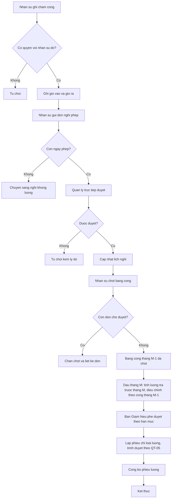
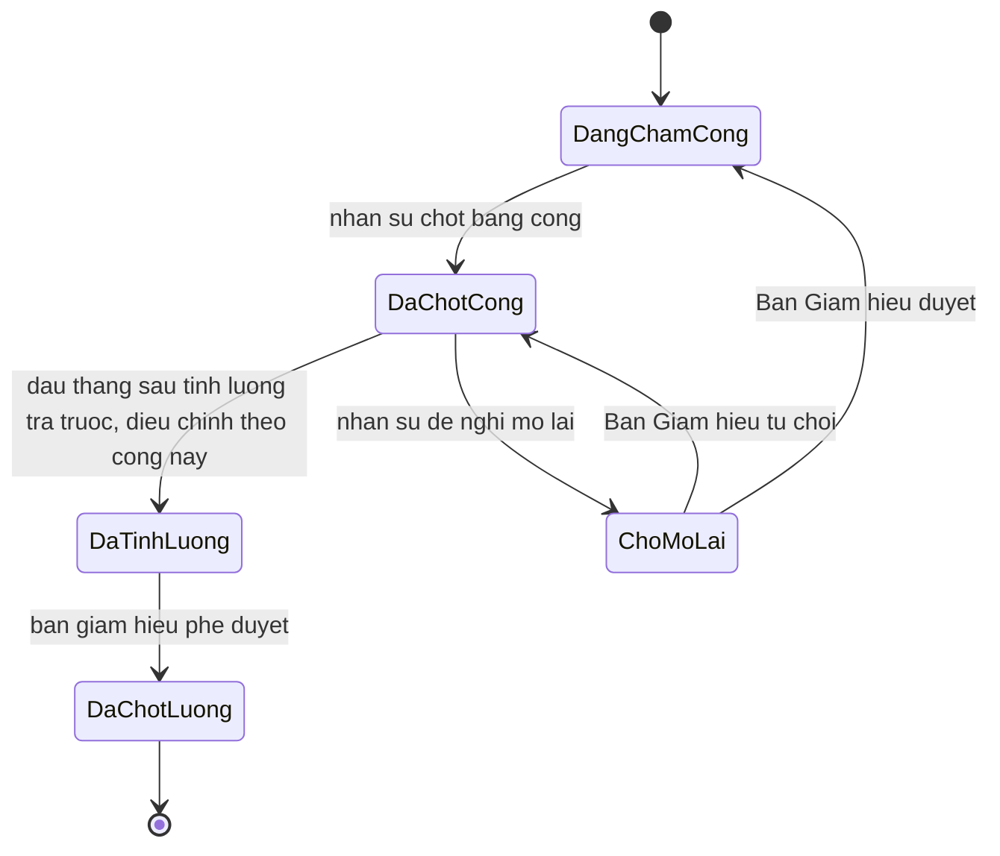

# [QT-06] Chấm công, nghỉ phép và tính lương

| Mục | Giá trị |
|-----|---------|
| Dự án | School Management - Hệ thống quản lý trường mầm non |
| Phiên bản | 1.5 - 2026-10-09 |
| Trạng thái | Đã phê duyệt |
| Người phê duyệt | Eric, ngày 2026-10-09 |
| Người yêu cầu | Eric |
| Ưu tiên | Gấp |
| Loại | Mới |

## 1. Tóm tắt

Nhân sự ghi nhận chấm công hằng ngày, nhân sự gửi đơn xin nghỉ phép và quản lý trực tiếp duyệt. Cuối tháng, nhân sự chốt bảng công. Đầu tháng M, kế toán tính bảng lương trả trước của tháng M gồm lương hợp đồng, phụ cấp cố định, thưởng, khấu trừ cố định, cộng trừ phần điều chỉnh theo bảng công đã chốt của tháng M−1 (ngày không hưởng lương, tiền làm thêm giờ, phụ cấp và khấu trừ theo ngày công). Lương trả một lần mỗi tháng, không đợi chốt công của tháng đó; nhà trường không cho ứng lương. Nhân sự nghỉ việc được lập bảng quyết toán cuối cùng (YCTD-29).

## 2. Tác nhân và quyền

| Tác nhân | Vai trò trong hệ thống | Được làm gì trong quy trình |
|----------|------------------------|------------------------------|
| Nhân sự | VT-06 | Ghi chấm công, quản lý lịch nghỉ và ngày nghỉ lễ, chốt bảng công, đề nghị mở lại kỳ công, quản lý hợp đồng và lương |
| Kế toán | VT-04 | Chạy tính lương, lập phiếu chi loại lương và trình duyệt theo QT-05 |
| Kế toán trưởng | VT-05 | Xem bảng lương; không phê duyệt |
| Quản lý đơn vị | VT-03 | Duyệt đơn nghỉ phép của nhân sự trực thuộc; không xem bảng lương |
| Giáo viên và nhân viên | VT-07 đến VT-12, VT-16 đến VT-18 | Chấm công, gửi đơn nghỉ phép, xem phiếu lương |
| Phó Hiệu trưởng | VT-15 | Phê duyệt bảng lương dưới hạn mức, duyệt mở lại kỳ công, trong các đơn vị được gán; lập lịch nghỉ thứ 7 và lịch học bù cùng Hiệu trưởng |
| Hiệu trưởng | VT-02 | Phê duyệt bảng lương từ hạn mức trở lên hoặc khi chưa cấu hình hạn mức; duyệt mở lại kỳ công; lập lịch nghỉ thứ 7 và lịch học bù; xem báo cáo chấm công và quỹ lương toàn trường |

## 3. Điều kiện trước

- Hồ sơ nhân sự và hợp đồng lao động còn hiệu lực trong kỳ tính lương.
- Cấu hình ngày công chuẩn, giờ làm việc, số ngày phép năm, đơn giá làm thêm giờ và các mức phụ cấp của đơn vị đã có.
- Lịch nghỉ lễ của năm (P08-09) và lịch nghỉ thứ 7, lịch học bù toàn trường (P08-10) đã có.
- Kỳ lương chưa được chốt.
- Các đơn nghỉ phép của kỳ đã được duyệt hoặc hủy hết, không còn đơn ở trạng thái chờ duyệt.

## 4. Luồng chính

| Bước | Ai | Hành động | Hệ thống xử lý | Kết quả người dùng thấy | Đã có / Mới |
|------|----|-----------|----------------|--------------------------|-------------|
| 1 | Nhân sự | Ghi chấm công cho ngày làm việc: giờ vào, giờ ra | Tính số giờ làm thực tế, xếp trạng thái theo cấu hình | Bản ghi chấm công của ngày | Mới |
| 2 | Giáo viên hoặc nhân viên | Gửi đơn xin nghỉ phép, chọn loại nghỉ và khoảng thời gian | Kiểm tra số ngày phép còn lại nếu là nghỉ có lương, gửi cho quản lý trực tiếp | Đơn nghỉ ở trạng thái chờ duyệt | Mới |
| 3 | Quản lý đơn vị | Duyệt hoặc từ chối đơn nghỉ | Cập nhật đơn, trừ số ngày phép, ghi vào lịch nghỉ | Đơn nghỉ đã duyệt | Mới |
| 4 | Nhân sự | Đối chiếu chấm công với đơn nghỉ và bấm chốt bảng công | Kiểm tra xung đột; áp lịch: ngày nghỉ lễ ghi nghỉ lễ, thứ 7 nghỉ định kỳ không tính vắng, thứ 7 học bù là ngày làm việc (BR-84); khóa bảng công của kỳ | Bảng công đã chốt | Mới |
| 5 | Hệ thống | Chặn chốt khi còn đơn nghỉ chờ duyệt | Liệt kê các đơn còn chờ | Danh sách đơn nghỉ cần xử lý trước | Mới |
| 6 | Kế toán | Đầu tháng M, tính bảng lương trả trước của tháng M | Kiểm tra bảng công tháng M−1 đã chốt, chưa chốt thì chặn; tính phần trả trước gồm lương hợp đồng, phụ cấp cố định, thưởng, khấu trừ cố định; cộng trừ điều chỉnh theo công tháng M−1: trừ ngày không hưởng lương theo tỷ lệ ngày công (Q-154), cộng tiền làm thêm giờ (BR-82), phụ cấp và khấu trừ theo ngày công; nhân sự vào làm trong tháng M−1 thì nhận phần tháng M−1 theo công (Q-155) | Bảng lương tạm của tháng M | Mới |
| 7 | Phó Hiệu trưởng hoặc Hiệu trưởng | Phê duyệt bảng lương theo hạn mức: Phó Hiệu trưởng duyệt dưới hạn mức, Hiệu trưởng duyệt từ hạn mức trở lên hoặc khi chưa cấu hình hạn mức | Khóa bảng lương, chặn sửa trực tiếp | Bảng lương đã chốt | Mới |
| 8 | Kế toán | Lập phiếu chi loại lương và công bố phiếu lương | Sinh phiếu chi loại lương, trình Ban Giám hiệu duyệt theo QT-05; công bố phiếu lương cho từng nhân sự | Nhân sự thấy phiếu lương của mình | Mới |
| 10 | Nhân sự, kế toán | Khi chấm dứt hợp đồng: nhân sự chốt công đến ngày nghỉ; kế toán lập bảng quyết toán cuối cùng | Tính số còn thiếu hoặc đã trả thừa so với lương trả trước; trả thừa thì ghi khoản phải thu hồi, thu bằng phiếu thu không gắn trẻ; trình Ban Giám hiệu duyệt theo hạn mức bảng lương (BR-90) | Bảng quyết toán | Mới |
| 9 | Nhân sự | Đề nghị mở lại kỳ công đã chốt kèm lý do khi cần sửa | Lưu đề nghị, thông báo Ban Giám hiệu; khi được duyệt thì mở khóa bảng công (Q-135) | Kỳ công mở lại | Mới |

## 5. Sơ đồ

## 6. Luồng phụ và lỗi

| Mã | Tình huống | Hệ thống phản hồi | Thông báo cho người dùng |
|----|-----------|-------------------|--------------------------|
| E1 | Người dùng không có quyền trên đơn vị hoặc nhân sự | Từ chối ở máy chủ | Bạn không có quyền thực hiện thao tác này |
| E2 | Không tìm thấy bản ghi chấm công khi sửa | Trả về không tìm thấy | Bản ghi chấm công không tồn tại |
| E3 | Giờ ra nhỏ hơn giờ vào | Chặn lưu | Giờ ra phải lớn hơn giờ vào |
| E4 | Đơn nghỉ phép vượt số ngày phép còn lại | Chặn duyệt, đề nghị chuyển sang nghỉ không lương | Số ngày phép còn lại không đủ |
| E5 | Đơn nghỉ phép trùng ngày với đơn đã duyệt | Chặn lưu | Khoảng thời gian này đã có đơn nghỉ được duyệt |
| E6 | Nhân sự chưa có quy định số ngày phép phù hợp chức danh và thâm niên | Chặn duyệt nghỉ phép năm, báo nhân sự cấu hình P08-11 | Chưa có quy định phép năm cho nhân sự này |
| E7 | Chốt bảng công khi còn đơn nghỉ chờ duyệt | Chặn chốt | Còn đơn nghỉ phép chưa xử lý, xử lý xong mới chốt được |
| E8 | Sửa chấm công của kỳ đã chốt | Chặn, yêu cầu nhân sự đề nghị mở lại kỳ và Ban Giám hiệu duyệt | Kỳ công đã chốt, cần mở lại để sửa |
| E9 | Nhân sự không có hợp đồng hiệu lực trong kỳ | Đưa vào danh sách chờ xử lý, không tính lương | Nhân sự này chưa có hợp đồng hiệu lực trong kỳ |
| E10 | Ngày thứ 7 học bù mà nhân sự không chấm công | Tính vắng không phép như ngày làm việc thường | Không hiển thị lỗi |
| E11 | Tính bảng lương tháng M khi bảng công tháng M−1 của đơn vị chưa chốt | Chặn, liệt kê đơn vị chưa chốt (BR-43) | Bảng công tháng trước chưa chốt |
| E12 | Nhân sự vào làm trong tháng M | Không có phần trả trước tháng M; phần tháng M trả vào bảng lương tháng M+1 theo công (Q-155) | Không hiển thị lỗi |

## 7. Trạng thái

| Từ | Sang | Khi nào | Ai được làm |
|----|------|---------|-------------|
| Đang chấm công | Đã chốt công | Nhân sự chốt bảng công của kỳ | VT-06 |
| Đã chốt công | Đã tính lương | Đầu tháng sau, kế toán tính bảng lương trả trước có điều chỉnh theo bảng công này | VT-04 |
| Đã tính lương | Đã chốt lương | Phó Hiệu trưởng hoặc Hiệu trưởng phê duyệt bảng lương theo hạn mức; chưa cấu hình hạn mức thì Hiệu trưởng | VT-15, VT-02 |
| Đã chốt công | Chờ mở lại | Nhân sự đề nghị mở lại kỳ công kèm lý do | VT-06 |
| Chờ mở lại | Đang chấm công | Phó Hiệu trưởng hoặc Hiệu trưởng phê duyệt mở lại kỳ công | VT-15, VT-02 |
| Chờ mở lại | Đã chốt công | Ban Giám hiệu từ chối kèm lý do | VT-15, VT-02 |

Trạng thái của một ngày công: đủ công, đi muộn, về sớm, đi muộn và về sớm, nghỉ có lương, nghỉ không lương, nghỉ lễ, vắng không phép.

Trạng thái của đơn nghỉ phép: chờ duyệt, đã duyệt, đã hủy, bị từ chối.

## 8. Quy tắc nghiệp vụ

| Mã | Quy tắc |
|----|---------|
| BR-37 | Mỗi nhân sự có một hồ sơ duy nhất, gắn với một đơn vị chính |
| BR-38 | Hợp đồng lao động có thời hạn và lương thỏa thuận; hệ thống cảnh báo trước số ngày cấu hình khi hợp đồng sắp hết hạn |
| BR-39 | Chấm công theo ngày, ghi nhận giờ vào, giờ ra, số giờ làm thực tế và trạng thái ngày công |
| BR-40 | Đơn xin nghỉ phép phải được quản lý trực tiếp duyệt trước khi tính vào ngày nghỉ có lương |
| BR-41 | Số ngày phép năm do nhà trường cấu hình theo chức danh và thâm niên (P08-11) |
| BR-42 | Bỏ ngày 09/10/2026: nhà trường không cho ứng lương (Q-54) |
| BR-43 | Lương tháng M trả trước một lần vào đầu tháng M, không đợi chốt công của tháng M: gồm lương theo hợp đồng, phụ cấp cố định và thưởng, trừ khấu trừ cố định; cộng trừ phần điều chỉnh theo bảng công đã chốt của tháng M−1, gồm trừ ngày không hưởng lương bằng lương hợp đồng nhân số ngày không hưởng lương chia ngày công chuẩn (Q-154), cộng tiền làm thêm giờ, phụ cấp và khấu trừ tính theo ngày công. Ngày không hưởng lương gồm nghỉ không lương, vắng không phép và ngày có đơn nghỉ bị từ chối hoặc đã hủy. Tháng M−1 chưa chốt công thì không tính được bảng lương tháng M. Nhân sự mới vào làm giữa tháng không được trả trước tháng đầu; phần tháng đầu trả vào đầu tháng sau theo ngày công đã chốt (Q-155). Xem YCTD-29 |
| BR-82 | Giờ làm thêm tính từ chấm công, tối đa 1 giờ mỗi ngày, nhân đơn giá cấu hình, cộng vào bảng lương tháng kế tiếp; không có phụ cấp dạy thay |
| BR-90 | Khi chấm dứt hợp đồng, nhân sự chốt công đến ngày nghỉ và kế toán lập bảng quyết toán cuối cùng: còn thiếu thì trả thêm, đã trả thừa thì ghi khoản phải thu hồi và thu bằng phiếu thu không gắn trẻ, khoản mục thu hồi lương; bảng quyết toán do Ban Giám hiệu duyệt theo hạn mức bảng lương (Q-156, YCTD-29) |
| BR-44 | Khấu trừ gồm bảo hiểm bắt buộc theo quy định, thuế thu nhập cá nhân theo biểu đang áp dụng và các khoản khác có ghi rõ căn cứ |
| BR-45 | Bảng lương đã chốt không sửa trực tiếp; sai thì lập bảng điều chỉnh cho kỳ sau |
| BR-84 | Lịch nghỉ thứ bảy định kỳ và lịch học bù thứ bảy do Ban Giám hiệu lập cho toàn trường; ngày học bù là ngày làm việc |
| BR-46 | Nhân sự chỉ xem được bảng lương, chấm công và đơn nghỉ của chính mình, trừ nhân sự, kế toán, kế toán trưởng, Ban Giám hiệu và kiểm toán viên trong thời hạn tài khoản |

## 9. Thông báo, thời gian thực và nhật ký

| Sự kiện | Ai nhận | Kênh | Nội dung | Ghi nhật ký |
|---------|---------|------|----------|-------------|
| Đơn nghỉ phép được gửi | Quản lý trực tiếp | Trong ứng dụng | Có đơn xin nghỉ phép cần duyệt | Có |
| Đơn nghỉ phép được duyệt hoặc bị từ chối | Nhân sự gửi đơn | Trong ứng dụng | Kết quả đơn nghỉ phép kèm lý do nếu bị từ chối | Có |
| Bảng công được chốt | Kế toán, quản lý đơn vị | Trong ứng dụng | Bảng công kỳ đã chốt | Có |
| Bảng lương được phê duyệt | Kế toán, Ban Giám hiệu | Trong ứng dụng | Bảng lương kỳ đã được phê duyệt | Có |
| Đề nghị mở lại kỳ công | Ban Giám hiệu | Trong ứng dụng | Có đề nghị mở lại kỳ công cần duyệt | Có |
| Phiếu lương được công bố | Từng nhân sự | Trong ứng dụng | Phiếu lương kỳ đã có, xem chi tiết | Có |
| Hợp đồng sắp hết hạn | Nhân sự, quản lý đơn vị | Trong ứng dụng | Hợp đồng của nhân sự sắp hết hạn | Có |

## 10. Dữ liệu

| Thông tin | Bắt buộc | Ràng buộc | Ví dụ |
|-----------|----------|-----------|-------|
| Nhân sự | Có | Hồ sơ đang hoạt động | Nguyễn Thị Lan |
| Ngày công | Có | Thuộc kỳ lương đang mở | 2026-10-09 |
| Giờ vào, giờ ra | Có khi có làm việc | Giờ ra lớn hơn giờ vào | 07:30 và 17:00 |
| Loại nghỉ | Có khi có đơn nghỉ | Nghỉ phép năm, nghỉ ốm, nghỉ không lương, nghỉ lễ | Nghỉ phép năm |
| Khoảng thời gian nghỉ | Có khi có đơn nghỉ | Không trùng với đơn đã duyệt | 2026-10-12 đến 2026-10-13 |
| Lương theo hợp đồng | Có | Lớn hơn không, đơn vị đồng | 12 000 000 |
| Phụ cấp | Không | Theo danh mục phụ cấp của đơn vị | Phụ cấp ăn trưa 730 000 |
| Tiền làm thêm giờ | Không | Số giờ vượt giờ chuẩn từ chấm công, tối đa 1 giờ mỗi ngày, nhân đơn giá cấu hình | 8 giờ × 50 000 |
| Khấu trừ | Có | Theo danh mục khấu trừ và căn cứ | Bảo hiểm bắt buộc 1 260 000 |
| Loại bảng lương | Có | Trả trước hoặc quyết toán | Trả trước |
| Tháng công dùng để điều chỉnh | Có với bảng lương trả trước | Tháng liền trước, đã chốt công | Tháng 9/2026 |
| Ngày công chuẩn | Có | Do đơn vị cấu hình theo tháng (GD-30) | 24 |
| Khoản phải thu hồi | Có khi quyết toán trả thừa | Số không âm | 2 800 000 |
| Người phê duyệt bảng lương | Có | Phó Hiệu trưởng khi dưới hạn mức, Hiệu trưởng khi từ hạn mức trở lên hoặc chưa cấu hình hạn mức | Hiệu trưởng |
| Lý do mở lại kỳ công | Có khi đề nghị mở lại | Tối đa năm trăm ký tự | Ghi nhầm giờ ra của hai nhân sự |

## 11. Màn hình liên quan

1. **Bảng chấm công theo tháng** — lưới nhân sự nhân ngày, hiển thị trạng thái từng ngày, nút chốt bảng công.
2. **Màn hình chấm công của nhân sự** — ghi giờ vào, giờ ra, xem tổng công trong tháng.
3. **Màn hình đơn xin nghỉ phép** — tạo đơn, danh sách đơn theo trạng thái, nút duyệt và từ chối.
4. **Màn hình ứng lương** — bỏ ngày 09/10/2026 (Q-54).
5. **Bảng lương của kỳ** — một dòng một nhân sự, các cột thành phần, nút chạy tính và nút phê duyệt.
6. **Phiếu lương của nhân sự** — chi tiết từng thành phần, chỉ xem được phiếu của chính mình; nhân sự dùng ứng dụng giáo viên xem ở MG-10, MG-11, nhân sự dùng cổng quản trị xem ở MH-44 (Q-146).
7. **Đề nghị mở lại kỳ công** — nhân sự nhập lý do; Ban Giám hiệu duyệt hoặc từ chối.

## 12. Tiêu chí nghiệm thu

- AC-38: Cho hợp đồng sắp hết hạn trong mười ngày và cấu hình cảnh báo mười lăm ngày / Khi nhân sự mở trang chủ / Thì thấy cảnh báo hợp đồng sắp hết hạn.
- AC-39: Cho nhân sự chấm công một ngày / Khi ghi giờ vào và giờ ra / Thì hệ thống tính số giờ làm và xếp trạng thái theo cấu hình.
- AC-40: Cho một đơn xin nghỉ phép bị từ chối hoặc đã hủy / Khi chốt bảng công / Thì ngày nghỉ đó không được tính là nghỉ có lương.
- AC-41: Cho bảng công đã chốt / Khi nhân sự sửa giờ chấm công của kỳ đó / Thì hệ thống chặn và yêu cầu mở lại kỳ, việc mở lại do Ban Giám hiệu phê duyệt.
- AC-42: Bỏ ngày 09/10/2026: nhà trường không cho ứng lương (Q-54).
- AC-43: Cho bảng công tháng 9 đã chốt / Khi kế toán tính bảng lương tháng 10 vào đầu tháng 10 / Thì lương mỗi nhân sự bằng phần trả trước cộng trừ phần điều chỉnh theo công tháng 9, mọi thành phần đều xem được chi tiết.
- AC-44: Cho một giáo viên / Khi mở phiếu lương / Thì chỉ thấy phiếu lương của chính mình.
- AC-45: Cho một giáo viên / Khi gọi điểm cuối bảng lương của đơn vị / Thì bị từ chối.
- AC-46: Cho bảng lương đã chốt / Khi kế toán sửa trực tiếp / Thì hệ thống không cho sửa và yêu cầu lập bảng điều chỉnh cho kỳ sau.
- AC-114: Cho một nhân sự của đơn vị A / Khi gọi điểm cuối bảng công của đơn vị B / Thì bị từ chối ở máy chủ.
- AC-115: Cho một kỳ còn đơn nghỉ phép chờ duyệt / Khi nhân sự bấm chốt bảng công / Thì hệ thống chặn và liệt kê các đơn còn chờ.
- AC-116: Cho một nhân sự không có hợp đồng hiệu lực trong kỳ / Khi kế toán chạy tính lương / Thì nhân sự đó vào danh sách chờ xử lý và không được tính lương.
- AC-224: Cho bảng công tháng 9 của một đơn vị chưa chốt / Khi kế toán tính bảng lương tháng 10 / Thì hệ thống chặn và liệt kê đơn vị chưa chốt công.
- AC-225: Cho lương hợp đồng 12 000 000, ngày công chuẩn tháng 9 là 24, 3 ngày không hưởng lương trong tháng 9 / Khi tính bảng lương tháng 10 / Thì dòng điều chỉnh trừ 1 500 000.
- AC-226: Cho nhân sự bắt đầu hợp đồng ngày 15/10 / Khi tính bảng lương tháng 10 và tháng 11 / Thì tháng 10 không có phần trả trước; tháng 11 gồm phần tháng 10 theo công và lương trả trước tháng 11.
- AC-227: Cho nhân sự đã nhận lương trả trước tháng 10 và chấm dứt hợp đồng ngày 10/10 / Khi lập bảng quyết toán / Thì số trả thừa ghi thành khoản phải thu hồi, trình Ban Giám hiệu duyệt.

## 13. Ảnh hưởng tới phần có sẵn

Không áp dụng. Đây là dự án mới, chưa có mã nguồn và dữ liệu cũ.

## 14. Giả định và câu hỏi mở

| Mã | Nội dung | Cần ai trả lời |
|----|----------|----------------|
| GD-30 | Đã xác nhận ngày 09/10/2026: Ngày công chuẩn của tháng do đơn vị cấu hình, dùng để tính lương theo ngày công thực tế | Eric |
| GD-31 | Đã xác nhận ngày 09/10/2026 (theo YCTD-02): Bảng lương phải được Ban Giám hiệu phê duyệt theo hạn mức trước khi công bố, áp dụng BR-77 | Eric |
| Q-53 | Đã trả lời ngày 09/10/2026: số ngày phép năm do nhà trường cấu hình (P08-11) | Eric |
| Q-54 | Đã trả lời ngày 09/10/2026: nhà trường không cho ứng lương; bỏ chức năng P08-05 | Eric |
| Q-55 | Đã trả lời ngày 09/10/2026: danh mục khấu trừ do nhà trường cấu hình (P08-11) | Eric |
| Q-56 | Đã trả lời ngày 09/10/2026: lương trả một lần mỗi tháng; được làm rõ tại YCTD-29: trả trước vào đầu tháng, điều chỉnh theo công tháng trước | Eric |
| Q-153 | Đã trả lời ngày 09/10/2026: lương chi từ đầu tháng, không đợi chốt công; ngày công bị trừ vào tháng tiếp theo; vẫn chặn chốt công khi còn đơn nghỉ chờ duyệt | Eric |
| Q-154 | Đã trả lời ngày 09/10/2026: ngày không hưởng lương trừ theo tỷ lệ lương hợp đồng nhân số ngày chia ngày công chuẩn | Eric |
| Q-155 | Đã trả lời ngày 09/10/2026: nhân sự mới không được trả trước tháng đầu; trả vào đầu tháng sau theo công | Eric |
| Q-156 | Đã trả lời ngày 09/10/2026: nghỉ việc thì lập bảng quyết toán cuối cùng, trả thừa ghi khoản phải thu hồi | Eric |
| Q-57 | Đã trả lời ngày 09/10/2026: trả tiền làm thêm giờ, tối đa 1 giờ mỗi ngày; không có phụ cấp dạy thay (BR-82, P08-12) | Eric |
| GD-91 | Đã xác nhận ngày 09/10/2026: Giờ làm thêm tính tự động từ chấm công, không cần đơn đề nghị làm thêm | Eric |
| Q-135 | Đã trả lời ngày 09/10/2026: Ban Giám hiệu phê duyệt mở lại kỳ công | Eric |

## 15. Ghi chú kỹ thuật

- Điểm cuối dự kiến: ghi chấm công, lấy bảng công, chốt bảng công, đề nghị và duyệt mở lại kỳ công, tạo đơn nghỉ, duyệt đơn nghỉ, tính bảng lương trả trước, phê duyệt bảng lương, lập bảng quyết toán, lấy phiếu lương.
- Bảng dữ liệu dự kiến: bản ghi chấm công, đơn nghỉ phép, lịch nghỉ, bảng lương, dòng bảng lương, danh mục phụ cấp và khấu trừ.
- Ràng buộc duy nhất dự kiến trên cặp nhân sự và ngày đối với chấm công.
- Việc chạy nền: tính lương theo lô, cảnh báo hợp đồng sắp hết hạn, gửi thông báo.
- Chưa có mã nguồn nên chưa tham chiếu được tệp và số dòng.

## Lịch sử thay đổi

| Phiên bản | Ngày | Thay đổi |
|-----------|------|----------|
| 1.0 | 2026-10-09 | Tạo mới |
| 1.1 | 2026-10-09 | Bỏ kế toán trưởng khỏi luồng phê duyệt bảng lương và mở lại kỳ công; bỏ kế toán và quản lý đơn vị khỏi luồng phê duyệt ứng lương; Ban Giám hiệu phê duyệt |
| 1.2 | 2026-10-09 | Bỏ ứng lương theo Q-54; lương trả một lần mỗi tháng; đánh số lại luồng chính; thay E6 |
| 1.3 | 2026-10-09 | Thêm kế toán trưởng, Ban Giám hiệu và kiểm toán viên vào nhóm được xem lương người khác (BR-46) |
| 1.4 | 2026-10-09 | Rà duyệt: thêm tiền làm thêm giờ; nhân sự đề nghị và Ban Giám hiệu duyệt mở lại kỳ công; áp lịch nghỉ lễ, nghỉ thứ 7, học bù khi chốt công; phiếu chi lương theo QT-05; chép AC-41, AC-43, AC-46 theo bản mới; Eric phê duyệt |
| 1.5 | 2026-10-09 | YCTD-29: lương trả trước đầu tháng, điều chỉnh theo công tháng trước; chặn tính lương khi tháng trước chưa chốt công; nhân sự mới và bảng quyết toán khi nghỉ việc; sửa AC-40, AC-43; thêm AC-224 đến AC-227 |
