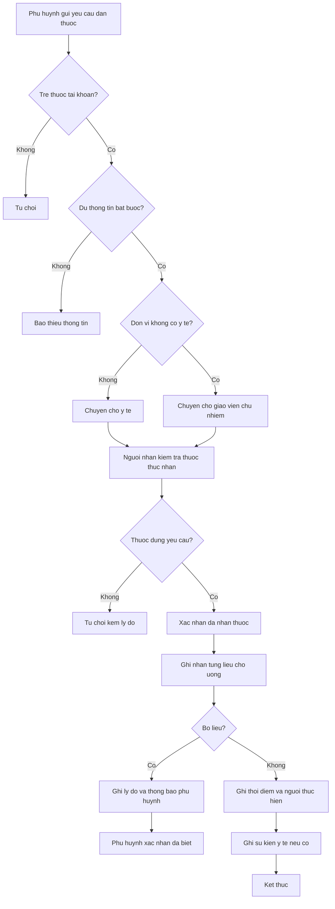
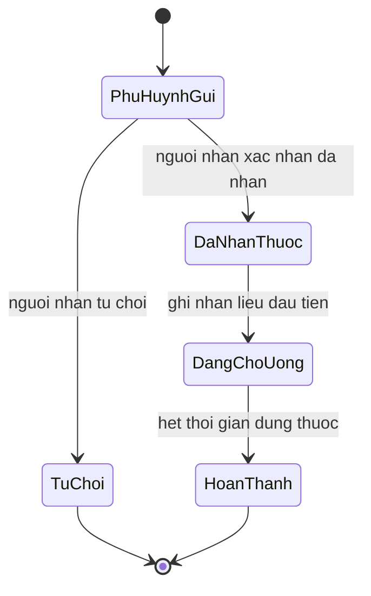

# [QT-07] Dặn thuốc, cấp thuốc và chăm sóc sức khỏe trẻ

| Mục | Giá trị |
|-----|---------|
| Dự án | School Management - Hệ thống quản lý trường mầm non |
| Phiên bản | 1.2 - 2026-10-09 |
| Trạng thái | Đã phê duyệt |
| Người phê duyệt | Eric, ngày 2026-10-09 |
| Người yêu cầu | Eric |
| Ưu tiên | Bình thường |
| Loại | Mới |

## 1. Tóm tắt

Phụ huynh gửi yêu cầu dặn thuốc cho con kèm tên thuốc, liều lượng, giờ cho uống, thời gian dùng và ảnh thuốc. Nhân viên y tế, hoặc giáo viên chủ nhiệm khi đơn vị không có nhân viên y tế, kiểm tra thông tin, xác nhận đã nhận thuốc rồi ghi nhận từng lần cho trẻ uống. Giáo viên chủ nhiệm và y tế ghi nhận chăm sóc hằng ngày của trẻ. Mọi sự kiện sức khỏe phát sinh tại trường đều được ghi nhận, thông báo cho phụ huynh, và phụ huynh xác nhận đã biết. Toàn bộ quy trình thuộc giai đoạn 2.

## 2. Tác nhân và quyền

| Tác nhân | Vai trò trong hệ thống | Được làm gì trong quy trình |
|----------|------------------------|------------------------------|
| Phụ huynh | VT-14 | Gửi yêu cầu dặn thuốc kèm ảnh thuốc, xem nhật ký cho uống thuốc, chăm sóc hằng ngày và kết quả khám của con, xác nhận đã biết sự kiện y tế và bỏ liều |
| Nhân viên y tế | VT-09 | Nhận thuốc, từ chối nếu thiếu thông tin, ghi nhận từng liều, ghi sự kiện y tế, ghi kết quả khám |
| Giáo viên chủ nhiệm | VT-07 | Xem tình trạng sức khỏe của trẻ trong lớp, ghi nhận sự kiện sức khỏe ban đầu, ghi chăm sóc hằng ngày; nhận thuốc và ghi liều khi đơn vị bật cấu hình không có nhân viên y tế (BR-86) |
| Ban Giám hiệu | VT-02, VT-15 | Xem dữ liệu sức khỏe trong phạm vi được gán (BR-53) |
| Quản lý đơn vị | VT-03 | Xem tổng hợp y tế của đơn vị, xử lý sự kiện nghiêm trọng |
| Kế toán | VT-04 | Xử lý đề nghị mua thuốc và cấp thuốc |

## 3. Điều kiện trước

- Trẻ đang ở trạng thái đang học.
- Phụ huynh gửi yêu cầu là phụ huynh có quan hệ với trẻ trong hệ thống.
- Danh mục thuốc và nhà thuốc đã được cấu hình nếu yêu cầu có liên quan tới kho thuốc của trường.
- Cấu hình "không có nhân viên y tế" của đơn vị đã được đặt (BR-86).
- Hồ sơ sức khỏe của trẻ đã có thông tin dị ứng và bệnh nền, hoặc đã được ghi rõ là chưa khai báo.

## 4. Luồng chính

| Bước | Ai | Hành động | Hệ thống xử lý | Kết quả người dùng thấy | Đã có / Mới |
|------|----|-----------|----------------|--------------------------|-------------|
| 1 | Phụ huynh | Mở màn hình dặn thuốc và gửi yêu cầu cho con | Kiểm tra quan hệ phụ huynh với trẻ, kiểm tra trường bắt buộc | Yêu cầu ở trạng thái phụ huynh đã gửi | Mới |
| 2 | Hệ thống | Kiểm tra thông tin bắt buộc | Nếu thiếu tên thuốc, liều, giờ, thời gian dùng hoặc ảnh thuốc thì từ chối gửi; ảnh đơn thuốc không bắt buộc | Thông báo các thông tin còn thiếu | Mới |
| 3 | Hệ thống | Chuyển yêu cầu cho người nhận thuốc | Đơn vị không bật cấu hình thì chuyển y tế; bật thì chuyển giáo viên chủ nhiệm (BR-86); thông báo cả hai | Người nhận thuốc thấy yêu cầu mới | Mới |
| 4 | Người nhận thuốc | Kiểm tra thuốc thực nhận so với yêu cầu | Ghi nhận số lượng và tình trạng thuốc nhận được | Phiếu dặn thuốc ở trạng thái đã nhận thuốc | Mới |
| 5 | Người nhận thuốc | Từ chối nhận nếu thuốc không đúng hoặc thiếu thông tin | Đổi trạng thái sang từ chối kèm lý do, thông báo phụ huynh | Phụ huynh thấy lý do từ chối | Mới |
| 6 | Người nhận thuốc | Ghi nhận từng lần cho trẻ uống thuốc theo giờ | Lưu thời điểm, người thực hiện, liều đã cho | Nhật ký cho uống thuốc | Mới |
| 7 | Người nhận thuốc | Ghi lý do khi bỏ một liều | Lưu lý do, thông báo cho phụ huynh của trẻ | Phụ huynh thấy liều bị bỏ kèm lý do | Mới |
| 8 | Nhân viên y tế hoặc giáo viên chủ nhiệm | Ghi nhận sự kiện y tế phát sinh tại trường | Lưu sự kiện kèm triệu chứng, cách xử lý, người xử lý; thông báo phụ huynh và quản lý đơn vị | Bản ghi sự kiện y tế | Mới |
| 9 | Nhân viên y tế | Ghi kết quả khám sức khỏe định kỳ theo đợt | Lưu kết quả từng chỉ số cho từng trẻ, công bố cho phụ huynh | Phiếu kết quả khám của con | Mới |
| 10 | Phụ huynh | Xem nhật ký cho uống thuốc, chăm sóc hằng ngày và kết quả khám của con | Trả dữ liệu giới hạn theo quan hệ phụ huynh | Nhật ký và kết quả khám | Mới |
| 11 | Giáo viên chủ nhiệm hoặc nhân viên y tế | Ghi chăm sóc hằng ngày: nhiệt độ, tình trạng khi trẻ ốm, chăm sóc đặc biệt theo lưu ý của phụ huynh (P10-12) | Lưu bản ghi theo trẻ và ngày | Nhật ký chăm sóc của trẻ | Mới |
| 12 | Phụ huynh | Bấm đã biết với thông báo sự kiện y tế hoặc bỏ liều | Lưu thời điểm xác nhận; y tế và giáo viên thấy trạng thái đã hoặc chưa xác nhận, không nhắc lại (BR-88) | Trạng thái đã xác nhận | Mới |

## 5. Sơ đồ

## 6. Luồng phụ và lỗi

| Mã | Tình huống | Hệ thống phản hồi | Thông báo cho người dùng |
|----|-----------|-------------------|--------------------------|
| E1 | Người dùng không có quyền trên trẻ hoặc trên đơn vị | Từ chối ở máy chủ | Bạn không có quyền thực hiện thao tác này |
| E2 | Không tìm thấy yêu cầu dặn thuốc | Trả về không tìm thấy | Yêu cầu dặn thuốc không tồn tại |
| E3 | Thiếu thông tin bắt buộc của thuốc | Chặn gửi | Vui lòng nhập đủ tên thuốc, liều, giờ và thời gian dùng |
| E4 | Ghi trùng một liều trong cùng thời điểm | Chặn ghi, hiển thị liều đã ghi trước đó | Liều này đã được ghi nhận |
| E5 | Ghi nhận cho uống thuốc khi chưa xác nhận nhận thuốc | Chặn | Cần xác nhận đã nhận thuốc trước khi ghi nhận liều |
| E6 | Bỏ liều không nhập lý do | Chặn lưu | Nhập lý do bỏ liều |
| E7 | Phụ huynh gửi yêu cầu cho trẻ không có quan hệ | Từ chối ở máy chủ | Bạn không có quyền gửi yêu cầu cho trẻ này |
| E8 | Sự kiện y tế nghiêm trọng chưa được xử lý trong thời gian cấu hình | Đẩy cảnh báo lên quản lý đơn vị | Có sự kiện y tế chưa được xử lý |
| E9 | Kết quả khám nhập cho trẻ không thuộc đợt khám của đơn vị | Chặn lưu | Trẻ không thuộc đợt khám này |
| E10 | Gửi yêu cầu dặn thuốc không có ảnh thuốc | Chặn gửi | Vui lòng chụp ít nhất một ảnh thuốc |
| E11 | Giáo viên chủ nhiệm nhận thuốc hoặc ghi liều khi đơn vị chưa bật cấu hình không có nhân viên y tế | Từ chối ở máy chủ | Đơn vị có nhân viên y tế, y tế nhận thuốc |
| E12 | Phụ huynh chưa xác nhận đã biết | Không nhắc lại; hiển thị chưa xác nhận cho y tế và giáo viên | Không hiển thị cho phụ huynh |

## 7. Trạng thái

| Từ | Sang | Khi nào | Ai được làm |
|----|------|---------|-------------|
| Phụ huynh gửi | Đã nhận thuốc | Người nhận thuốc xác nhận đã nhận thuốc đúng yêu cầu | VT-09; VT-07 khi đơn vị bật BR-86 |
| Phụ huynh gửi | Từ chối | Người nhận thuốc từ chối kèm lý do | VT-09; VT-07 khi đơn vị bật BR-86 |
| Đã nhận thuốc | Đang cho uống | Người nhận thuốc ghi nhận liều đầu tiên | VT-09; VT-07 khi đơn vị bật BR-86 |
| Đang cho uống | Hoàn thành | Hết số ngày dùng thuốc | Hệ thống |

## 8. Quy tắc nghiệp vụ

| Mã | Quy tắc |
|----|---------|
| BR-48 | Phụ huynh gửi thuốc phải khai báo tên thuốc, liều lượng, giờ cho uống, thời gian dùng, tình trạng dị ứng và gửi ít nhất một ảnh thuốc; ảnh đơn thuốc không bắt buộc; thiếu thông tin bắt buộc thì không nhận thuốc |
| BR-49 | Người nhận thuốc (y tế, hoặc giáo viên chủ nhiệm theo BR-86) phải xác nhận đã nhận thuốc trước khi thuốc được đưa vào danh sách cần cho uống |
| BR-50 | Mỗi lần cho trẻ uống thuốc, người nhận thuốc ghi nhận thời điểm và người thực hiện; bỏ liều phải ghi lý do |
| BR-51 | Hồ sơ sức khỏe của trẻ gồm chiều cao, cân nặng, dị ứng, bệnh nền, kết quả khám định kỳ và sự kiện y tế tại trường, nhu cầu đặc biệt và lưu ý chăm sóc |
| BR-52 | Sự kiện y tế tại trường phải được ghi nhận ngay, thông báo cho phụ huynh, ghi rõ ai xử lý và xử lý như thế nào |
| BR-53 | Dữ liệu sức khỏe của trẻ là dữ liệu cá nhân nhạy cảm; chỉ giáo viên chủ nhiệm, y tế, Ban Giám hiệu, quản lý đơn vị, kế toán và chính phụ huynh của trẻ được xem; nhu cầu đặc biệt cũng thuộc nhóm dữ liệu này |
| BR-86 | Đơn vị bật cấu hình không có nhân viên y tế thì giáo viên chủ nhiệm nhận thuốc, cho uống và ghi liều; y tế cấp trên vẫn xem được |
| BR-87 | Giáo viên chủ nhiệm và y tế ghi chăm sóc hằng ngày; phụ huynh của trẻ xem được |
| BR-88 | Phụ huynh xác nhận đã biết sự kiện y tế và bỏ liều; chỉ hiển thị trạng thái, không nhắc lại |

## 9. Thông báo, thời gian thực và nhật ký

| Sự kiện | Ai nhận | Kênh | Nội dung | Ghi nhật ký |
|---------|---------|------|----------|-------------|
| Phụ huynh gửi yêu cầu dặn thuốc | Nhân viên y tế, giáo viên chủ nhiệm | Trong ứng dụng | Có yêu cầu dặn thuốc mới cho trẻ; ghi rõ ai là người nhận thuốc | Có |
| Người nhận thuốc từ chối | Phụ huynh của trẻ | Trong ứng dụng và tin nhắn | Yêu cầu dặn thuốc bị từ chối kèm lý do | Có |
| Người nhận thuốc xác nhận đã nhận | Phụ huynh của trẻ | Trong ứng dụng | Nhà trường đã nhận thuốc của con | Có |
| Cho trẻ uống thuốc | Phụ huynh của trẻ | Trong ứng dụng | Con đã được cho uống thuốc lúc giờ tương ứng | Có |
| Bỏ liều thuốc | Phụ huynh của trẻ | Trong ứng dụng và tin nhắn | Một liều thuốc của con bị bỏ kèm lý do | Có |
| Sự kiện y tế tại trường | Phụ huynh của trẻ, quản lý đơn vị | Trong ứng dụng và tin nhắn | Ghi nhận sự kiện sức khỏe của con và cách xử lý | Có |
| Kết quả khám định kỳ được công bố | Phụ huynh của trẻ | Trong ứng dụng | Kết quả khám sức khỏe của con đã có | Có |
| Phụ huynh xác nhận đã biết | Nhân viên y tế, giáo viên chủ nhiệm | Trong ứng dụng | Phụ huynh đã xác nhận thông báo | Có |

## 10. Dữ liệu

| Thông tin | Bắt buộc | Ràng buộc | Ví dụ |
|-----------|----------|-----------|-------|
| Trẻ | Có | Đang học, thuộc quyền của người gửi | Nguyễn Gia Bảo |
| Tên thuốc | Có | Tối đa hai trăm ký tự | Paracetamol 250 miligam |
| Liều lượng | Có | Tối đa một trăm ký tự | Nửa viên |
| Giờ cho uống | Có | Danh sách giờ trong ngày | 11:30 và 16:00 |
| Thời gian dùng | Có | Khoảng ngày, không quá ba mươi ngày | 2026-10-09 đến 2026-10-11 |
| Tình trạng dị ứng | Có | Khai báo hoặc ghi rõ chưa biết | Dị ứng đậu phộng |
| Ảnh thuốc | Có | Ít nhất một ảnh | Ảnh hộp thuốc |
| Ảnh đơn thuốc | Không | Ảnh đơn của bác sĩ (Q-60) | Ảnh đơn thuốc |
| Thuốc thực nhận | Có khi y tế nhận | Số lượng và tình trạng | Một hộp còn nguyên |
| Người thực hiện cho uống | Có khi ghi liều | Tài khoản nhân viên y tế, hoặc giáo viên chủ nhiệm khi đơn vị bật BR-86 | Nguyễn Thị Hoa |
| Lý do bỏ liều | Có khi bỏ liều | Tối đa năm trăm ký tự | Trẻ nghỉ học ngày hôm đó |
| Mô tả sự kiện y tế | Có khi ghi sự kiện | Tối đa một nghìn ký tự | Trẻ sốt ba mươi tám độ năm, đã lau mát |
| Nhiệt độ | Không | Số thập phân, độ C | 37,8 |
| Tình trạng và chăm sóc đặc biệt trong ngày | Không | Tối đa một nghìn ký tự | Trẻ ho nhẹ, đã cho uống nước ấm theo lưu ý của mẹ |
| Thời điểm phụ huynh xác nhận đã biết | Không | Trống khi chưa xác nhận | 2026-10-09 10:15 |

## 11. Màn hình liên quan

1. **Màn hình dặn thuốc của phụ huynh** — chọn trẻ, nhập thông tin thuốc, chụp ảnh thuốc, đính kèm đơn nếu có, gửi yêu cầu, xem lịch sử (MP-07).
2. **Danh sách yêu cầu dặn thuốc của y tế** — lọc theo trạng thái, lớp, đơn vị.
3. **Màn hình cho uống thuốc theo giờ** — danh sách trẻ cần cho uống trong khung giờ, nút ghi nhận liều.
4. **Hồ sơ sức khỏe của trẻ** — chỉ số theo lần đo, dị ứng, bệnh nền, sự kiện y tế, kết quả khám.
5. **Màn hình đợt khám sức khỏe** — danh sách trẻ trong đợt, ô nhập kết quả từng chỉ số.
6. **Màn hình sự kiện y tế** — ghi nhận nhanh, hiển thị cảnh báo sự kiện chưa xử lý, trạng thái phụ huynh đã hoặc chưa xác nhận.
7. **Dặn thuốc và chăm sóc của lớp trên ứng dụng giáo viên** — yêu cầu dặn thuốc của lớp, nhận thuốc và ghi liều khi đơn vị không có y tế, ghi chăm sóc hằng ngày (MG-09).
8. **Sức khỏe của con trên ứng dụng phụ huynh** — kết quả khám, chăm sóc hằng ngày, nút đã biết (MP-08).

## 12. Tiêu chí nghiệm thu

- AC-47: Cho phụ huynh gửi yêu cầu dặn thuốc thiếu giờ cho uống / Khi gửi / Thì hệ thống từ chối và yêu cầu bổ sung.
- AC-48: Cho yêu cầu dặn thuốc đã đủ thông tin / Khi y tế chưa xác nhận nhận thuốc / Thì thuốc không xuất hiện trong danh sách cần cho uống.
- AC-49: Cho phiếu dặn thuốc đã nhận / Khi y tế ghi nhận một liều / Thì hệ thống lưu thời điểm và người thực hiện và không cho ghi trùng cùng thời điểm.
- AC-50: Cho y tế bỏ một liều / Khi ghi nhận bỏ liều / Thì hệ thống bắt buộc nhập lý do và thông báo cho phụ huynh.
- AC-51: Cho giáo viên không liên quan tới trẻ A / Khi gọi điểm cuối hồ sơ sức khỏe của trẻ A / Thì bị từ chối.
- AC-52: Cho sự kiện y tế phát sinh tại trường / Khi y tế ghi nhận / Thì phụ huynh nhận được thông báo và bản ghi lưu người xử lý cùng cách xử lý.
- AC-117: Cho một phụ huynh của trẻ A / Khi gửi yêu cầu dặn thuốc cho trẻ B / Thì bị từ chối ở máy chủ.
- AC-118: Cho một phụ huynh của trẻ A / Khi mở hồ sơ sức khỏe / Thì chỉ thấy dữ liệu sức khỏe của trẻ A.
- AC-119: Cho một nhân viên bếp / Khi gọi điểm cuối hồ sơ sức khỏe của trẻ / Thì bị từ chối.
- AC-215: Cho đơn vị đã bật cấu hình không có nhân viên y tế / Khi phụ huynh của trẻ thuộc đơn vị đó gửi yêu cầu dặn thuốc / Thì giáo viên chủ nhiệm nhận được yêu cầu, xác nhận nhận thuốc và ghi nhận được từng liều.
- AC-216: Cho đơn vị chưa bật cấu hình không có nhân viên y tế / Khi giáo viên chủ nhiệm gọi điểm cuối xác nhận nhận thuốc / Thì bị từ chối.
- AC-217: Cho yêu cầu dặn thuốc không có ảnh thuốc / Khi phụ huynh gửi / Thì hệ thống từ chối và yêu cầu gửi ảnh thuốc; yêu cầu không có ảnh đơn thuốc vẫn gửi được.
- AC-218: Cho giáo viên chủ nhiệm ghi nhiệt độ và tình trạng của trẻ A trong ngày / Khi phụ huynh trẻ A mở ứng dụng / Thì thấy bản ghi chăm sóc của con; phụ huynh trẻ khác không thấy.
- AC-219: Cho sự kiện y tế đã thông báo phụ huynh / Khi phụ huynh bấm đã biết / Thì y tế và giáo viên chủ nhiệm thấy trạng thái đã xác nhận kèm thời điểm; khi chưa bấm thì thấy chưa xác nhận và hệ thống không nhắc lại.

## 13. Ảnh hưởng tới phần có sẵn

Không áp dụng. Đây là dự án mới, chưa có mã nguồn và dữ liệu cũ.

## 14. Giả định và câu hỏi mở

| Mã | Nội dung | Cần ai trả lời |
|----|----------|----------------|
| GD-32 | Không còn hiệu lực từ ngày 09/10/2026: giáo viên chủ nhiệm nhận thuốc và ghi liều khi đơn vị bật cấu hình không có nhân viên y tế (BR-86, YCTD-25) | Eric |
| GD-33 | Đã xác nhận ngày 09/10/2026: Sự kiện y tế tại trường luôn phải thông báo cho phụ huynh ngay khi ghi nhận | Eric |
| Q-58 | Đã trả lời ngày 09/10/2026: trường vừa nhận thuốc phụ huynh gửi, vừa có tủ thuốc riêng để sơ cứu | Eric |
| Q-59 | Đã trả lời ngày 09/10/2026: một yêu cầu dặn thuốc tối đa 30 ngày, cấu hình được | Eric |
| Q-60 | Đã trả lời ngày 09/10/2026: ảnh đơn thuốc của bác sĩ là tùy chọn | Eric |
| Q-61 | Đã trả lời ngày 09/10/2026: bắt buộc khai báo dị ứng hoặc chọn không có dị ứng trước khi trình duyệt hồ sơ (BR-06) | Eric |

## 15. Ghi chú kỹ thuật

- Điểm cuối dự kiến: gửi yêu cầu dặn thuốc, lấy danh sách yêu cầu, xác nhận nhận thuốc, từ chối nhận thuốc, ghi nhận liều, lấy danh sách cần cho uống theo giờ, lấy hồ sơ sức khỏe, ghi sự kiện y tế, ghi kết quả khám, ghi và xem chăm sóc hằng ngày, phụ huynh xác nhận đã biết.
- Bảng dữ liệu dự kiến: yêu cầu dặn thuốc kèm ảnh, nhật ký cho uống thuốc, nhật ký chăm sóc hằng ngày (`daily_care_logs`), hồ sơ sức khỏe, chỉ số sức khỏe, sự kiện y tế, đợt khám, danh mục thuốc, nhà thuốc.
- Việc chạy nền: nhắc giờ cho uống thuốc, cảnh báo sự kiện y tế chưa xử lý.
- Thời gian thực: thông báo yêu cầu dặn thuốc mới cho y tế.
- Chưa có mã nguồn nên chưa tham chiếu được tệp và số dòng.

## Lịch sử thay đổi

| Phiên bản | Ngày | Thay đổi |
|-----------|------|----------|
| 1.0 | 2026-10-09 | Tạo mới |
| 1.1 | 2026-10-09 | Thêm Ban Giám hiệu vào nhóm được xem dữ liệu sức khỏe (BR-53) |
| 1.2 | 2026-10-09 | YCTD-25: giáo viên chủ nhiệm nhận thuốc khi đơn vị không có y tế, ảnh thuốc bắt buộc, chăm sóc hằng ngày, phụ huynh xác nhận đã biết; thêm Ban Giám hiệu vào tác nhân; Eric phê duyệt |
