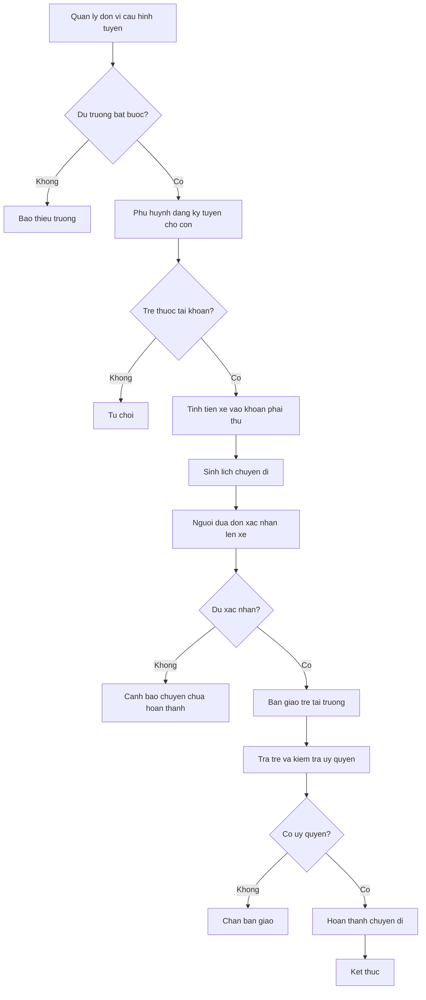
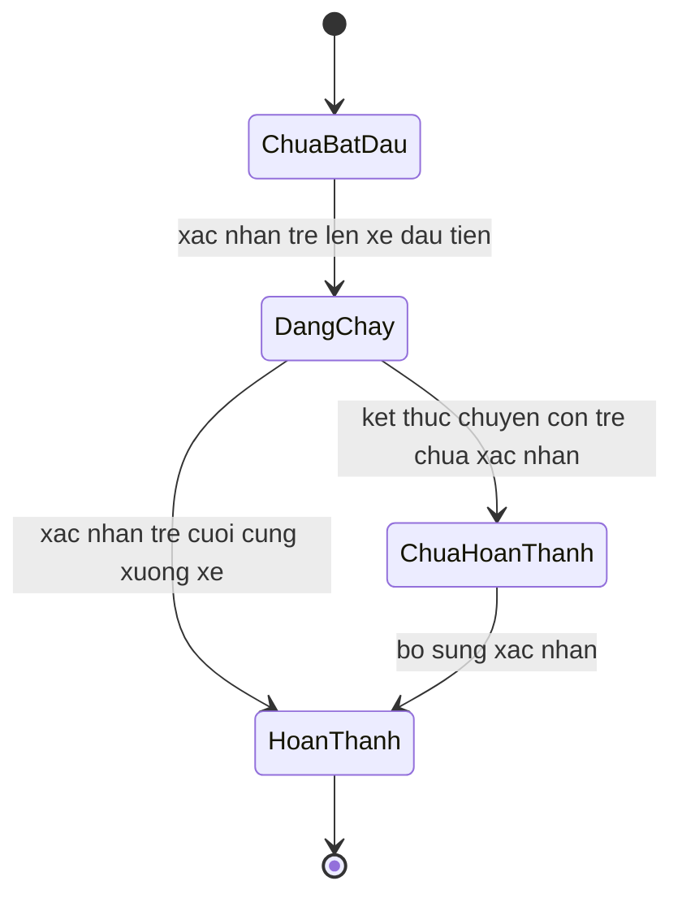

# [QT-08] Tổ chức đưa đón trẻ

| Mục | Giá trị |
|-----|---------|
| Dự án | School Management - Hệ thống quản lý trường mầm non |
| Phiên bản | 1.0 - 2026-10-09 |
| Người yêu cầu | Eric |
| Ưu tiên | Bình thường |
| Loại | Mới |

> Quy trình này đã bỏ ngày 09/10/2026: trường không có xe đưa đón (Q-62). Nội dung dưới đây giữ lại để tra cứu, không còn hiệu lực.

## 1. Tóm tắt

Quản lý đơn vị cấu hình tuyến đưa đón, xe và nhân sự phụ trách. Phụ huynh đăng ký tuyến và điểm đón cho con theo tháng. Mỗi chuyến đi, người đưa đón xác nhận trẻ lên xe và xuống xe, ghi nhận bàn giao trẻ và báo sự cố nếu có.

## 2. Tác nhân và quyền

| Tác nhân | Vai trò trong hệ thống | Được làm gì trong quy trình |
|----------|------------------------|------------------------------|
| Quản lý đơn vị | VT-03 | Cấu hình tuyến, điểm đón, xe, nhân sự phụ trách; xử lý sự cố |
| Kế toán | VT-04 | Ghi nhận đăng ký xe vào khoản phải thu của trẻ |
| Phụ huynh | VT-14 | Đăng ký hoặc hủy tuyến cho con, xem lịch đưa đón |
| Người đưa đón | VT-13 | Xác nhận lên xe, xuống xe, bàn giao trẻ, báo sự cố |
| Giáo viên chủ nhiệm | VT-07 | Nhận trẻ khi tới trường, xác nhận bàn giao |

## 3. Điều kiện trước

- Tuyến đưa đón của đơn vị đã được cấu hình kèm danh sách điểm đón và giờ dự kiến.
- Xe và nhân sự phụ trách đã được gán cho tuyến.
- Trẻ đang ở trạng thái đang học.
- Kỳ đăng ký xe đang mở.

## 4. Luồng chính

| Bước | Ai | Hành động | Hệ thống xử lý | Kết quả người dùng thấy | Đã có / Mới |
|------|----|-----------|----------------|--------------------------|-------------|
| 1 | Quản lý đơn vị | Cấu hình tuyến, điểm đón, giờ dự kiến, xe và nhân sự phụ trách | Kiểm tra trường bắt buộc, kiểm tra trùng tên tuyến | Danh sách tuyến của đơn vị | Mới |
| 2 | Phụ huynh | Đăng ký tuyến và điểm đón cho con trong kỳ | Kiểm tra trẻ thuộc tài khoản, kiểm tra tuyến còn chỗ | Đăng ký xe của con | Mới |
| 3 | Kế toán | Ghi nhận tiền xe vào khoản phải thu của kỳ | Thêm dòng khoản phải thu tiền xe đưa đón | Khoản phải thu có tiền xe | Mới |
| 4 | Hệ thống | Sinh lịch chuyến đi theo ngày và theo chiều | Lấy danh sách trẻ đăng ký và loại trừ trẻ nghỉ có báo | Lịch chuyến đi trong ngày | Mới |
| 5 | Người đưa đón | Mở lịch chuyến đi buổi sáng của tuyến được phân công | Kiểm tra phân công, trả danh sách trẻ theo thứ tự điểm đón | Danh sách trẻ cần đón | Mới |
| 6 | Người đưa đón | Xác nhận từng trẻ đã lên xe | Lưu thời điểm lên xe của trẻ | Trạng thái trẻ đã lên xe | Mới |
| 7 | Người đưa đón | Xác nhận trẻ đã tới trường và bàn giao cho giáo viên | Liên kết với điểm danh trong ngày, lưu thời điểm bàn giao | Trạng thái trẻ đã tới trường | Mới |
| 8 | Người đưa đón | Xác nhận trẻ xuống xe khi trả về | Kiểm tra người nhận có trong danh sách ủy quyền, lưu nhật ký bàn giao | Trạng thái chuyến đi hoàn thành | Mới |
| 9 | Người đưa đón | Báo sự cố nếu chuyến đi gặp vấn đề | Lưu sự cố, thông báo phụ huynh của trẻ trên tuyến và quản lý đơn vị | Bản ghi sự cố | Mới |
| 10 | Quản lý đơn vị | Xem báo cáo chuyến đi trong ngày | Tổng hợp chuyến hoàn thành, chuyến thiếu xác nhận, sự cố | Báo cáo đưa đón | Mới |

## 5. Sơ đồ

## 6. Luồng phụ và lỗi

| Mã | Tình huống | Hệ thống phản hồi | Thông báo cho người dùng |
|----|-----------|-------------------|--------------------------|
| E1 | Người dùng không có quyền trên tuyến hoặc đơn vị | Từ chối ở máy chủ | Bạn không có quyền thực hiện thao tác này |
| E2 | Không tìm thấy chuyến đi của ngày | Trả về không tìm thấy | Không có chuyến đi nào trong ngày đã chọn |
| E3 | Xác nhận lên xe cho trẻ không đăng ký tuyến | Chặn, đề nghị quản lý đơn vị xử lý | Trẻ này không đăng ký tuyến đưa đón |
| E4 | Trẻ đã được xác nhận lên xe hai lần | Chặn ghi trùng, hiển thị thời điểm đã ghi | Trẻ đã được xác nhận lên xe |
| E5 | Người nhận trẻ không có trong danh sách ủy quyền | Chặn bàn giao | Người này không có quyền nhận trẻ |
| E6 | Kết thúc chuyến mà còn trẻ chưa xác nhận xuống xe | Đánh dấu chuyến chưa hoàn thành, cảnh báo quản lý đơn vị | Còn trẻ chưa được xác nhận xuống xe |
| E7 | Phụ huynh đăng ký tuyến cho trẻ không thuộc tài khoản | Từ chối ở máy chủ | Bạn không có quyền đăng ký cho trẻ này |
| E8 | Đăng ký tuyến khi tuyến đã đủ chỗ | Cảnh báo, đề nghị chọn tuyến khác hoặc chờ quản lý đơn vị xử lý | Tuyến đã đủ chỗ |
| E9 | Sự cố được báo nhưng chưa ghi rõ loại sự cố | Chặn lưu | Chọn loại sự cố trước khi gửi |

## 7. Trạng thái

| Từ | Sang | Khi nào | Ai được làm |
|----|------|---------|-------------|
| Chưa bắt đầu | Đang chạy | Người đưa đón xác nhận trẻ đầu tiên lên xe | VT-13 |
| Đang chạy | Hoàn thành | Mọi trẻ trên chuyến đã được xác nhận xuống xe | VT-13 |
| Đang chạy | Chưa hoàn thành | Kết thúc chuyến mà còn trẻ thiếu xác nhận | VT-13 |
| Chưa hoàn thành | Hoàn thành | Bổ sung xác nhận còn thiếu | VT-13, VT-03 |

## 8. Quy tắc nghiệp vụ

| Mã | Quy tắc |
|----|---------|
| BR-54 | Đăng ký xe đưa đón theo tháng, gắn với tuyến và điểm đón; đổi tuyến giữa tháng phải được quản lý đơn vị duyệt |
| BR-55 | Người đưa đón xác nhận trẻ lên xe và xuống xe; thiếu xác nhận thì chuyến đi bị coi là chưa hoàn thành và quản lý đơn vị nhận cảnh báo |
| BR-56 | Trẻ chỉ được bàn giao cho phụ huynh hoặc người được ủy quyền có trong hồ sơ |
| BR-57 | Sự cố trên đường phải được ghi nhận và thông báo cho phụ huynh và quản lý đơn vị |
| BR-58 | Số trẻ trên chuyến lấy từ đăng ký tuyến trừ số nghỉ có báo |

## 9. Thông báo, thời gian thực và nhật ký

| Sự kiện | Ai nhận | Kênh | Nội dung | Ghi nhật ký |
|---------|---------|------|----------|-------------|
| Trẻ đã lên xe | Phụ huynh của trẻ | Trong ứng dụng | Con đã lên xe lúc giờ tương ứng | Có |
| Trẻ đã tới trường | Phụ huynh của trẻ | Trong ứng dụng | Con đã tới trường an toàn | Có |
| Trẻ đã được bàn giao khi trả về | Phụ huynh của trẻ | Trong ứng dụng | Con đã được bàn giao cho người nhận | Có |
| Chuyến đi chưa hoàn thành | Quản lý đơn vị | Trong ứng dụng | Có chuyến đi còn trẻ chưa xác nhận | Có |
| Sự cố chuyến đi | Phụ huynh của trẻ trên tuyến, quản lý đơn vị | Trong ứng dụng và tin nhắn | Sự cố trên tuyến kèm mô tả | Có |
| Đăng ký tuyến mới hoặc đổi tuyến | Kế toán, quản lý đơn vị | Trong ứng dụng | Có thay đổi đăng ký tuyến đưa đón | Có |

## 10. Dữ liệu

| Thông tin | Bắt buộc | Ràng buộc | Ví dụ |
|-----------|----------|-----------|-------|
| Tuyến | Có | Thuộc đơn vị, tên không trùng trong đơn vị | Tuyến số một Thảo Điền |
| Điểm đón | Có | Thuộc tuyến, có thứ tự và giờ dự kiến | Điểm đón chung cư An Phú, 06:45 |
| Xe | Có | Biển số không trùng | 51H-123.45 |
| Người đưa đón | Có | Nhân sự đang hoạt động của đơn vị | Nguyễn Văn Tài |
| Trẻ | Có | Đang học và có đăng ký tuyến | Nguyễn Gia Bảo |
| Chiều | Có | Đón hoặc trả | Đón |
| Thời điểm xác nhận | Có khi xác nhận | Không lớn hơn thời điểm hiện tại | 06:52 |
| Người nhận trẻ | Có khi trả trẻ | Có trong danh sách ủy quyền | Nguyễn Tiến Vinh |
| Loại sự cố | Có khi báo sự cố | Theo danh mục sự cố | Xe hỏng |

## 11. Màn hình liên quan

1. **Màn hình cấu hình tuyến** — tên tuyến, danh sách điểm đón, giờ dự kiến, xe, nhân sự phụ trách.
2. **Màn hình đăng ký xe của phụ huynh** — chọn trẻ, chọn tuyến, chọn điểm đón, chọn chiều.
3. **Lịch chuyến đi của người đưa đón** — danh sách trẻ theo thứ tự điểm đón, nút xác nhận nhanh.
4. **Màn hình bàn giao trẻ** — chọn người nhận, hiển thị cảnh báo nếu không có ủy quyền.
5. **Màn hình báo sự cố** — chọn loại sự cố, mô tả, thời điểm, mức độ.
6. **Báo cáo đưa đón** — số chuyến, số trẻ, chuyến chưa hoàn thành, danh sách sự cố.

## 12. Tiêu chí nghiệm thu

- AC-53: Cho trẻ đăng ký tuyến số một / Khi người đưa đón xác nhận trẻ lên xe / Thì trạng thái chuyến đi ghi nhận trẻ đã lên xe kèm thời điểm.
- AC-54: Cho chuyến đi còn trẻ chưa xác nhận xuống xe / Khi kết thúc chuyến / Thì quản lý đơn vị nhận cảnh báo chuyến chưa hoàn thành.
- AC-55: Cho tài xế tuyến số một / Khi gọi điểm cuối danh sách trẻ của tuyến số hai / Thì bị từ chối.
- AC-56: Cho một phụ huynh / Khi mở lịch đưa đón / Thì chỉ thấy lịch đưa đón của con mình.
- AC-57: Cho sự cố trên đường / Khi người đưa đón ghi nhận / Thì phụ huynh của trẻ trên tuyến và quản lý đơn vị đều nhận thông báo.
- AC-120: Cho một người đưa đón của tuyến số một / Khi gọi điểm cuối xác nhận lên xe của tuyến số hai / Thì bị từ chối ở máy chủ.
- AC-121: Cho một người nhận trẻ không có trong danh sách ủy quyền / Khi người đưa đón xác nhận trả trẻ / Thì hệ thống chặn bàn giao.
- AC-122: Cho một trẻ nghỉ có báo trong ngày / Khi hệ thống sinh lịch chuyến đi / Thì trẻ đó không có trong danh sách cần đón.
- AC-123: Cho một phụ huynh / Khi gọi điểm cuối lịch đưa đón của trẻ không có quan hệ / Thì bị từ chối.

## 13. Ảnh hưởng tới phần có sẵn

Không áp dụng. Đây là dự án mới, chưa có mã nguồn và dữ liệu cũ.

## 14. Giả định và câu hỏi mở

| Mã | Nội dung | Cần ai trả lời |
|----|----------|----------------|
| GD-34 | Không còn hiệu lực từ ngày 09/10/2026: trường không có xe đưa đón (Q-62) | Eric |
| GD-35 | Không còn hiệu lực từ ngày 09/10/2026: trường không có xe đưa đón (Q-62) | Eric |
| Q-62 | Đã trả lời ngày 09/10/2026: trường không có xe đưa đón; bỏ phân hệ P11 | Eric |
| Q-63 | Đã trả lời ngày 09/10/2026: không áp dụng, đã bỏ phân hệ P11 | Eric |
| Q-64 | Đã trả lời ngày 09/10/2026: không áp dụng, đã bỏ phân hệ P11 | Eric |
| Q-65 | Đã trả lời ngày 09/10/2026: chụp ảnh khi bàn giao trẻ là tùy chọn | Eric |

## 15. Ghi chú kỹ thuật

- Điểm cuối dự kiến: cấu hình tuyến, lấy danh sách tuyến, đăng ký tuyến cho trẻ, sinh lịch chuyến đi, xác nhận lên xe, xác nhận xuống xe, bàn giao trẻ, báo sự cố, lấy báo cáo đưa đón.
- Bảng dữ liệu dự kiến: tuyến, điểm đón, xe, phân công nhân sự theo tuyến, đăng ký tuyến của trẻ, chuyến đi, xác nhận lên xuống xe, nhật ký bàn giao, sự cố.
- Việc chạy nền: sinh lịch chuyến đi trước giờ đón, cảnh báo chuyến chưa hoàn thành.
- Ràng buộc duy nhất dự kiến trên cặp chuyến đi và trẻ đối với xác nhận.
- Chưa có mã nguồn nên chưa tham chiếu được tệp và số dòng.

## Lịch sử thay đổi

| Phiên bản | Ngày | Thay đổi |
|-----------|------|----------|
| 1.0 | 2026-10-09 | Tạo mới |
