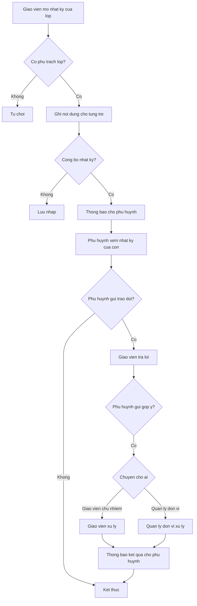
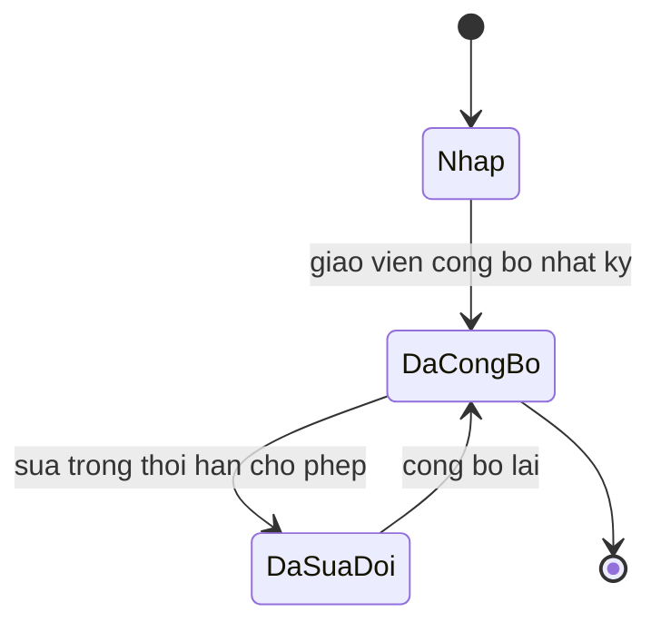

# [QT-09] Ghi nhật ký của bé và trao đổi với phụ huynh

| Mục | Giá trị |
|-----|---------|
| Dự án | School Management - Hệ thống quản lý trường mầm non |
| Phiên bản | 1.1 - 2026-10-09 |
| Trạng thái | Đã phê duyệt |
| Người phê duyệt | Eric, ngày 2026-10-09 |
| Người yêu cầu | Eric |
| Ưu tiên | Gấp |
| Loại | Mới |

## 1. Tóm tắt

Giáo viên chủ nhiệm ghi nhật ký trong ngày cho từng trẻ về ăn, ngủ, vệ sinh, tâm trạng và hoạt động. Nhật ký được công bố cho phụ huynh của trẻ. Phụ huynh và giáo viên trao đổi hai chiều trong cùng hệ thống; phụ huynh gửi góp ý thì được chuyển tới người có trách nhiệm xử lý. Nhật ký của bé thuộc giai đoạn 1 (G1-04, P04-04); trao đổi hai chiều và góp ý thuộc giai đoạn 2 (G2-07, P15).

## 2. Tác nhân và quyền

| Tác nhân | Vai trò trong hệ thống | Được làm gì trong quy trình |
|----------|------------------------|------------------------------|
| Giáo viên chủ nhiệm | VT-07 | Ghi nhật ký, trả lời trao đổi, tiếp nhận góp ý ở mức lớp |
| Phụ huynh | VT-14 | Xem nhật ký của con, gửi trao đổi, gửi góp ý |
| Quản lý đơn vị | VT-03 | Nhận góp ý chuyển lên, xử lý và ghi kết quả; sửa nhật ký đã công bố quá thời hạn của giáo viên (Q-67) |
| Giáo viên bộ môn | VT-08 | Xem nhật ký của lớp được phân công, không sửa |

## 3. Điều kiện trước

- Trẻ đang ở trạng thái đang học và đã được phân lớp.
- Giáo viên chủ nhiệm đã được phân công cho lớp của trẻ.
- Ngày ghi nhật ký thuộc năm học đang mở.
- Tài khoản phụ huynh đã được tạo và có quan hệ với trẻ.

## 4. Luồng chính

| Bước | Ai | Hành động | Hệ thống xử lý | Kết quả người dùng thấy | Đã có / Mới |
|------|----|-----------|----------------|--------------------------|-------------|
| 1 | Giáo viên chủ nhiệm | Mở màn hình nhật ký của lớp theo ngày | Kiểm tra phân công lớp, trả danh sách trẻ trong lớp | Danh sách trẻ cần ghi nhật ký | Mới |
| 2 | Giáo viên chủ nhiệm | Ghi nội dung ăn, ngủ, vệ sinh, tâm trạng, hoạt động cho từng trẻ | Kiểm tra trẻ thuộc lớp, lưu nội dung theo trẻ và ngày | Nhật ký từng trẻ trong ngày | Mới |
| 3 | Giáo viên chủ nhiệm | Bấm công bố nhật ký của ngày | Đổi trạng thái nhật ký sang đã công bố, gửi thông báo cho phụ huynh | Nhật ký hiển thị cho phụ huynh | Mới |
| 4 | Phụ huynh | Mở nhật ký của con | Trả dữ liệu giới hạn theo quan hệ phụ huynh | Nhật ký của con trong ngày | Mới |
| 5 | Phụ huynh | Gửi trao đổi tới giáo viên chủ nhiệm (giai đoạn 2) | Kiểm tra quan hệ với trẻ, gửi thông báo cho giáo viên | Luồng trao đổi với giáo viên | Mới |
| 6 | Giáo viên chủ nhiệm | Trả lời trao đổi | Lưu nội dung, đánh dấu đã đọc, thông báo cho phụ huynh | Phụ huynh thấy phản hồi | Mới |
| 7 | Phụ huynh | Gửi góp ý, chọn mức riêng tư (giai đoạn 2) | Lưu góp ý, chuyển tới giáo viên chủ nhiệm hoặc quản lý đơn vị theo mức chọn | Góp ý ở trạng thái đã gửi | Mới |
| 8 | Giáo viên chủ nhiệm hoặc quản lý đơn vị | Xem góp ý, xử lý và ghi kết quả | Lưu nội dung xử lý, người xử lý, thời điểm; thông báo cho phụ huynh | Phụ huynh thấy kết quả xử lý | Mới |
| 9 | Hệ thống | Nhắc giáo viên chưa ghi nhật ký trong ngày | Chạy kiểm tra theo giờ cấu hình, gửi nhắc | Thông báo nhắc ghi nhật ký | Mới |

## 5. Sơ đồ

## 6. Luồng phụ và lỗi

| Mã | Tình huống | Hệ thống phản hồi | Thông báo cho người dùng |
|----|-----------|-------------------|--------------------------|
| E1 | Người dùng không có quyền với lớp hoặc với trẻ | Từ chối ở máy chủ | Bạn không có quyền thực hiện thao tác này |
| E2 | Không tìm thấy nhật ký của ngày | Trả về không tìm thấy | Ngày này chưa có nhật ký |
| E3 | Ghi nhật ký cho trẻ không thuộc lớp phụ trách | Chặn lưu | Trẻ không thuộc lớp bạn phụ trách |
| E4 | Công bố nhật ký khi chưa ghi nội dung cho trẻ nào | Cảnh báo, yêu cầu xác nhận | Còn trẻ chưa có nội dung nhật ký |
| E5 | Phụ huynh mở nhật ký của trẻ không có quan hệ | Từ chối ở máy chủ | Bạn không có quyền xem nhật ký của trẻ này |
| E6 | Trao đổi tới người không có quyền với trẻ | Chặn gửi | Người nhận không phụ trách trẻ này |
| E7 | Góp ý không chọn mức riêng tư | Chặn gửi | Chọn mức riêng tư trước khi gửi góp ý |
| E8 | Sửa nhật ký sau khi đã công bố quá số giờ cấu hình | Chặn, yêu cầu quản lý đơn vị thực hiện | Nhật ký đã công bố quá thời hạn sửa |
| E9 | Gửi thông báo công bố nhật ký thất bại | Ghi hàng đợi gửi lại, đánh dấu chưa gửi được | Chưa gửi được thông báo, hệ thống sẽ thử lại |

## 7. Trạng thái

| Từ | Sang | Khi nào | Ai được làm |
|----|------|---------|-------------|
| Nháp | Đã công bố | Giáo viên chủ nhiệm bấm công bố | VT-07 |
| Đã công bố | Đã sửa đổi | Giáo viên sửa trong thời hạn cho phép | VT-07 |
| Đã sửa đổi | Đã công bố | Giáo viên công bố lại | VT-07 |
| Đã công bố | Đã sửa đổi | Quản lý đơn vị sửa sau khi quá thời hạn của giáo viên (Q-67) | VT-03 |

Trạng thái của góp ý: đã gửi, đang xử lý, đã xử lý, đã đóng.

## 8. Quy tắc nghiệp vụ

| Mã | Quy tắc |
|----|---------|
| BR-15 | Nhật ký của bé ghi theo ngày và theo trẻ; phụ huynh chỉ xem được nhật ký của con mình |
| BR-16 | Không cho phép nhập nhật ký cho trẻ không thuộc lớp mà người dùng phụ trách |
| BR-66 | Bình luận và trao đổi của phụ huynh không bị xóa; phản hồi tiêu cực chuyển cho quản lý đơn vị xử lý riêng; quản lý đơn vị được ẩn bình luận vi phạm kèm lý do |
| BR-70 | Thông báo quan trọng phải ghi nhận ai đã đọc và ai chưa đọc |

## 9. Thông báo, thời gian thực và nhật ký

| Sự kiện | Ai nhận | Kênh | Nội dung | Ghi nhật ký |
|---------|---------|------|----------|-------------|
| Nhật ký của ngày được công bố | Phụ huynh của trẻ trong lớp | Trong ứng dụng | Nhật ký của con hôm nay đã có | Có |
| Phụ huynh gửi trao đổi | Giáo viên chủ nhiệm | Trong ứng dụng | Phụ huynh gửi trao đổi mới | Có |
| Giáo viên trả lời trao đổi | Phụ huynh của trẻ | Trong ứng dụng | Giáo viên đã phản hồi | Có |
| Phụ huynh gửi góp ý | Người được chọn nhận góp ý | Trong ứng dụng | Có góp ý mới cần xử lý | Có |
| Góp ý được xử lý | Phụ huynh gửi góp ý | Trong ứng dụng | Góp ý của bạn đã được xử lý kèm nội dung xử lý | Có |
| Giáo viên chưa ghi nhật ký trong ngày | Giáo viên chủ nhiệm, quản lý đơn vị | Trong ứng dụng | Chưa ghi nhật ký cho lớp trong ngày | Có |

## 10. Dữ liệu

| Thông tin | Bắt buộc | Ràng buộc | Ví dụ |
|-----------|----------|-----------|-------|
| Trẻ | Có | Thuộc lớp giáo viên phụ trách | Nguyễn Gia Bảo |
| Ngày | Có | Thuộc năm học đang mở | 2026-10-09 |
| Nội dung ăn | Không | Tối đa năm trăm ký tự | Ăn hết suất, ăn thêm cơm |
| Nội dung ngủ | Không | Tối đa năm trăm ký tự | Ngủ một giờ ba mươi phút |
| Nội dung vệ sinh | Không | Tối đa năm trăm ký tự | Đi vệ sinh bình thường |
| Tâm trạng | Không | Theo danh mục tâm trạng | Vui vẻ |
| Hoạt động trong ngày | Không | Tối đa một nghìn ký tự | Tham gia hoạt động vẽ tranh |
| Mức riêng tư của góp ý | Có khi gửi góp ý | Lớp hoặc quản lý đơn vị | Quản lý đơn vị |
| Nội dung xử lý góp ý | Có khi xử lý | Tối đa một nghìn ký tự | Đã trao đổi với giáo viên và điều chỉnh giờ ăn |

## 11. Màn hình liên quan

1. **Màn hình nhật ký của lớp** — danh sách trẻ, ô nhập nhanh cho từng mục, nút công bố.
2. **Màn hình nhật ký của con trên ứng dụng phụ huynh** — theo ngày, theo tuần.
3. **Màn hình trao đổi** — luồng tin nhắn giữa phụ huynh và giáo viên, trạng thái đã đọc.
4. **Màn hình gửi góp ý** — nội dung, chủ đề, mức riêng tư.
5. **Màn hình xử lý góp ý** — danh sách góp ý theo trạng thái, ô ghi nội dung xử lý.

## 12. Tiêu chí nghiệm thu

- AC-18: Cho phụ huynh của trẻ A / Khi mở nhật ký của bé / Thì chỉ thấy nhật ký của trẻ A, không thấy của trẻ khác trong lớp.
- AC-19: Cho giáo viên ghi nhật ký cho trẻ không thuộc lớp mình / Khi lưu / Thì bị từ chối.
- AC-124: Cho giáo viên chủ nhiệm ghi nhật ký đủ cho cả lớp / Khi bấm công bố / Thì nhật ký ở trạng thái đã công bố và phụ huynh của từng trẻ nhận được thông báo.
- AC-125: Cho một nhật ký đã công bố quá thời hạn sửa cấu hình / Khi giáo viên sửa / Thì hệ thống chặn và yêu cầu quản lý đơn vị thực hiện.
- AC-126: Cho một phụ huynh / Khi gọi điểm cuối đọc nhật ký của trẻ không có quan hệ / Thì bị từ chối ở máy chủ.
- AC-127: Cho một phụ huynh gửi góp ý ở mức quản lý đơn vị / Khi gửi / Thì quản lý đơn vị nhận thông báo và giáo viên chủ nhiệm không nhận.
- AC-128: Cho một giáo viên bộ môn / Khi gọi điểm cuối lưu nhật ký của lớp / Thì bị từ chối.
- AC-129: Cho một góp ý đã được xử lý / Khi phụ huynh mở lại góp ý / Thì thấy nội dung xử lý và người xử lý.

## 13. Ảnh hưởng tới phần có sẵn

Không áp dụng. Đây là dự án mới, chưa có mã nguồn và dữ liệu cũ.

## 14. Giả định và câu hỏi mở

| Mã | Nội dung | Cần ai trả lời |
|----|----------|----------------|
| GD-36 | Đã xác nhận ngày 09/10/2026: Nhật ký phải được công bố trong ngày để phụ huynh xem kịp | Eric |
| GD-37 | Đã xác nhận ngày 09/10/2026: Góp ý có hai mức nhận: giáo viên chủ nhiệm và quản lý đơn vị | Eric |
| Q-66 | Đã trả lời ngày 09/10/2026: nhật ký không bắt buộc ảnh | Eric |
| Q-67 | Đã trả lời ngày 09/10/2026: giáo viên sửa trong 24 giờ sau khi công bố, cấu hình được; sau đó quản lý đơn vị sửa | Eric |
| Q-68 | Đã trả lời ngày 09/10/2026: phụ huynh liên hệ quản lý đơn vị qua góp ý ở mức quản lý đơn vị; không mở luồng tin nhắn riêng | Eric |
| Q-69 | Đã trả lời ngày 09/10/2026: không dịch nhật ký; giao diện chỉ tiếng Việt | Eric |

## 15. Ghi chú kỹ thuật

- Điểm cuối dự kiến: lấy nhật ký của lớp theo ngày, lưu nhật ký, công bố nhật ký, lấy nhật ký của trẻ, gửi trao đổi, lấy luồng trao đổi, gửi góp ý, xử lý góp ý.
- Bảng dữ liệu dự kiến: nhật ký của bé, chi tiết chăm sóc trong ngày, luồng trao đổi, tin nhắn, góp ý.
- Ràng buộc duy nhất dự kiến trên cặp trẻ và ngày đối với nhật ký.
- Việc chạy nền: nhắc giáo viên chưa ghi nhật ký, gửi thông báo công bố.
- Thời gian thực: thông báo trao đổi và góp ý mới.
- Chưa có mã nguồn nên chưa tham chiếu được tệp và số dòng.

## Lịch sử thay đổi

| Phiên bản | Ngày | Thay đổi |
|-----------|------|----------|
| 1.0 | 2026-10-09 | Tạo mới |
| 1.1 | 2026-10-09 | Rà duyệt: bỏ chữ kích hoạt tài khoản; ghi giai đoạn của nhật ký và của trao đổi, góp ý; quản lý đơn vị sửa nhật ký quá hạn theo Q-67; Eric phê duyệt |
