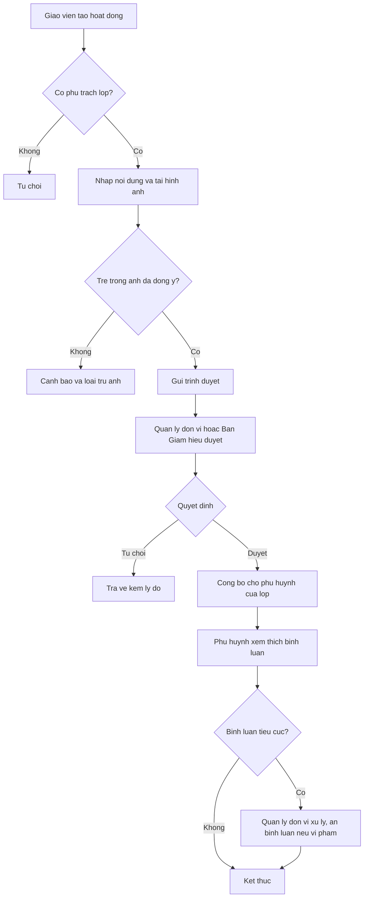
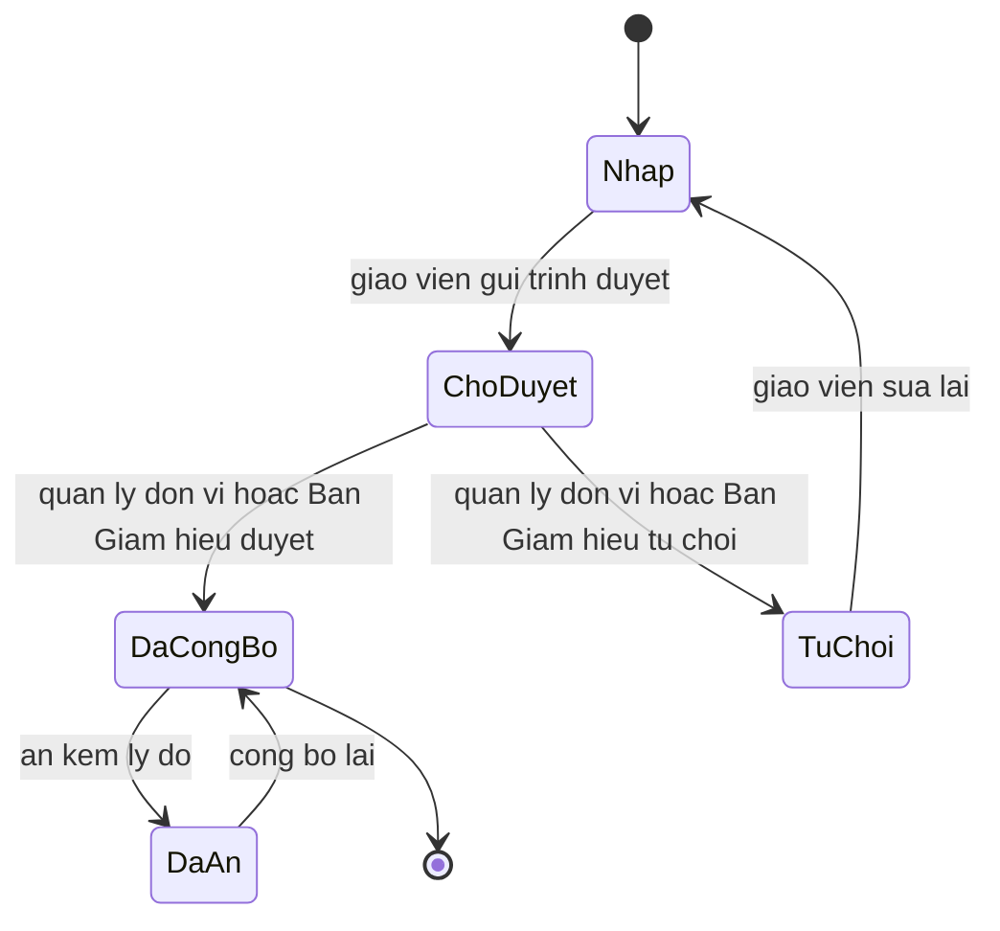

# [QT-10] Đăng hoạt động của lớp, duyệt và công bố cho phụ huynh

| Mục | Giá trị |
|-----|---------|
| Dự án | School Management - Hệ thống quản lý trường mầm non |
| Phiên bản | 1.1 - 2026-10-09 |
| Trạng thái | Đã phê duyệt |
| Người phê duyệt | Eric, ngày 2026-10-09 |
| Người yêu cầu | Eric |
| Ưu tiên | Bình thường |
| Loại | Mới |

## 1. Tóm tắt

Giáo viên tạo hoạt động của lớp kèm nội dung và hình ảnh, gửi trình duyệt. Quản lý đơn vị hoặc Ban Giám hiệu duyệt hoặc từ chối. Chỉ hoạt động đã duyệt mới hiển thị cho phụ huynh của trẻ trong lớp; phụ huynh có thể xem, thích và bình luận. Hình ảnh của trẻ chỉ được công bố khi phụ huynh đã đồng ý sử dụng hình ảnh. Quy trình thuộc giai đoạn 2 (G2-06, P14); đăng lên Facebook thuộc giai đoạn 3 (Q-73).

## 2. Tác nhân và quyền

| Tác nhân | Vai trò trong hệ thống | Được làm gì trong quy trình |
|----------|------------------------|------------------------------|
| Giáo viên chủ nhiệm | VT-07 | Tạo hoạt động, tải hình ảnh, gửi trình duyệt, xem bình luận |
| Giáo viên bộ môn | VT-08 | Tạo hoạt động cho lớp được phân công |
| Quản lý đơn vị | VT-03 | Duyệt hoặc từ chối, ẩn hoạt động đã công bố kèm lý do, quản lý danh mục hoạt động, xử lý và ẩn bình luận vi phạm kèm lý do |
| Phụ huynh | VT-14 | Xem hoạt động của lớp con, thích và bình luận |
| Phó Hiệu trưởng | VT-15 | Duyệt hoạt động, ẩn hoạt động đã công bố kèm lý do, xử lý bình luận tiêu cực trong các đơn vị được gán |
| Hiệu trưởng | VT-02 | Duyệt hoạt động phạm vi toàn trường, ẩn hoạt động đã công bố kèm lý do; xem báo cáo hoạt động toàn trường |

## 3. Điều kiện trước

- Giáo viên đã được phân công cho lớp.
- Danh mục hoạt động đã được cấu hình.
- Lớp đang hoạt động trong năm học hiện tại.
- Trẻ có mặt trong hình ảnh đã có cờ đồng ý sử dụng hình ảnh, nếu không thì hình của trẻ đó phải được loại trừ.

## 4. Luồng chính

| Bước | Ai | Hành động | Hệ thống xử lý | Kết quả người dùng thấy | Đã có / Mới |
|------|----|-----------|----------------|--------------------------|-------------|
| 1 | Giáo viên | Mở màn hình hoạt động của lớp và tạo hoạt động mới | Kiểm tra phân công lớp, mở biểu mẫu | Biểu mẫu hoạt động | Mới |
| 2 | Giáo viên | Nhập tiêu đề, nội dung, chọn danh mục, chọn lớp và ngày diễn ra | Kiểm tra trường bắt buộc | Hoạt động ở trạng thái nháp | Mới |
| 3 | Giáo viên | Tải hình ảnh lên album của hoạt động | Kiểm tra định dạng và dung lượng, kiểm tra cờ đồng ý hình ảnh của trẻ có trong ảnh | Hình ảnh đã tải lên, cảnh báo nếu có trẻ chưa đồng ý | Mới |
| 4 | Giáo viên | Bấm gửi trình duyệt | Đổi trạng thái sang chờ duyệt, gửi thông báo cho quản lý đơn vị và Ban Giám hiệu trong phạm vi | Hoạt động ở trạng thái chờ duyệt | Mới |
| 5 | Quản lý đơn vị hoặc Ban Giám hiệu | Mở danh sách hoạt động chờ duyệt và kiểm tra nội dung | Kiểm tra quyền duyệt theo đơn vị | Chi tiết hoạt động kèm nút duyệt và từ chối | Mới |
| 6 | Quản lý đơn vị hoặc Ban Giám hiệu | Bấm duyệt | Đổi trạng thái sang đã công bố, xác định đối tượng nhận theo lớp | Hoạt động đã công bố | Mới |
| 7 | Quản lý đơn vị hoặc Ban Giám hiệu | Bấm từ chối và nhập lý do | Đổi trạng thái sang từ chối, thông báo cho giáo viên | Giáo viên thấy lý do từ chối | Mới |
| 8 | Hệ thống | Gửi thông báo cho phụ huynh của trẻ trong lớp | Tạo thông báo và ghi nhận trạng thái đã đọc | Phụ huynh nhận thông báo hoạt động mới | Mới |
| 9 | Phụ huynh | Xem hoạt động, bấm thích, gửi bình luận | Lưu lượt thích và bình luận, không cho xóa bình luận của phụ huynh | Hoạt động kèm lượt thích và bình luận | Mới |
| 10 | Quản lý đơn vị | Xử lý bình luận tiêu cực; ẩn bình luận vi phạm kèm lý do nếu cần | Ghi nhận nội dung xử lý và người xử lý; bình luận bị ẩn vẫn được lưu, không xóa (BR-66, Q-70) | Bản ghi xử lý bình luận | Mới |
| 11 | Quản lý đơn vị hoặc Ban Giám hiệu | Ẩn hoạt động đã công bố kèm lý do, hoặc công bố lại (Q-72) | Đổi trạng thái, thông báo giáo viên tạo hoạt động | Hoạt động đã ẩn | Mới |
| 12 | Hệ thống | Ẩn hình của trẻ khi phụ huynh rút đồng ý sử dụng hình ảnh | Ẩn mọi hình đã công bố có gắn thẻ trẻ đó, không xóa tệp (BR-65, GD-89) | Hình của trẻ không còn hiển thị | Mới |

## 5. Sơ đồ

## 6. Luồng phụ và lỗi

| Mã | Tình huống | Hệ thống phản hồi | Thông báo cho người dùng |
|----|-----------|-------------------|--------------------------|
| E1 | Người dùng không có quyền với lớp hoặc đơn vị | Từ chối ở máy chủ | Bạn không có quyền thực hiện thao tác này |
| E2 | Không tìm thấy hoạt động | Trả về không tìm thấy | Hoạt động không tồn tại |
| E3 | Thiếu tiêu đề hoặc nội dung | Chặn lưu | Vui lòng nhập tiêu đề và nội dung |
| E4 | Hình ảnh vượt dung lượng hoặc sai định dạng | Chặn tải lên | Tệp không hợp lệ hoặc vượt dung lượng cho phép |
| E5 | Ảnh có trẻ chưa đồng ý sử dụng hình ảnh | Cảnh báo và yêu cầu loại trừ trước khi công bố | Có trẻ chưa đồng ý sử dụng hình ảnh trong tệp này |
| E6 | Giáo viên sửa hoạt động đã công bố | Chặn, yêu cầu gửi lại trình duyệt | Hoạt động đã công bố, gửi lại trình duyệt để sửa |
| E7 | Phụ huynh xem hoạt động của lớp không có con mình | Từ chối ở máy chủ | Bạn không có quyền xem hoạt động này |
| E8 | Gửi thông báo công bố thất bại | Ghi hàng đợi gửi lại, đánh dấu chưa gửi được | Chưa gửi được thông báo, hệ thống sẽ thử lại |
| E9 | Người duyệt không phải quản lý đơn vị hoặc Ban Giám hiệu có phạm vi trên đơn vị của hoạt động | Từ chối ở máy chủ | Bạn không có quyền duyệt hoạt động của đơn vị này |
| E10 | Ẩn hoạt động hoặc bình luận không nhập lý do | Chặn | Nhập lý do ẩn |
| E11 | Tải lên vượt 30 ảnh cho một hoạt động | Chặn tải thêm | Mỗi hoạt động tối đa 30 ảnh |

## 7. Trạng thái

| Từ | Sang | Khi nào | Ai được làm |
|----|------|---------|-------------|
| Nháp | Chờ duyệt | Giáo viên gửi trình duyệt | VT-07, VT-08 |
| Chờ duyệt | Đã công bố | Quản lý đơn vị hoặc Ban Giám hiệu duyệt | VT-03, VT-15, VT-02 |
| Chờ duyệt | Từ chối | Quản lý đơn vị hoặc Ban Giám hiệu từ chối kèm lý do | VT-03, VT-15, VT-02 |
| Từ chối | Nháp | Giáo viên sửa lại | VT-07, VT-08 |
| Đã công bố | Đã ẩn | Quản lý đơn vị hoặc Ban Giám hiệu ẩn hoạt động kèm lý do (Q-72) | VT-03, VT-15, VT-02 |
| Đã ẩn | Đã công bố | Quản lý đơn vị hoặc Ban Giám hiệu công bố lại | VT-03, VT-15, VT-02 |

## 8. Quy tắc nghiệp vụ

| Mã | Quy tắc |
|----|---------|
| BR-64 | Hoạt động do giáo viên tạo phải ở trạng thái chờ duyệt; chỉ hoạt động đã duyệt mới hiển thị cho phụ huynh |
| BR-65 | Hình ảnh của trẻ chỉ công bố khi phụ huynh đồng ý trên ứng dụng hoặc bằng giấy ký tay; khi phụ huynh rút đồng ý, hình đã công bố có trẻ bị ẩn |
| BR-66 | Bình luận của phụ huynh không bị xóa; phản hồi tiêu cực chuyển cho quản lý đơn vị xử lý riêng; quản lý đơn vị được ẩn bình luận vi phạm kèm lý do |
| BR-69 | Tin tức, thư viện và thông báo có phạm vi công bố: toàn trường, theo đơn vị, theo lớp hoặc theo từng trẻ |
| BR-70 | Thông báo quan trọng phải ghi nhận ai đã đọc và ai chưa đọc |

## 9. Thông báo, thời gian thực và nhật ký

| Sự kiện | Ai nhận | Kênh | Nội dung | Ghi nhật ký |
|---------|---------|------|----------|-------------|
| Hoạt động được gửi trình duyệt | Quản lý đơn vị, Ban Giám hiệu trong phạm vi | Trong ứng dụng | Có hoạt động của lớp chờ duyệt | Có |
| Hoạt động bị từ chối | Giáo viên tạo hoạt động | Trong ứng dụng | Hoạt động bị từ chối kèm lý do | Có |
| Hoạt động được công bố | Phụ huynh của trẻ trong lớp | Trong ứng dụng | Lớp của con có hoạt động mới | Có |
| Phụ huynh bình luận | Giáo viên chủ nhiệm, quản lý đơn vị | Trong ứng dụng | Có bình luận mới trên hoạt động | Có |
| Bình luận tiêu cực được xử lý | Quản lý đơn vị | Trong ứng dụng | Ghi nhận xử lý bình luận tiêu cực | Có |
| Hoạt động bị ẩn | Giáo viên tạo hoạt động | Trong ứng dụng | Hoạt động đã bị ẩn kèm lý do | Có |

## 10. Dữ liệu

| Thông tin | Bắt buộc | Ràng buộc | Ví dụ |
|-----------|----------|-----------|-------|
| Tiêu đề | Có | Tối đa hai trăm ký tự | Bé tập làm bánh |
| Nội dung | Có | Tối đa hai nghìn ký tự | Các bé cùng nhau nhào bột và tạo hình bánh quy |
| Lớp | Có | Lớp đang hoạt động của đơn vị | Mầm 1 |
| Danh mục hoạt động | Có | Thuộc danh mục đang hoạt động | Hoạt động sáng tạo |
| Ngày diễn ra | Có | Không lớn hơn ngày hiện tại | 2026-10-09 |
| Hình ảnh | Không | Mỗi ảnh tối đa 10 MB, mỗi hoạt động tối đa 30 ảnh, cấu hình được (Q-71) | Ba tệp ảnh |
| Cờ đồng ý hình ảnh của trẻ | Có khi ảnh có trẻ | Đồng ý hoặc không đồng ý | Đồng ý |
| Lý do từ chối | Có khi từ chối | Tối đa năm trăm ký tự | Nội dung chưa phù hợp để công bố |
| Nội dung xử lý bình luận | Có khi xử lý | Tối đa một nghìn ký tự | Đã trao đổi riêng với phụ huynh |
| Lý do ẩn hoạt động hoặc bình luận | Có khi ẩn | Tối đa năm trăm ký tự | Ảnh chưa phù hợp |

## 11. Màn hình liên quan

1. **Màn hình tạo hoạt động** — tiêu đề, nội dung, danh mục, lớp, ngày, khối tải hình ảnh.
2. **Danh sách hoạt động của giáo viên** — lọc theo trạng thái, theo lớp.
3. **Danh sách hoạt động chờ duyệt** — hiển thị với quản lý đơn vị và Ban Giám hiệu, nút duyệt, từ chối, ẩn và công bố lại.
4. **Màn hình hoạt động trên ứng dụng phụ huynh** — danh sách, chi tiết, nút thích, ô bình luận.
5. **Màn hình quản lý danh mục hoạt động** — thêm, sửa, ngừng sử dụng danh mục.
6. **Báo cáo hoạt động** — số hoạt động theo lớp, theo tháng, tỷ lệ lượt xem.

## 12. Tiêu chí nghiệm thu

- AC-67: Cho giáo viên tạo hoạt động của lớp / Khi lưu / Thì hoạt động ở trạng thái chờ duyệt và chưa hiển thị cho phụ huynh.
- AC-68: Cho hoạt động đã được duyệt / Khi phụ huynh của trẻ trong lớp mở ứng dụng / Thì thấy hoạt động kèm hình ảnh.
- AC-69: Cho hoạt động bị từ chối / Khi giáo viên mở lại / Thì thấy lý do từ chối.
- AC-70: Cho trẻ chưa có cờ đồng ý sử dụng hình ảnh / Khi giáo viên tải lên album có hình của trẻ đó / Thì hệ thống cảnh báo và không công bố hình của trẻ đó.
- AC-72: Cho giáo viên bộ môn / Khi gọi điểm cuối duyệt hoạt động / Thì bị từ chối.
- AC-130: Cho một quản lý đơn vị A / Khi gọi điểm cuối duyệt hoạt động của đơn vị B / Thì bị từ chối ở máy chủ.
- AC-131: Cho một phụ huynh của trẻ lớp Mầm 1 / Khi mở danh sách hoạt động / Thì chỉ thấy hoạt động đã công bố của lớp Mầm 1 và không thấy của lớp khác.
- AC-132: Cho một bình luận của phụ huynh / Khi quản lý đơn vị xử lý / Thì bình luận vẫn tồn tại và có bản ghi xử lý.
- AC-133: Cho một hoạt động đã công bố / Khi giáo viên sửa nội dung / Thì hệ thống chặn và yêu cầu gửi lại trình duyệt.
- AC-190: Cho phụ huynh của trẻ A đã đồng ý sử dụng hình ảnh / Khi phụ huynh rút đồng ý trên ứng dụng / Thì hình của trẻ A không được công bố thêm, hình đã công bố có trẻ A bị ẩn và lịch sử đồng ý ghi người, thời điểm.
- AC-134: Cho một hoạt động đã công bố / Khi quản lý đơn vị mở báo cáo hoạt động / Thì hoạt động được tính vào số liệu của lớp và của đơn vị.

## 13. Ảnh hưởng tới phần có sẵn

Không áp dụng. Đây là dự án mới, chưa có mã nguồn và dữ liệu cũ.

## 14. Giả định và câu hỏi mở

| Mã | Nội dung | Cần ai trả lời |
|----|----------|----------------|
| GD-38 | Đã xác nhận ngày 09/10/2026: Mọi hoạt động của giáo viên đều phải qua duyệt trước khi phụ huynh thấy | Eric |
| GD-39 | Đã xác nhận ngày 09/10/2026: Cờ đồng ý sử dụng hình ảnh kiểm tra ở cấp trẻ, không phải ở cấp tệp ảnh | Eric |
| GD-89 | Đã xác nhận ngày 09/10/2026: Khi phụ huynh rút đồng ý hình ảnh, hình đã công bố có trẻ được ẩn tự động, không xóa tệp | Eric |
| Q-70 | Đã trả lời ngày 09/10/2026: không kiểm duyệt trước; quản lý đơn vị ẩn được bình luận vi phạm kèm lý do | Eric |
| Q-71 | Đã trả lời ngày 09/10/2026: mỗi ảnh tối đa 10 MB, mỗi hoạt động tối đa 30 ảnh, cấu hình được | Eric |
| Q-72 | Đã trả lời ngày 09/10/2026: quản lý đơn vị và Ban Giám hiệu ẩn được hoạt động đã công bố, kèm lý do | Eric |
| Q-73 | Đã trả lời ngày 09/10/2026: đăng Facebook ở giai đoạn 3; chỉ hoạt động đã duyệt; bước đăng lên Fanpage là một lần duyệt riêng; loại ảnh trẻ chưa đồng ý | Eric |

## 15. Ghi chú kỹ thuật

- Điểm cuối dự kiến: tạo hoạt động, cập nhật hoạt động, gửi trình duyệt, duyệt, từ chối, ẩn, công bố lại, lấy danh sách hoạt động, thích, bình luận, ẩn bình luận.
- Bảng dữ liệu dự kiến: hoạt động, hình ảnh hoạt động, danh mục hoạt động, lượt thích, bình luận, bản ghi xử lý bình luận, cờ đồng ý hình ảnh.
- Việc chạy nền: gửi thông báo công bố, xử lý tệp ảnh.
- Thời gian thực: thông báo hoạt động chờ duyệt và bình luận mới.
- Chưa có mã nguồn nên chưa tham chiếu được tệp và số dòng.

## Lịch sử thay đổi

| Phiên bản | Ngày | Thay đổi |
|-----------|------|----------|
| 1.0 | 2026-10-09 | Tạo mới |
| 1.1 | 2026-10-09 | Rà duyệt: Ban Giám hiệu duyệt và ẩn hoạt động; ẩn hoạt động và bình luận kèm lý do (Q-70, Q-72); tự ẩn hình khi rút đồng ý; giới hạn ảnh (Q-71); ghi giai đoạn; Eric phê duyệt |
